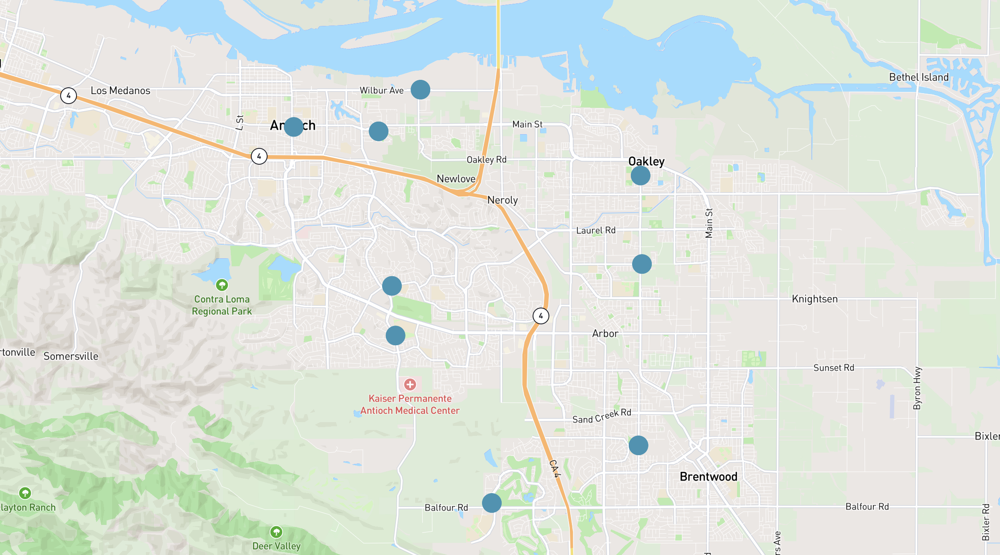
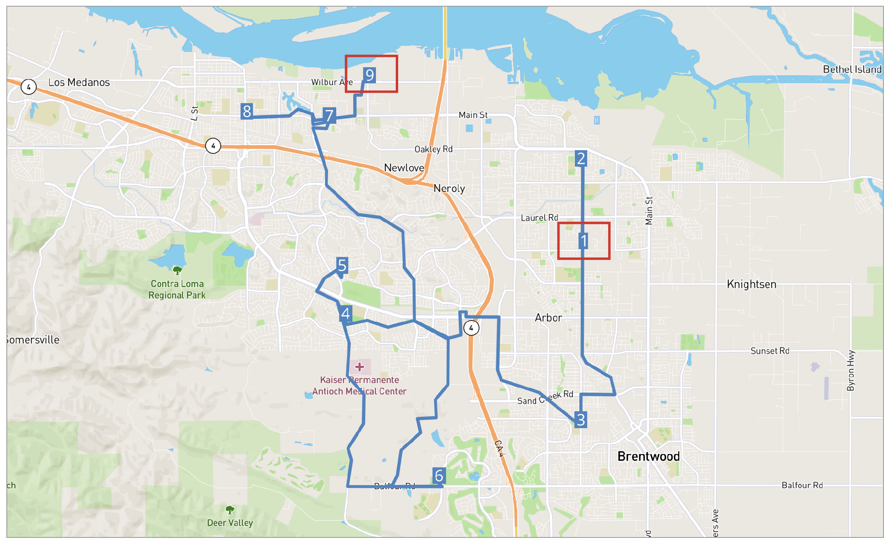
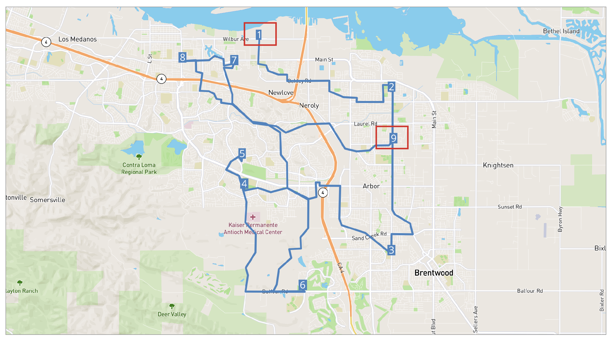

# Get Route Paths



Here's an example of how to get a path of route.

## Table of contents

- [Get Route Paths](#get-route-paths)
  - [Example](#example)
  - [Different Sequence of Stops](#different-sequence-of-stops)
  - [Notes](#notes)

## Example



Let's say we have 9 stops for route `ecdd0458-7e63-44ad-b26d-b89fded637a2-k1`

and we want to get the paths for it.

**Request**
```
GET {{baseURL}}/enterprise/v1/lists/routes/path/{{list-route-id}}?enc=true
```

From the response, we can see time and distance for each segment between the stops.

So, for the sequence of the stops we set, we can see from stop 1 to stop 2

- distanceM is 2574.0 (meters)
- timeS is 209.9 (seconds)

And from stop 2 (ecdd0458-7e63-44ad-b26d-b89fded637a2-k1-02) to stop 3 (ecdd0458-7e63-44ad-b26d-b89fded637a2-k1-03)

- distanceM is 7459.2
- timeS is 582.7

**Response**
```json
{
    "line": [
        {
            "distanceM": 2574.0,
            "timeS": 209.9,
            "encoded": "gexfFde{eV?V?j@@XM?yICgJ?S?qE@uB?u@@qH?YAWOaEGaECoB@wC@e@@m@AwBEe@?uFC[?gF?Y@oGAy@@YL_ACuBAoC@o@?qC@yCCAeFzCB?dF~AAp@?n@?nCAtB@~@BXLx@?d@?hF?X?hFAX@tF@d@@bDCf@@zCDjBAbE@dAF|@@~@@ROX@pH?t@AtB?pEAR?fJ?xIBL?~E?vC?rB@F?hF?jC?d@?VFb@?F?lA?nI?J?V?P?zH?dD?p@Er@Gp@MnAG|CDF?nDD`JFP?T?V@hA@nG@zCBbC?t@?J?\\?`C@zA@v@?jB@dEB|@?ZAhACR?z@?n@Ab@G`@Gd@O\\O`@UZS\\YVW\\e@^o@|@_C|B}GpCoIpC_IbAsCZq@T_@X]XYPO\\Uj@_@v@Ur@Kv@CbCE~@EzAY~Bc@^SA~@K~DErB@pC?dB?~@@hB?~B@b\\J?H?lBAz@AdFBP?nMBJ?lC?x@@bA?bCLr@Aj@??z@eB?Dy@cCMcA?y@AmC?K?oMCQ?eFC{@@mB@I?K?ArBCz@C~@Cz@AtBApBBfN@pAFvAJt@XbBH\\jBjL@Tp@|Cd@zBX|ARnB@HF`B@zA?zACzG?dB?fB@~CAzN@lDWS_BBsAB_@AkBFu@Jo@L{Ad@}Az@a@Zu@v@WVKNc@j@m@r@}@fAu@n@s@d@u@`@q@XaAXo@N}@Ju@DgBAI?I@u@Ae@AoGa@gAGoDCS?iA@i@AwB@wA@iA?yJ?u@Gq@MkB?S?gC@q@?uA?mC?aA?a@?A`@?nB?jD?tCAzCA|C?nB?v@@pF?rBAvD?lHG`H?\\?dI?lF?fBCnW@bO?hN?^?`@?T@xB@|D@dFOrBsBrOAH{@vFkFl^EV\\HhCn@zBl@vA\\LDr@JH@d@?pBWLG|EcBfAU~@JHB|@^Kv@CdA@jATfBj@bC\\lAd@zA^|AXdAR`BJnCuFt@qFp@wEv@o@JeAf@_@^WTyFxFk@`@GDKDMDaBh@mA@y@O_Bi@yAy@IGWQUMA?{BkAm@Sm@KSAq@AsCV{ALkAXyCrBgApA_AlAuCjDMMmAoCSoAp@Qx@OzAMf@W^[b@aAPeA_ACs@B}@TqAC?s@BsCvE?bAJ[hDQdAc@`A_@Zg@V{ALy@Nq@PRnAlAnCLLRXrCsDDGjA}AfAoApBmA|Ag@fAGvCQt@?n@Hp@Rj@X~@h@RJTLVPH]ZkA`A{Dh@wB\\}BdAyHt@sFFi@hBmLfHig@vBuOJ{AB[EcP?U?]?]?mN@yI?}C?S?}P?cEFmGAkC?]DeF?]DwFBiIlA?jHf@lHb@xDHnB@jC?zCAtC?J?nG?xF?bD?pCUvC_@rBe@zDsA`CaAfBo@xAi@vAi@fG_C|Bw@pBs@TGt@YpEeBnBu@zCiA`Bo@vAi@rOgGtHsChGaC|PeGhEyAvAg@~Ae@rA]vA]h@K^E^Ad@@j@@v@?~@DfCCdD@B~EAhC?H?J?dD@fEBrU?`@?vW@nV?hB?~IM?cB@MBDZ@r@YH?pA?~@`@A?kB@m@I?As@V?`BCZ??_@?}HCyZCwW@a@?iN@yE?[?mD?cECwFAwB?e@@sICiJd@CXCVAn@?RBRFNHPLLNHNHTFTBZ@ZC`@ETIXKTINMLQLu@VkA`@e@Na@Pc@TWJqAd@eBn@sBt@cC~@_Ct@kBh@wBh@gAXqCt@kJrC_AZoQzG}K`EcJjDyAf@[LyQ~GiC`AmQrGm@TgBn@sEdBy@Zu@Vg@Ns@Ls@Lq@Hq@Fu@Fq@Bq@@w@?gUBeDAoCCy@C{@E{@G_AI_AMu@K{@My@Oy@Ss@Qu@Ss@Uu@Ys@[{@_@_Ae@m@]q@a@u@e@o@e@wAkAqBiBqDsDk@a@k@c@i@_@i@_@m@]o@]u@]o@Ym@Uo@S{@Uw@Qq@Ow@Mw@Ky@Gq@Eo@Cw@Cw@?u@@w@Du@DwANyB\\eBd@_Bf@uBz@}BpAkG~D{FpDoFnDgOpJwP`LuFxDmBrA{@j@i@XoJjGeBlAsAhAyCpDaA|AaAfBYn@y@tB}@nCy@hDYlBQvBS~BWlDSvCYbE[jEi@jJq@xHa@vCUtAWhAc@hBq@~BwBlHoBbHi@lB_@xA_@hBYvAc@nC_@~CwBfT}BxVMvAu@hEo@xDKt@WnAYj@_@d@a@Zc@N_@DWF]F[d@E`@?f@YbDGt@Aj@AnA?\\_@Ny@X_Ab@yBjAeAj@GBg@Vg@Vy@Vq@Ls@BS?O?yE?sA@mCA?WBeDHqDDyD?yDkC@?kCAyA@uADOJIxB?DrCE~D?xDExDIpDCdD?VW?gA@_@Ac@?]?MBYJMj@u@xDUnA?f@WpAOdAEfAArA?v@?`@?L?t@?nA?dB?p@?l@?rB?`@?V@~B?t@?bB?lA?L?`A?zB?j@?p@?R?N@jA?\\?b@?\\?z@?J?ZAN?f@?h@?n@@j@?~@?b@?H?b@?l@ArC?pB?dA?fA?pA?R?b@@hA?lA?`@?j@?hB?X?b@x@O@n@@p@t@B@j@i@?kAA{@?a@?[?U?IAO@O?G?O?w@?_@?eB?I@q@?y@?{@A[?g@?y@?M?o@A_@?M?iA@eA?Y?s@Ag@@i@?qA?}@?}@@oAIa@CIIGUIo@?c@AoACmCAyH?uC?oBAkA?c@EeHDc@AmDB}CHoB?}I@gBA{A?cA?yE?U?gEAcDAgC@}G?uI?uCCwBGaAE{S?oR?c@@gBA]?e@?{LDc@@gIBoF@_F?Q@I@eD@kDCcBGm@G~@?nAAhDA|EAzA",
            "referenceId": "ecdd0458-7e63-44ad-b26d-b89fded637a2-k1-02"
        },
        {
            "distanceM": 7459.2,
            "timeS": 582.7,
            "referenceId": "ecdd0458-7e63-44ad-b26d-b89fded637a2-k1-03"
        },
        {
            "distanceM": 9356.7,
            "timeS": 763.1,
            "referenceId": "ecdd0458-7e63-44ad-b26d-b89fded637a2-k1-04"
        },
        {
            "distanceM": 1801.1,
            "timeS": 180.6,
            "referenceId": "ecdd0458-7e63-44ad-b26d-b89fded637a2-k1-05"
        },
        {
            "distanceM": 10453.1,
            "timeS": 763.8,
            "referenceId": "ecdd0458-7e63-44ad-b26d-b89fded637a2-k1-06"
        },
        {
            "distanceM": 14477.5,
            "timeS": 844.7,
            "referenceId": "ecdd0458-7e63-44ad-b26d-b89fded637a2-k1-07"
        },
        {
            "distanceM": 2391.6,
            "timeS": 239.3,
            "referenceId": "ecdd0458-7e63-44ad-b26d-b89fded637a2-k1-08"
        },
        {
            "distanceM": 4461.4,
            "timeS": 347.6,
            "referenceId": "ecdd0458-7e63-44ad-b26d-b89fded637a2-k1-09"
        }
    ]
}
```

## Different Sequence of Stops



Now, let's switch the sequence of first and last stop and see the difference.

**Request**

```
GET {{baseURL}}/enterprise/v1/lists/routes/path/{{list-route-id}}?enc=true
```

So we can see the result changes, from 1st stop to 2ed stop
- distanceM becomes 6976.4 (from 2574.0)
- time becomes 504.5 (from 209.9)

**Response**
```json
{
    "line": [
        {
            "distanceM": 6976.4,
            "timeS": 504.5,
            "encoded": "ah_gFrrffV?jBP?@_F?Q@I@eD@kDCcBGm@?_B?M@oBAeM?}JA}[AY?mE@kC@}H?[?I?C?O?_A?qB?a@?Y?s@?u@@c@?OHq@BY@iA@oA?aBAsAC{@C_@`BAhC@vC?~A@zB?xG?dA@^?fA@hEA@?l@?dA@XAZ?AwAAmCAaAG{J?{AMk@?i@?gA?u@?i@CuM?yD?OAaD?gC?gB@yD?kB@mC@mEB}JDgADo@BMNiAXiALWXo@d@q@Za@RCNOx@m@z@]~A_@l@?rC?bDA`E?x@Ax@Gp@M`@OJErAu@LKPQl@s@HUb@u@NW\\cATkANuAD_A?kACaE?{J@mF?gJ?MAaB?cD?wB?}H?Q?qBE_@@kF?G?O@qC?i@?{A?eE?_ACiC?g@p@?zAApCCzBDH?xCB~AAp@?n@?nCAtB@~@BXLx@?d@?hF?X?hFAX@tF@d@@bDCf@@zCDjBAbE@dAF|@@~@@ROX@pH?t@AtB?pEAR?fJ?xIBL?~E?vC?rB@F?hF?jC?d@?VFb@?F?lA?nI?J?V?P?zH?dD?p@Er@Gp@MnAG|CDF?nDD`JFP?T?V@hA@nG@zCBbC?t@?J?\\?`C@zA@v@?jB@dEB|@?ZAhACR?z@?n@Ab@G`@Gd@O\\O`@UZS\\YVW\\e@^o@|@_C|B}GpCoIpC_IbAsCZq@T_@X]XYPO\\Uj@_@v@Ur@Kv@CbCE~@EzAY~Bc@^SA~@K~DErB@pC?dB?~@@hB?~B@b\\J?H?lBAz@AdFBP?nMBJ?lC?x@@bA?bCLr@Aj@??z@eB?Dy@cCMcA?y@AmC?K?oMCQ?eFC{@@mB@I?K?ArBCz@C~@Cz@AtBApBBfN@pAFvAJt@XbBH\\jBjL@Tp@|Cd@zBX|ARnB@HF`B@zA?zACzG?dB?fB@~CAzN@lDWS_BBsAB_@AkBFu@Jo@L{Ad@}Az@a@Zu@v@WVKNc@j@m@r@}@fAu@n@s@d@u@`@q@XaAXo@N}@Ju@DgBAI?I@u@Ae@AoGa@gAGoDCS?iA@i@AwB@wA@iA?yJ?u@Gq@MkB?S?gC@q@?uA?mC?aA?a@?A`@?nB?jD?tCAzCA|C?nB?v@@pF?rBAvD?lHG`H?\\?dI?lF?fBCnW@bO?hN?^?`@?T@xB@|D@dFOrBsBrOAH{@vFkFl^EV\\HhCn@zBl@vA\\LDr@JH@d@?pBWLG|EcBfAU~@JHB|@^Kv@CdA@jATfBj@bC\\lAd@zA^|AXdAR`BJnCuFt@qFp@wEv@o@JeAf@_@^WTyFxFk@`@GDKDMDaBh@mA@y@O_Bi@yAy@IGWQUMA?{BkAm@Sm@KSAq@AsCV{ALkAXyCrBgApA_AlAuCjDMMmAoCSoAp@Qx@OzAMf@W^[b@aAPeA_ACs@B}@TqAC?s@BsCvE?bAJ[hDQdAc@`A_@Zg@V{ALy@Nq@PRnAlAnCLLRXrCsDDGjA}AfAoApBmA|Ag@fAGvCQt@?n@Hp@Rj@X~@h@RJTLVPH]ZkA`A{Dh@wB\\}BdAyHt@sFFi@hBmLfHig@vBuOJ{AB[EcP?U?]?]?mN@yI?}C?S?}P?cEFmGAkC?]DeF?]DwFBiIlA?jHf@lHb@xDHnB@jC?zCAtC?J?nG?xF?bD?pCUvC_@rBe@zDsA`CaAfBo@xAi@vAi@fG_C|Bw@pBs@TGt@YpEeBnBu@zCiA`Bo@vAi@rOgGtHsChGaC|PeGhEyAvAg@~Ae@rA]vA]h@K^E^Ad@@j@@v@?~@DfCCdD@B~EAhC?H?J?dD@fEBrU?`@?vW@nV?hB?~IM?cB@MBDZ@r@YH?pA?~@`@A?kB@m@I?As@V?`BCZ??_@?}HCyZCwW@a@?iN@yE?[?mD?cECwFAwB?e@@sICiJd@CXCVAn@?RBRFNHPLLNHNHTFTBZ@ZC`@ETIXKTINMLQLu@VkA`@e@Na@Pc@TWJqAd@eBn@sBt@cC~@_Ct@kBh@wBh@gAXqCt@kJrC_AZoQzG}K`EcJjDyAf@[LyQ~GiC`AmQrGm@TgBn@sEdBy@Zu@Vg@Ns@Ls@Lq@Hq@Fu@Fq@Bq@@w@?gUBeDAoCCy@C{@E{@G_AI_AMu@K{@My@Oy@Ss@Qu@Ss@Uu@Ys@[{@_@_Ae@m@]q@a@u@e@o@e@wAkAqBiBqDsDk@a@k@c@i@_@i@_@m@]o@]u@]o@Ym@Uo@S{@Uw@Qq@Ow@Mw@Ky@Gq@Eo@Cw@Cw@?u@@w@Du@DwANyB\\eBd@_Bf@uBz@}BpAkG~D{FpDoFnDgOpJwP`LuFxDmBrA{@j@i@XoJjGeBlAsAhAyCpDaA|AaAfBYn@y@tB}@nCy@hDYlBQvBS~BWlDSvCYbE[jEi@jJq@xHa@vCUtAWhAc@hBq@~BwBlHoBbHi@lB_@xA_@hBYvAc@nC_@~CwBfT}BxVMvAu@hEo@xDKt@WnAYj@_@d@a@Zc@N_@DWF]F[d@E`@?f@YbDGt@Aj@AnA?\\_@Ny@X_Ab@yBjAeAj@GBg@Vg@Vy@Vq@Ls@BS?O?yE?sA@mCA?WBeDHqDDyD?yDkC@?kCAyA@uADOJIxB?DrCE~D?xDExDIpDCdD?VW?gA@_@Ac@?]?MBYJMj@u@xDUnA?f@WpAOdAEfAArA?v@?`@?L?t@?nA?dB?p@?l@?rB?`@?V@~B?t@?bB?lA?L?`A?zB?j@?p@?R?N@jA?\\?b@?\\?z@?J?ZAN?f@?h@?n@@j@?~@?b@?H?b@?l@ArC?pB?dA?fA?pA?R?b@@hA?lA?`@?j@?hB?X?b@x@O@n@@p@t@B@j@F?ZAz@?lA?pA?d@?dC?JNtAAzAANAh@?r@?\\?t@?pA?dA@h@?fB@hA?~B@?m@c@mQ_@}O?eCBgGBwAHcCHiBFyALaBNgBLyAbDu\\vG{p@hH{u@VkCNkANwAVeB`@_CV}A\\}Aj@cCXmAVy@fBoGn@aCnAkEj@qCn@{D^yElA_RVqEVaDf@eH^}Cd@yCh@cCv@cCr@sBdAqBjAkBnAaBjAkAvAqAfBsAfLiH`CyAhC}Az@g@~@i@p@S~BiAnCkAr@Mf@Ch@BdE\\f@@j@?h@EZMh@[b@YVWcAeBeAoBoBqDUa@yGoMqBsD}BgEeBqDMYe@_AUcAa@cBUmAMwAGiA?O?yC?g@?o@?I?c@@_A@]DmB@e@DgC?O@]AwF?m@KoHCsC@sCAyJIoFE{H@wIAkF@sB?GEoE?k@BoLAsLpH?t@AtB?pEAR?fJ?xIBL?AY?k@?W",
            "referenceId": "ecdd0458-7e63-44ad-b26d-b89fded637a2-k1-02"
        },
        {
            "distanceM": 7459.2,
            "timeS": 582.7,
            "referenceId": "ecdd0458-7e63-44ad-b26d-b89fded637a2-k1-03"
        },
        {
            "distanceM": 9356.7,
            "timeS": 763.1,
            "referenceId": "ecdd0458-7e63-44ad-b26d-b89fded637a2-k1-04"
        },
        {
            "distanceM": 1801.1,
            "timeS": 180.6,
            "referenceId": "ecdd0458-7e63-44ad-b26d-b89fded637a2-k1-05"
        },
        {
            "distanceM": 10453.1,
            "timeS": 763.8,
            "referenceId": "ecdd0458-7e63-44ad-b26d-b89fded637a2-k1-06"
        },
        {
            "distanceM": 14477.5,
            "timeS": 844.7,
            "referenceId": "ecdd0458-7e63-44ad-b26d-b89fded637a2-k1-07"
        },
        {
            "distanceM": 2391.6,
            "timeS": 239.3,
            "referenceId": "ecdd0458-7e63-44ad-b26d-b89fded637a2-k1-08"
        },
        {
            "distanceM": 10865.2,
            "timeS": 665.6,
            "referenceId": "ecdd0458-7e63-44ad-b26d-b89fded637a2-k1-01"
        }
    ]
}
```

## Notes

**Parameters**
- enc (boolean/optional) - whether or not to encode the path

**Payload**
- encoded - It is the encoded paths of route for reducing the network bandwidth and it it in the first segment of "line".

When encoded feature is disabled (enc=false), 

the "paths" key will become `point`  (from key `encoded`).

```json
{
    "line": [
        {
            "point": [
                {
                    "latitude": 37.97604,
                    "longitude": -121.71363
                },
                {
                    "latitude": 37.97604,
                    "longitude": -121.71375
                },
                {
                    "latitude": 37.97604,
                    "longitude": -121.71397
                },

                // ...

                {
                    "latitude": 38.01232,
                    "longitude": -121.77164
                },
                {
                    "latitude": 38.01233,
                    "longitude": -121.7721
                }
            ],
            "distanceM": 2574.0,
            "timeS": 209.9,
            "referenceId": "ecdd0458-7e63-44ad-b26d-b89fded637a2-k1-02"
        },
        {
            "distanceM": 7459.2,
            "timeS": 582.7,
            "referenceId": "ecdd0458-7e63-44ad-b26d-b89fded637a2-k1-03"
        },
        {
            "distanceM": 9356.7,
            "timeS": 763.1,
            "referenceId": "ecdd0458-7e63-44ad-b26d-b89fded637a2-k1-04"
        },
        {
            "distanceM": 1801.1,
            "timeS": 180.6,
            "referenceId": "ecdd0458-7e63-44ad-b26d-b89fded637a2-k1-05"
        },
        {
            "distanceM": 10453.1,
            "timeS": 763.8,
            "referenceId": "ecdd0458-7e63-44ad-b26d-b89fded637a2-k1-06"
        },
        {
            "distanceM": 14477.5,
            "timeS": 844.7,
            "referenceId": "ecdd0458-7e63-44ad-b26d-b89fded637a2-k1-07"
        },
        {
            "distanceM": 2391.6,
            "timeS": 239.3,
            "referenceId": "ecdd0458-7e63-44ad-b26d-b89fded637a2-k1-08"
        },
        {
            "distanceM": 4461.4,
            "timeS": 347.6,
            "referenceId": "ecdd0458-7e63-44ad-b26d-b89fded637a2-k1-09"
        }
    ]
}
```


