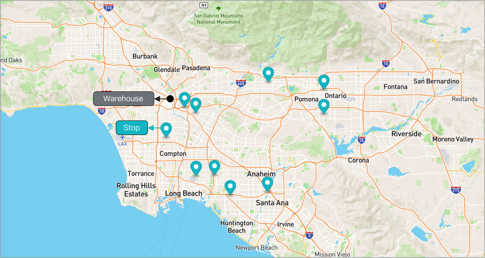
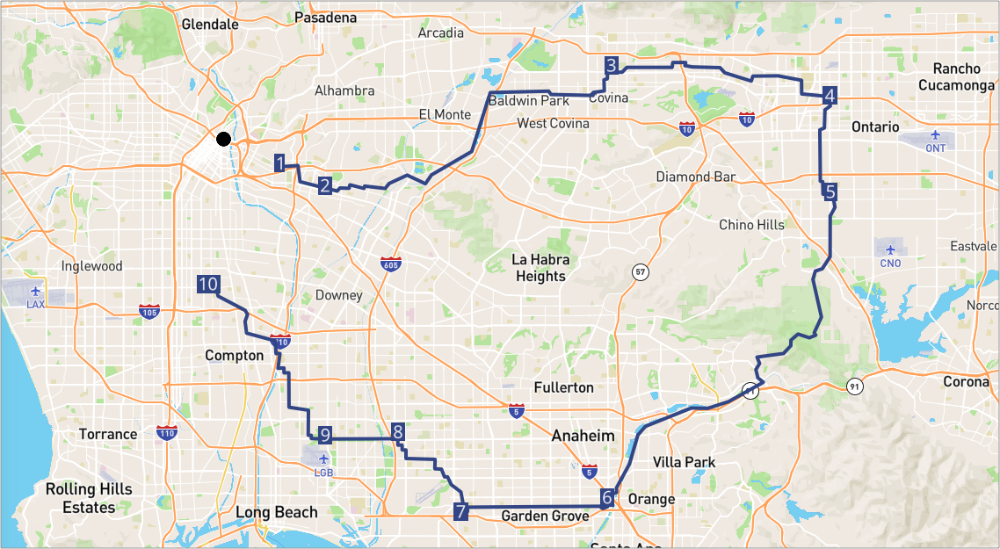

# Route Optimization

Route Optimization is offering stops visiting suggestion for most of common use cases.

For other route optimization conditions like pickup-dropoff, visiting time window... please see [Dynamic Route Optimization](https://github.com/beansai/beans-tutorials/tree/main/dynamic-routes-optimization)

## Table of contents

- [Route Optimization](#route-optimization)
- [Optimize Route](#optimize-route)

## Optimize Route
Let's say we have a route with 10 stops in LA, and we want to optimize the route for assignee who will start/end work at  warehouse.

**Request example**
```
POST {{baseURL}}/enterprise/v1/lists/items/do/optimize/?startMode=WAREHOUSE&endMode=WAREHOUSE
```
Here is a list of startMode, endMode which we are supporting for optimization conditions.
- WAREHOUSE
- ASSIGNEE_LOCATION
- ASSIGNEE_ADDRESS
- PREVIOUS_STOP
- NONE

**Body**
You can find the full payload here [stops](assets/stops.json) which contains 10 stops in an array, while the partial is below.
```json
{
    "item": [
        {
            "listItemId": "8d156298-e779-4176-ad9a-5ea6fca79f1c-7",
            "address": "9404 Central Ave, Montclair, CA 91763, United States",
            "formattedAddress": "9404 Central Ave, Montclair, CA",
            "status": "NEW",
            "updatedAt": 1648193534000,
            "statusUpdatedAt": 1648193534000,
            "route": {
                "listRouteId": "la-route-1"
            },
            "routePriority": 32,
            "type": "DROPOFF",
            "position": {
                "latitude": 34.08418,
                "longitude": -117.68966
            },
            "displayPosition": {
                "latitude": 34.08303,
                "longitude": -117.69066
            },
            "addressComponents": {
                "city": "Montclair",
                "state": "CA",
                "zipcode": "91763",
                "street": "9404 Central Ave",
                "countryIso3": "USA"
            },
            "countryIso3": "USA"
        }
        ...
    ]
}
```

**Response example**
You can find the full response content from here [response](assets/optimize-route-response.json) while the partial is below


```json
{
    "item": [
        {
            "listItemId": "9ec8c902-cba0-483a-8c13-02ebc28f791d10",
            "address": "3845 E 3RD ST LOS ANGELES",
            "formattedAddress": "3845 E 3rd St Los Angeles",
            "status": "NEW",
            "updatedAt": 1648195367387,
            "statusUpdatedAt": 1648193171000,
            "route": {
                "listRouteId": "la-route-1"
            },
            "routePriority": 8,
            "type": "DROPOFF",
            "position": {
                "latitude": 34.03351,
                "longitude": -118.18494
            },
            "displayPosition": {
                "latitude": 34.03351,
                "longitude": -118.18494
            },
            "isExternal": true,
            "sourceSeq": 1
        }
    ],
    "route": [
        {
            "listRouteId": "la-route-1",
            "accountBuid": "4022a1aada0e4c4684e61e3f73290a68",
            "name": "LA Route 1",
            "status": "OPEN",
            "createdAt": 1648192867000,
            "updatedAt": 1648195368000,
            "warehouse": {
                "listWarehouseId": "la-union-station",
                "accountBuid": "4022a1aada0e4c4684e61e3f73290a68",
                "address": "800 N Alameda St, Los Angeles, CA 90012, United States",
                "formattedAddress": "800 N Alameda St, Los Angeles, CA",
                "createdAt": 1648192761000,
                "updatedAt": 1648192761000,
                "position": {
                    "latitude": 34.05669,
                    "longitude": -118.23621
                },
                "name": "CA - Union Station"
            },
            "routePathMd5": "_zip_dbf4d42dc5f96d74215f471db55cee6f",
            "dateStr": "2031-03-10",
            "startMode": "WAREHOUSE",
            "endMode": "WAREHOUSE"
        }
    ]
}

```
**Note**
- route_priority may not start from 1, in other words the route_priority may looks like this 3,6,10,15,23,100,200...
- We have priority 0 (and -1) which is meant to be out of the path.

The Route Optimization algorithm will update each stop's route_priority which is the system's suggestion of stop visiting priority.

Here's a visualization of result.
As we can see the stops' visiting suggestion meets the condition of start/end work at warehouse.


