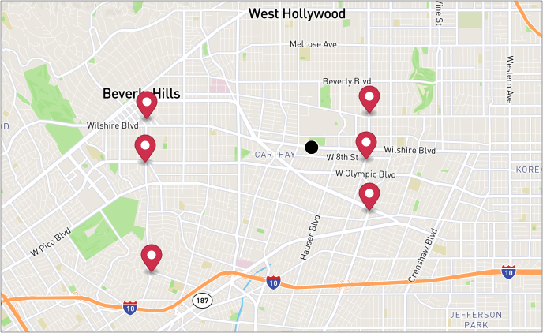
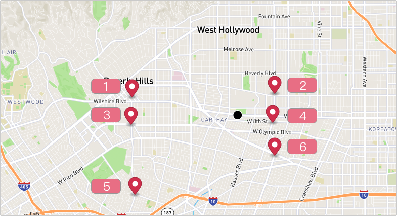

# Source Sequence
When we want to predetermine the stops' order in relative of each other, we can simply set the source_seq for each stop.

For example, we have 6 stops A,B,X,Y,Z and the order we want is
```
A -> B -> X -> Y -> Z
```
then, we can set source_seq for them
- A (source_seq = 5)
- B (source_seq = 10)
- X (source_seq = 20)
- Y (source_seq = 100)
- Z (source_seq = 200)

The effect of the system is the following:
- Stops that satisfy time range and other filters would be considered (thus, stops that did not satisfy the filters would be omitted)
- Stops that has source_seq attribute > 0 would then be put under the relative ordering constraint for the whatif analysis if ignore_source_sequence = false

## Table of contents
- [Create Stops with Source Sequence](#create-stops-with-source-sequence)
- [Update Stop with Source Sequence](#update-stop-with-source-sequence)

### Create Stops With Source Sequence

Let's say we have 6 stops, and we want to predetermine the ordering of the stops.



**Request Example**

```
POST https://isp.beans.ai/enterprise/v1/lists/items
```

**Body**
- source_seq - where we can predetermin the order of the stop
  - To remove it - set it to 0 or remove it from request.

```json
{
    "item": [
        {
            "list_item_id": "0584623a-f6ff-48ee-aa04-7f45cf85af6c-01",
            "address": "225 N Canon Dr, Beverly Hills, CA 90210, United States",
            "route": {
                "list_route_id": "0584623a-0894-459b-9cc9-26d03a5bf04a"
            },
            "source_seq":1
        },
        {
            "list_item_id": "0584623a-f6ff-48ee-aa04-7f45cf85af6c-02",
            "address": "9467 W Olympic Blvd, Beverly Hills, CA 90212, United States",
            "route": {
                "list_route_id": "0584623a-0894-459b-9cc9-26d03a5bf04a"
            },
            "source_seq":3
        },
        {
            "list_item_id": "0584623a-f6ff-48ee-aa04-7f45cf85af6c-03",
            "address": "9755 Cattaraugus Ave, Los Angeles, CA 90034, United States",
            "route": {
                "list_route_id": "0584623a-0894-459b-9cc9-26d03a5bf04a"
            },
            "source_seq":5
        },
        {
            "list_item_id": "0584623a-f6ff-48ee-aa04-7f45cf85af6c-04",
            "address": "260 S La Brea Ave, Los Angeles, CA 90036, United States",
            "route": {
                "list_route_id": "0584623a-0894-459b-9cc9-26d03a5bf04a"
            },
            "source_seq":2
        },
        {
            "list_item_id": "0584623a-f6ff-48ee-aa04-7f45cf85af6c-05",
            "address": "800 S La Brea Ave, Los Angeles, CA 90036, United States",
            "route": {
                "list_route_id": "0584623a-0894-459b-9cc9-26d03a5bf04a"
            },
            "source_seq":4
        },
        {
            "list_item_id": "0584623a-f6ff-48ee-aa04-7f45cf85af6c-06",
            "address": "1302 S La Brea Ave Ste A, Los Angeles, CA 90019, United States",
            "route": {
                "list_route_id": "0584623a-0894-459b-9cc9-26d03a5bf04a"
            },
            "source_seq":6
        }
    ]
}

```

**Response Example**

```json
{
    "item": [
        {
            "listItemId": "0584623a-f6ff-48ee-aa04-7f45cf85af6c-01",
            "address": "225 N Canon Dr, Beverly Hills, CA 90210, United States",
            "formattedAddress": "225 N Canon Dr, Beverly Hills, CA",
            "status": "NEW",
            "updatedAt": 1649224864451,
            "statusUpdatedAt": 1649221703000,
            "route": {
                "listRouteId": "0584623a-0894-459b-9cc9-26d03a5bf04a"
            },
            "routePriority": 1,
            "type": "DROPOFF",
            "position": {
                "latitude": 34.06857,
                "longitude": -118.39888
            },
            "displayPosition": {
                "latitude": 34.0683,
                "longitude": -118.39914
            },
            "addressComponents": {
                "city": "Beverly Hills",
                "state": "CA",
                "zipcode": "90210",
                "street": "225 N Canon Dr",
                "countryIso3": "USA"
            },
            "sourceSeq": 1,
            "countryIso3": "USA"
        },
        {
            "listItemId": "0584623a-f6ff-48ee-aa04-7f45cf85af6c-02",
            "address": "9467 W Olympic Blvd, Beverly Hills, CA 90212, United States",
            "formattedAddress": "9467 W Olympic Blvd, Beverly Hills, CA",
            "status": "NEW",
            "updatedAt": 1649224864450,
            "statusUpdatedAt": 1649221703000,
            "route": {
                "listRouteId": "0584623a-0894-459b-9cc9-26d03a5bf04a"
            },
            "routePriority": 3,
            "type": "DROPOFF",
            "position": {
                "latitude": 34.05968,
                "longitude": -118.39934
            },
            "displayPosition": {
                "latitude": 34.05999,
                "longitude": -118.39967
            },
            "addressComponents": {
                "city": "Beverly Hills",
                "state": "CA",
                "zipcode": "90212",
                "street": "9467 W Olympic Blvd",
                "countryIso3": "USA"
            },
            "sourceSeq": 3,
            "countryIso3": "USA"
        },
        {
            "listItemId": "0584623a-f6ff-48ee-aa04-7f45cf85af6c-03",
            "address": "9755 Cattaraugus Ave, Los Angeles, CA 90034, United States",
            "formattedAddress": "9755 Cattaraugus Ave, Los Angeles, CA",
            "status": "NEW",
            "updatedAt": 1649224864469,
            "statusUpdatedAt": 1649221703000,
            "route": {
                "listRouteId": "0584623a-0894-459b-9cc9-26d03a5bf04a"
            },
            "routePriority": 5,
            "type": "DROPOFF",
            "position": {
                "latitude": 34.03718,
                "longitude": -118.39775
            },
            "displayPosition": {
                "latitude": 34.03729,
                "longitude": -118.39771
            },
            "addressComponents": {
                "city": "Los Angeles",
                "state": "CA",
                "zipcode": "90034",
                "street": "9755 Cattaraugus Ave",
                "countryIso3": "USA"
            },
            "sourceSeq": 5
        },
        {
            "listItemId": "0584623a-f6ff-48ee-aa04-7f45cf85af6c-04",
            "address": "260 S La Brea Ave, Los Angeles, CA 90036, United States",
            "formattedAddress": "260 S La Brea Ave, Los Angeles, CA",
            "status": "NEW",
            "updatedAt": 1649224864472,
            "statusUpdatedAt": 1649221703000,
            "route": {
                "listRouteId": "0584623a-0894-459b-9cc9-26d03a5bf04a"
            },
            "routePriority": 2,
            "type": "DROPOFF",
            "position": {
                "latitude": 34.06963,
                "longitude": -118.34383
            },
            "displayPosition": {
                "latitude": 34.06965,
                "longitude": -118.34383
            },
            "addressComponents": {
                "city": "Los Angeles",
                "state": "CA",
                "zipcode": "90036",
                "street": "260 S La Brea Ave",
                "countryIso3": "USA"
            },
            "sourceSeq": 2,
            "countryIso3": "USA"
        },
        {
            "listItemId": "0584623a-f6ff-48ee-aa04-7f45cf85af6c-05",
            "address": "800 S La Brea Ave, Los Angeles, CA 90036, United States",
            "formattedAddress": "800 S La Brea Ave, Los Angeles, CA",
            "status": "NEW",
            "updatedAt": 1649224864488,
            "statusUpdatedAt": 1649221703000,
            "route": {
                "listRouteId": "0584623a-0894-459b-9cc9-26d03a5bf04a"
            },
            "routePriority": 4,
            "type": "DROPOFF",
            "position": {
                "latitude": 34.06033,
                "longitude": -118.34475
            },
            "displayPosition": {
                "latitude": 34.06027,
                "longitude": -118.34454
            },
            "addressComponents": {
                "city": "Los Angeles",
                "state": "CA",
                "zipcode": "90036",
                "street": "800 S La Brea Ave",
                "countryIso3": "USA"
            },
            "sourceSeq": 4,
            "countryIso3": "USA"
        },
        {
            "listItemId": "0584623a-f6ff-48ee-aa04-7f45cf85af6c-06",
            "address": "1302 S La Brea Ave Ste A, Los Angeles, CA 90019, United States",
            "formattedAddress": "1302 S La Brea Ave, Los Angeles, CA",
            "status": "NEW",
            "updatedAt": 1649224864490,
            "statusUpdatedAt": 1649221703000,
            "route": {
                "listRouteId": "0584623a-0894-459b-9cc9-26d03a5bf04a"
            },
            "routePriority": 6,
            "type": "DROPOFF",
            "position": {
                "latitude": 34.04974,
                "longitude": -118.34391
            },
            "displayPosition": {
                "latitude": 34.04984,
                "longitude": -118.3439
            },
            "addressComponents": {
                "city": "Los Angeles",
                "state": "CA",
                "zipcode": "90019",
                "street": "1302 S La Brea Ave A",
                "countryIso3": "USA"
            },
            "sourceSeq": 6,
            "countryIso3": "USA"
        }
    ],
    "route": [
        {
            "listRouteId": "0584623a-0894-459b-9cc9-26d03a5bf04a",
            "accountBuid": "4022a1aada0e4c4684e61e3f73290a68",
            "name": "Via Cassia",
            "status": "OPEN",
            "createdAt": 1649221340000,
            "updatedAt": 1649224865000,
            "warehouse": {
                "listWarehouseId": "d56bb78a-cdcb-4cfb-975a-597bb2b468f0",
                "accountBuid": "4022a1aada0e4c4684e61e3f73290a68",
                "address": "5905 Wilshire Blvd, Los Angeles, CA 90036, United States",
                "formattedAddress": "5905 Wilshire Blvd, Los Angeles, CA",
                "createdAt": 1646707733000,
                "updatedAt": 1649201403000,
                "position": {
                    "latitude": 34.06262,
                    "longitude": -118.35821
                },
                "name": "Thermopylae"
            },
            "routePathMd5": "c8ff8b87c7645db3cd51a4e140608ebc",
            "dateStr": "2023-02-21",
            "startMode": "WAREHOUSE",
            "endMode": "WAREHOUSE"
        }
    ]
}
```

Here's a visualized map of the result.


### Update Stop With Source Sequence

**Request Example**

```
POST https://isp.beans.ai/enterprise/v1/lists/items/{{list-item-id}}
```

**Body**
- source_seq - where we can predetermin the order of the stop
  - To remove it - set it to 0 or remove it from request.

```json
{
    "list_item_id": "5f75f6cc-f6ff-48ee-aa04-7f45cf85af6c-01",
    "address": "225 N Canon Dr, Beverly Hills, CA 90210, United States",
    "route": {
        "list_route_id": "0d8fe987-6245-4fc9-a23a-71e4aa917581-01"
    },
    "source_seq":10
}
```

**Response Example**

```json
{
    "item": [
        {
            "listItemId": "5f75f6cc-f6ff-48ee-aa04-7f45cf85af6c-01",
            "address": "225 N Canon Dr, Beverly Hills, CA 90210, United States",
            "formattedAddress": "225 N Canon Dr, Beverly Hills, CA",
            "status": "NEW",
            "updatedAt": 1649226238000,
            "statusUpdatedAt": 1649221629000,
            "route": {
                "listRouteId": "0d8fe987-6245-4fc9-a23a-71e4aa917581-01"
            },
            "routePriority": 10,
            "type": "DROPOFF",
            "position": {
                "latitude": 34.06857,
                "longitude": -118.39888
            },
            "displayPosition": {
                "latitude": 34.0683,
                "longitude": -118.39914
            },
            "addressComponents": {
                "city": "Beverly Hills",
                "state": "CA",
                "zipcode": "90210",
                "street": "225 N Canon Dr",
                "countryIso3": "USA"
            },
            "sourceSeq": 10,
            "countryIso3": "USA"
        }
    ]
}
```