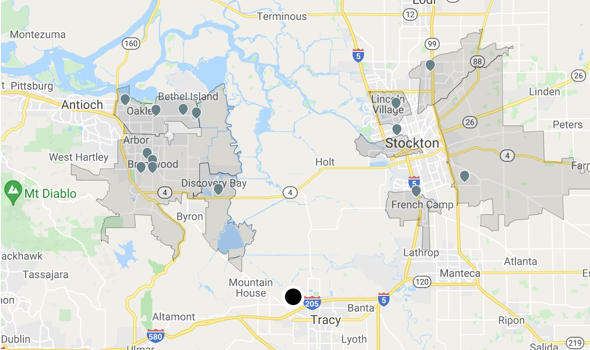
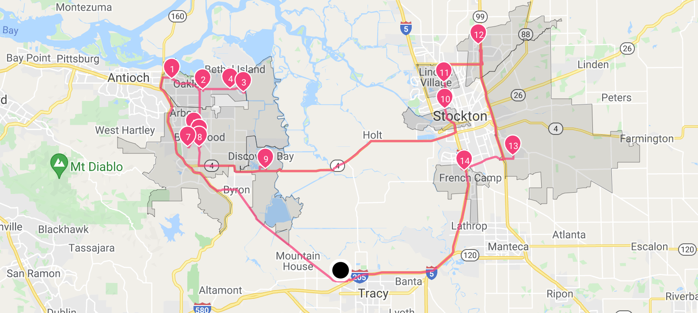

# Basic Routing Optimization



This is an example of how to do basic routing optimization when only a single driver has locations to visit.


## Table of contents

- [Basic Routing Optimization](#basic-routing-optimization)
  - [Table of contents](#table-of-contents)
  - [Create the data](#create-the-data)
    - [Create a warehouse](#create-a-warehouse)
    - [Create a route](#create-a-route)
    - [Add stops to the route](#add-stops-to-the-route)
    - [Configure an assignee](#configure-an-assignee)
  - [Run stateless DRO](#run-stateless-dro)

## Create the data
### Create a warehouse

**Request example**

```
curl -k -H 'Authorization: <token>' https://isp.beans.ai/enterprise/v1/lists/warehouses -XPOST -d '{"warehouse":[{"list_warehouse_id":"cabb46d6-776a-11ec-90d6-0242ac120003","address":"5655 Hood Way, Tracy, CA 95377"}]}'
```

- You must set a list_warehouse_id that is unique within your account.

```json
{
  "warehouse": [
    {
      "listWarehouseId": "cabb46d6-776a-11ec-90d6-0242ac120003",
      "accountBuid": "{{your-account-buid}}",
      "address": "5655 Hood Way, Tracy, CA 95377"
    }
  ]
}
```

**Note**: Your account_buid, list_warehouse_id, and address will be different from the ones in these examples.

### Create a route

**Request example**

```
curl -k -H 'Authorization: <token>' -X POST 'https://isp.beans.ai/enterprise/v1/lists/routes' -d '{"route":[{"name":"Tutorial Route A","warehouse":{"list_warehouse_id":"cabb46d6-776a-11ec-90d6-0242ac120003"},"list_route_id":"b13dfeea-d3f0-4054-91f3-aafeea458b8e","status":"OPEN","date_str":"2023-01-10"}]}'
```

- You must set a list_route_id that is unique within your account.
- You must confgure the date_str with the yyyy-MM-dd format.

```json
{
    "route":[
        {
            "name": "Tutorial Route A",
            "warehouse":
            {
                "list_warehouse_id": "cabb46d6-776a-11ec-90d6-0242ac120003"
            },
            "list_route_id": "b13dfeea-d3f0-4054-91f3-aafeea458b8e",
            "status": "OPEN",
            "date_str": "2023-01-10"
        }
    ]
}
```

**Note**: Your list_warehouse_id and list_route_id will be different from the ones in these examples.

### Add stops to the route

**Request**

```
curl -k -H 'Authorization: <token>' https://isp.beans.ai/enterprise/v1/lists/items -XPOST --data '@assets/stops.json'
```

- The [assets/stops.json](assets/stops.json) file will contain 14 stops in a couple of cities in California.

- An important thing to note is that each stop contains the route reference to the route that was created above with route id `b13dfeea-d3f0-4054-91f3-aafeea458b8e`

### Configure an assignee

**Request**

```
curl -k -H 'Authorization: <token>' https://isp.beans.ai/enterprise/v1/lists/assignees -XPOST --data '{"assignee":[{"list_assignee_id":"tutorial-driver-1","name":"Tutorial Driver One"}]}'
```

- list_assignee_id should be unique within your account.

```json
{
    "assignee":[
        {
            "list_assignee_id": "tutorial-driver-1",
            "name": "Tutorial Driver One"
        }
    ]
}
```

**Note**: Your list_assignee_id will be different.

## Run stateless DRO

**The Simple Scenario consists of:**

- 1 vehicle/driver
- 14 stops from the above Route `b13dfeea-d3f0-4054-91f3-aafeea458b8e`
- Driver has a capacity of up to 50 (thus, up to 50 stops)
- Driver has up to 8 hours of shift time
- Driver shift start time is 07:00
- Each stop will take 60 seconds
- Each dropoff/pickup will take 60 seconds

The respective configurations for the above scenario is at [assets/stateless-dro-request](assets/stateless-dro-request.json). The partial configuration bit is:

```json
    "default_capacity": 0,
    "default_shift_start_time": "07:00",
    "default_shift_length": 8,
    "default_stop_time_seconds": 60,
    "default_dropoff_time_seconds": 60,
    "default_pickup_time_seconds": 60,
    "disallow_pickup_dropoff_mode": true
```

**Request**

```
curl -k -H 'Authorization: <token>' https://isp.beans.ai/enterprise/v1/dro/run -X POST --data '@assets/stateless-dro-request.json'
```

**Note**: The above assumes that the file `assets/stateless-dro-request.json` is relative to where cURL is run. The `--data '@xxx'` option instructs cURL to read the file as the body of the POST request.

**Response**
You can find the sample response in [assets/stateless-dro-response.json](assets/stateless-dro-response.json)


Here's a visualization of the result.



