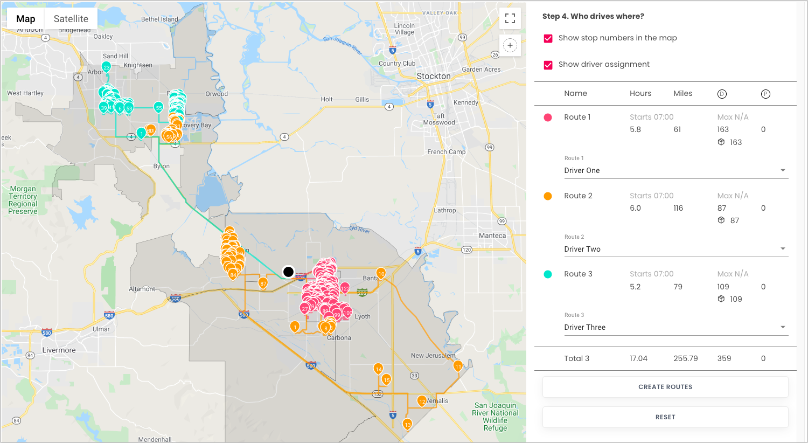

# Dynamic Route Optimization - Driver scheduling

Optimization for a collection of pickup/delivery is often one of the most critical aspects for
logistic planning and cost evaluations. With ebbs and flows of various demands, preemptive
capacity adjustments would improve your business efficiency.

For recommendations, suggestions, questions, and corrections, please contact us at
`developers@beans.ai`.

For detailed API shapes, please refer to [Beans Route API](https://www.beansroute.ai/route-api-v1.php)

## Table of contents
- [Introduction](#introduction)
- [Prerequisites](#prerequisites)
- [Steps](#steps)
  - [Configure a warehouse](#configure-a-warehouse)
  - [Add a route to the warehouse](#add-a-route-to-the-warehouse)
  - [Append stops to the route](#append-stops-to-the-route)
  - [Configure assignees](#configure-assignees)
  - [Run stateless DRO](#run-stateless-dro)
  - [Applying DRO result](#applying-dro-result)

## Introduction
In this tutorial we will learn how to use DRO (dynamic route optimization) tool to work on scheduling.

Let's say, there would be 350 packages as average in a day and 5 assignees (drivers) for a warehouse.
and we want to see how many drivers we need for a day to consume thoese packages.

### Prerequisites
To prepare your account for the tutorial, there are couples of basic elements to create so you
can examine, from our UI, the effects as well.

You will need

   * a registered account at [Beans Route](https://beansroute.ai)
   * the credential to used in Authorization in your API interactions

This tutorial uses [cURL](https://curl.se/) to illustrate the interactions with the system, and you
can use any HTTP based client to interact with the system as well.

We also recommend running cURL command piping to an output file. For example,
`curl ... | tee /tmp/my.output` would both pipe the output of the curl to the file
/tmp/my.output and also the standard output as well.

## Steps
### Configure a warehouse

**Request example**

```
curl -k -H 'Authorization: <token>' https://isp.beans.ai/enterprise/v1/lists/warehouses -XPOST -d '{"warehouse":[{"list_warehouse_id":"d0686fa0-c24b-40c1-b81f-0615bfa3718a","address":"5655 Hood Way, Tracy, CA 95377"}]}'
```

- It is important to set list_warehouse_id that is unique in your account.

```json
{
  "warehouse": [
    {
      "listWarehouseId": "cabb46d6-776a-11ec-90d6-0242ac120003",
      "accountBuid": "{{your-account-buid}}",
      "address": "5655 Hood Way, Tracy, CA 95377"
    }
  ]
}
```

**Note**: Your account_buid, list_warehouse_id, address would be differ.

### Add a route to the warehouse

A grouping Route, although isn't required for optimization, is a convenient bucket to gather
stops to be optimized.

**Request example**

```
curl -k -H 'Authorization: <token>' -X POST 'https://isp.beans.ai/enterprise/v1/lists/routes' -d '{"route":[{"name":"Tutorial Route A","warehouse":{"list_warehouse_id":"cabb46d6-776a-11ec-90d6-0242ac120003"},"list_route_id":"cdd60756-b662-404f-be64-af33b317ac60","status":"OPEN","date_str":"2023-01-10"}]}'
```

- It is important to set the list_route_id that is unique in your account
- It is important to confgure the date_str with yyyy-MM-dd format

```json
{
    "route":[
        {
            "name": "Tutorial Route A",
            "warehouse":
            {
                "list_warehouse_id": "cabb46d6-776a-11ec-90d6-0242ac120003"
            },
            "list_route_id": "cdd60756-b662-404f-be64-af33b317ac60",
            "status": "OPEN",
            "date_str": "2023-01-10"
        }
    ]
}
```

**Note**: Your list_warehouse_id, list_route_id would be differ.

### Append stops to the route

**Request example**

```
curl -k -H 'Authorization: <token>' https://isp.beans.ai/enterprise/v1/lists/items -XPOST --data '@assets/stops.json'
```

- You will find file [assets/stops.json](assets/stops.json) containing 359stops in couples of cities in Califonia

- An important thing to note is that each stop contains the route reference to the route that was created above with route id `c6d4f946-a0e6-40a6-983d-9a72730a3500`

Here's a visualization of the stops with a warehouse ( the big black dot in the middle ) we just created.


### Configure assignees

Here's an example of configuring assignees (drivers)

**Request example**

You can see the example data at [assets/assignees.json](assets/assignees.json)

```
curl -k -H 'Authorization: <token>' https://isp.beans.ai/enterprise/v1/lists/assignees -XPOST --data '@assets/assignees.json'
```

- list_assignee_id should be unique in your account.

```json
{
  "assignee": [
    {
      "list_assignee_id": "tu1-tutorial-driver-1",
      "name": "Driver One"
    },
    {
      "list_assignee_id": "tu1-tutorial-driver-2",
      "name": "Driver Two"
    },
    {
      "list_assignee_id": "tu1-tutorial-driver-3",
      "name": "Driver Three"
    },
    {
      "list_assignee_id": "tu1-tutorial-driver-4",
      "name": "Driver Four"
    },
    {
      "list_assignee_id": "tu1-tutorial-driver-5",
      "name": "Driver Five"
    }
  ]
}
```

**Note**: Your list_assignee_id should be differ.

### Run stateless DRO

**The Simple Scenario consists of**

- 359 stops from the Route `cdd60756-b662-404f-be64-af33b317ac60` above
- Up to 5 drivers (where optimization may not use all of them)
- Each driver has capacity up to 50 (thus, up to 50 stops)
- Each driver has up to 6 hours of shift time
- Starting and Ending location can be flexible

The respective configurations for the above is at [assets/stateless-dro-request](assets/stateless-dro-request.json)  where the partial configuration bit is

```json
  "default_shift_start_time": "07:00",
  "default_shift_length": 6,
  "default_capacity": 50,
  "default_stop_time_seconds": 60,
  "default_dropoff_time_seconds": 60,
  "default_pickup_time_seconds": 60,
  "check_seconds": 30,
  "timeout_seconds": 30,
  "start_anywhere": true,
  "end_anywhere": true,
  "use_assignees_start_address": true,
  "use_assignees_end_address": true,
  "allow_drop_time_constraints": false,
  "optimize_for": "TIME",
  "debug_print_log": true,
  "disallow_pickup_dropoff_mode": true,
  "solution_strategy": "PARALLEL_CHEAPEST_INSERTION",
  "search_strategy": "GUIDED_LOCAL_SEARCH",
  "solution_count": 200,
  "dro_request_id": "",
  "name": "dro-tutorial-run-1",
  "dro_response_id": "",
  "response_name": "dro_tutorial-run-1",
  "allow_assignee_penalty": true,
  "assignee_penalty": 1,
  "slowness": 1,
  "workarea": [],
  "disallow_transition": []
```

**Request example**

```
curl -k -H 'Authorization: <token>' https://isp.beans.ai/enterprise/v1/dro/run -X POST --data '@assets/stateless-dro-request.json'
```

**Note**: the above assumes that the file `assets/stateless-dro-request.json` is relative to where the cURL is run. The `--data '@xxx'` option instructed cURL to read the file as the body of the POST request.

**Response**
You can find the sample response at [assets/stateless-dro-response.json](assets/stateless-dro-response.json) where you can see the result with multiple segments ( assignee with packages )

Let's see the suggestions from DRO tool with a visualization result.



A closer look at the optimized route.


### Applying DRO result

The segments in the [assets/stateless-dro-response.json](assets/stateless-dro-response.json)
represents the routes that the optimizer found the best solution for given the constraints. To
finalize those segments, we need to **apply** them into routes for operations.

This tutorial has constructed [assets/apply-dro](assets/apply-dro.json) which included
   * the "default" warehouse
   * the "default" start time and shift length
   * the segment from the result
   * for each segment, the assignee associated with it

```
curl -k -H 'Authorization: <token>' https://isp.beans.ai/enterprise/v1/dro/apply -XPOST --data '@assets/apply-dro.json
```

Here's the visualization showing the routes


