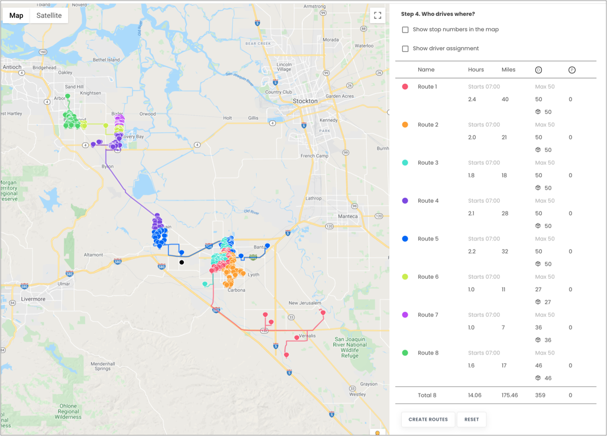
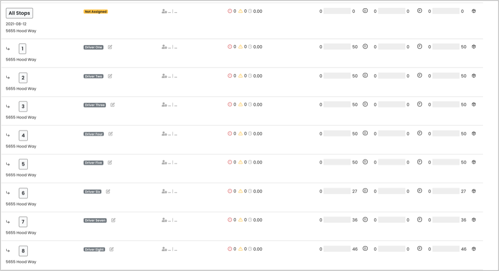

# Dynamic Route Optimization - Getting Started

Optimizing for a collection of pickup/delivery points is one of the most critical components of successful logistics planning and cost evaluation. It allows for preemptive capacity adjustments to respond to ebbing and flowing demand: ultimately improving your business' efficiency.

For recommendations, suggestions, questions, and corrections, please contact us at
`developers@beans.ai`.

For detailed API shapes, please refer to [Beans Route API](https://www.beansroute.ai/route-api-v1.php)

## Table of contents

- [Dynamic Route Optimization - Getting Started](#dynamic-route-optimization---getting-started)
  - [Table of contents](#table-of-contents)
  - [Introduction](#introduction)
    - [Prerequisites](#prerequisites)
      - [Setting up your account with a warehouse](#setting-up-your-account-with-a-warehouse)
    - [Configure a grouping Route for Stops](#configure-a-grouping-route-for-stops)
      - [Setting up your account with a Route](#setting-up-your-account-with-a-route)
      - [Loading Stops into the grouping Route](#loading-stops-into-the-grouping-route)
    - [Simple Stateless DRO with up to 10 Routes](#simple-stateless-dro-with-up-to-10-routes)
    - [Stateless to Stateful](#stateless-to-stateful)
      - [Configure some assignees (drivers)](#configure-some-assignees-drivers)
      - [Applying the DRO results to create routes](#applying-the-dro-results-to-create-routes)
    - [Simple Stateful Route Planning](#simple-stateful-route-planning)
      - [Perform stateful Optimization](#perform-stateful-optimization)
      - [Applying the stateful response](#applying-the-stateful-response)

## Introduction

In this tutorial, we'll use the API to setup an account for simple route optimizations in
both "stateless" and "stateful" manners.

"Stateless" optimization can be used to evaluate planning feasibility and experimentation, while
"Stateful" optimization can be used to adjust existing routes to examine differences.

### Prerequisites

To prepare for the tutorial, you'll need a few things.

You will need

   * A registered account at [Beans Route](https://beansroute.ai)
   * A credential to authorize your API interactions

This tutorial uses [cURL](https://curl.se/) to illustrate interactions with the API. However, you
can use any HTTP based client to interact with the system as well.

We also recommend piping to an output file whenever running cURL. For example,
`curl ... | tee /tmp/my.output` would pipe the output of cURL to both the file
/tmp/my.output and also to standard output.

#### Setting up your account with a warehouse

`curl -k -H 'Authorization: <token>' https://isp.beans.ai/enterprise/v1/lists/warehouses`

`curl -k -H 'Authorization: <token>' https://isp.beans.ai/enterprise/v1/lists/warehouses
-XPOST
-d '{"warehouse":[{"list_warehouse_id":"b47c3bc1-efc0-49fb-9aad-b3095f13b31b","address":"5655 Hood Way, Tracy, CA 95377"}]}'`

```json
{
  "warehouse": [
    {
      "listWarehouseId": "b47c3bc1-efc0-49fb-9aad-b3095f13b31b",
      "accountBuid": "c2647bb5d26847faac56907f980da023",
      "address": "5655 Hood Way, Tracy, CA 95377",
      "formattedAddress": "5655 Hood Way, Tracy, CA",
      "createdAt": 1628277510865,
      "updatedAt": 1628277510865,
      "position": {
        "latitude": 37.7289493,
        "longitude": -121.5082503
      }
    }
  ]
}
```
**Note** Your accountBuid field will be different from the example.

### Configure a grouping Route for Stops

Although it's not required for optimization, a grouping Route is a convenient way to 'bucket' stops that need to be optimized.


#### Setting up your account with a Route

`curl -k -H 'Authorization: <token>' https://isp.beans.ai/enterprise/v1/lists/routes -XPOST -d '{"route":[{"list_route_id":"d27e174b-ff71-4854-af85-72c056ae1b05","name":"All Stops","date_str":"2023-08-01","status":"open","warehouse":{"list_warehouse_id":"b47c3bc1-efc0-49fb-9aad-b3095f13b31b"}}]}'`
   * It's important to set a list_route_id that is unique within your account.
   * It's important to configure the date_str with the yyyy-MM-dd format.

```json
{
  "route": [
    {
      "listRouteId": "d27e174b-ff71-4854-af85-72c056ae1b05",
      "accountBuid": "c2647bb5d26847faac56907f980da023",
      "name": "All Stops",
      "status": "OPEN",
      "createdAt": 1628277348000,
      "updatedAt": 1628287742324,
      "warehouse": {
        "listWarehouseId": "b47c3bc1-efc0-49fb-9aad-b3095f13b31b",
        "accountBuid": "c2647bb5d26847faac56907f980da023",
        "address": "5655 Hood Way, Tracy, CA 95377",
        "formattedAddress": "5655 Hood Way, Tracy, CA",
        "createdAt": 1628277511000,
        "updatedAt": 1628277511000,
        "position": {
          "latitude": 37.7289493,
          "longitude": -121.5082503
        }
      },
      "routePathMd5": "_zip_07f8fe511d25d0280d20ef5047868f7d",
      "dateStr": "2023-08-01"
    }
  ]
}
```
**Note** Your accountBuid, createdAt, updatedAt field values will be different from the example.

#### Loading Stops into the grouping Route

This [assets/stops.json](https://github.com/beansai/beans-tutorials/blob/main/dynamic-routes-optimization/assets/stops.json) file contains 359 stops in a couple of California cities. Note that each stop contains a route reference to the route that was created above with route id: d27e174b-ff71-4854-af85-72c056ae1b05.

`curl -k -H 'Authorization: <token>' https://isp.beans.ai/enterprise/v1/lists/items -XPOST --data '@assets/stops.json'`

**Note**: The above assumes that the file "assets/stops.json" is relative to where cURL is run.
The `--data '@xxx'` option instructs cURL to read the file as the body of the POST request.

Since there are 359 stops, the response is HUGE.

Here's a visualization of the route. (https://www.beansroute.ai/3pl-manager/#dro)


### Simple Stateless DRO with up to 10 Routes

The Simple Scenario consists of
   * 359 stops from the grouping Route `d27e174b-ff71-4854-af85-72c056ae1b05` above
   * Up to 10 routes/drivers (where optimization may not use all of them)
   * Each driver has a capacity up to 50 (thus, up to 50 stops)
   * Each driver has up to 8 hours of shift time
   * Starting and Ending location can be flexible

The configurations for the above is at
[assets/simple_dro_request.json](https://github.com/beansai/beans-tutorials/blob/main/dynamic-routes-optimization/assets/simple_dro_request.json) The partial configuration bit is:
```json
  "default_shift_start_time": "07:00",
  "default_shift_length": 8,
  "default_capacity": 50,
  "default_stop_time_seconds": 60,
  "default_dropoff_time_seconds": 60,
  "default_pickup_time_seconds": 60,
  "check_seconds": 30,
  "timeout_seconds": 30,
  "start_anywhere": true,
  "end_anywhere": true,
  "use_assignees_start_address": true,
  "use_assignees_end_address": true,
  "allow_drop_time_constraints": false,
  "optimize_for": "TIME",
  "debug_print_log": true,
  "disallow_pickup_dropoff_mode": true,
  "solution_strategy": "PARALLEL_CHEAPEST_INSERTION",
  "search_strategy": "GUIDED_LOCAL_SEARCH",
  "solution_count": 200,
  "dro_request_id": "",
  "name": "dro-tutorial-run-1",
  "dro_response_id": "",
  "response_name": "dro_tutorial-run-1",
  "allow_assignee_penalty": true,
  "assignee_penalty": 1,
  "slowness": 1,
  "workarea": [],
  "disallow_transition": []
```
The file [assets/simple_dro_request.json](https://github.com/beansai/beans-tutorials/blob/main/dynamic-routes-optimization/assets/simple_dro_request.json)
contains all the stops from the grouping route, so you can always create the DRO Request object
straight from the stops, without needing the grouping Route. You DO need to geo-code the stops to make
sure the location is specified.

Here is the cURL request
`curl -k -H 'Authorization: <token>' https://isp.beans.ai/enterprise/v1/dro/run -XPOST --data '@assets/simple_dro_request.json'`

Since the response is large, an example response is at
[assets/simple_dro_response.json](https://github.com/beansai/beans-tutorials/blob/main/dynamic-routes-optimization/assets/simple_dro_response.json)

Here's the visualization of the result:



   * We specified the name of the request as "dro-tutorial-run-1" in our request, and it will be
      saved and available in the dropdown menu on the UI.
   * Also, we specified the name of the response with the same name, so it would also be available
      in the dropdown menu on the UI as well.

### Stateless to Stateful

The optimization above does not create routes nor make any assignments, which is suitable for
continuous experimentation and tuning. The saved configuration and saved result can be used for
analysis or route matching prior to finalizing the routes.


To go from optimization to dispatch, we will need to apply the result of the optimization to create
routes, and thus transition to the **stateful**.

#### Configure some assignees (drivers)

We need to create some assignees (drivers) so we can associate the segments.
`curl -k -H 'Authorization:<token>' https://isp.beans.ai/enterprise/v1/lists/assignees -XPOST --data '@assets/assignees.json'`

#### Applying the DRO results to create routes

The segments in the [assets/simple_dro_response.json](https://github.com/beansai/beans-tutorials/blob/main/dynamic-routes-optimization/assets/simple_dro_response.json) file represent the routes that the optimizer found the best solution for given the constraints. To
finalize those segments, we need to **apply** them into routes for operations.

This tutorial has constructed [assets/simple_dro_apply.json](https://github.com/beansai/beans-tutorials/blob/main/dynamic-routes-optimization/assets/simple_dro_apply.json)
which includes:
   * The "default" warehouse
   * The "default" start time and shift length
   * The segment from the result
   * For each segment, the assignee associated with it

`curl -k -H 'Authorization: <token>' https://isp.beans.ai/enterprise/v1/dro/apply -XPOST --data '@assets/simple_dro_apply.json'`


Here's the visualization showing the routes:



### Simple Stateful Route Planning

Now, there are routes with stops that are assigned. We can now add extra stops for optimization by
adding those extra stops into our grouping Route first.

`curl -k -H 'Authorization:<token>' https://isp.beans.ai/enterprise/v1/lists/items -XPOST --data '@assets/extra_stops.json'`

The visualization of just extra stops


The following places those extra stops in context of the stateful routes


#### Perform stateful Optimization

You can find the sample request at [assets/stateful_dro_request.json](https://github.com/beansai/beans-tutorials/blob/main/dynamic-routes-optimization/assets/stateful_dro_request.json), which wraps around the request with additional specifications:
   * The route_id array captures the list of routes to be included. You'll need to get the list of routes
      from [Simple DRO Routes applied](https://github.com/beansai/beans-tutorials/blob/main/dynamic-routes-optimization/assets/images/routes_applied.png)
   * The assignee array captures the list of drivers, and whether or not their current items
      should be kept together. If set to true, this will ensure the stops in the driver's route are
      kept together.

`curl -k -H 'Authorization: <token>' https://isp.beans.ai/enterprise/v1/dro/run-stateful -XPOST --data '@assets/stateful_dro_request.json'`

You can find the sample response at [assets/stateful_dro_response.json](https://github.com/beansai/beans-tutorials/blob/main/dynamic-routes-optimization/assets/stateful_dro_response.json)

#### Applying the stateful response

This tutorial has constructed [assets/stateful_dro_apply.json](https://github.com/beansai/beans-tutorials/blob/main/dynamic-routes-optimization/assets/stateful_dro_apply.json)
which includes:
   * The "default" warehouse
   * The "default" start time and shift length
   * The segment from the result
   * For each segment, the assignee associated with it
   * **For each segment**, the route name associated with it (if you wish to maintain the route/driver
      association)

The visualization of Stateful DRO Routes applied


