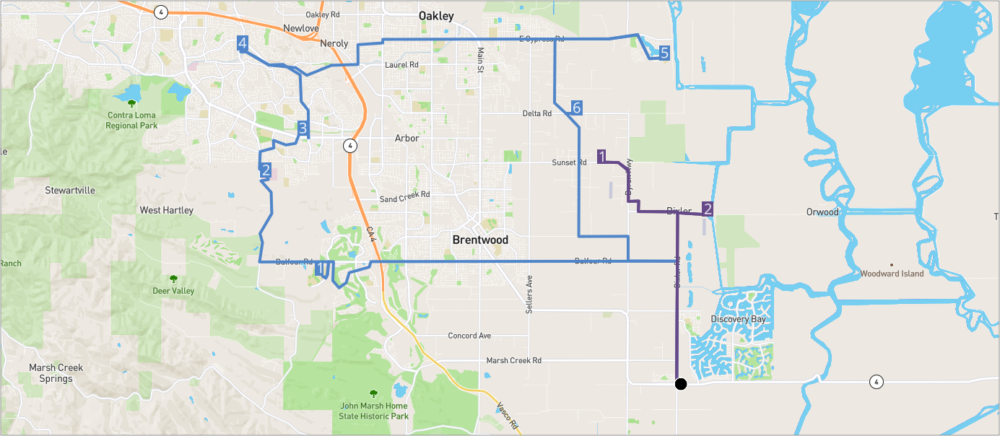
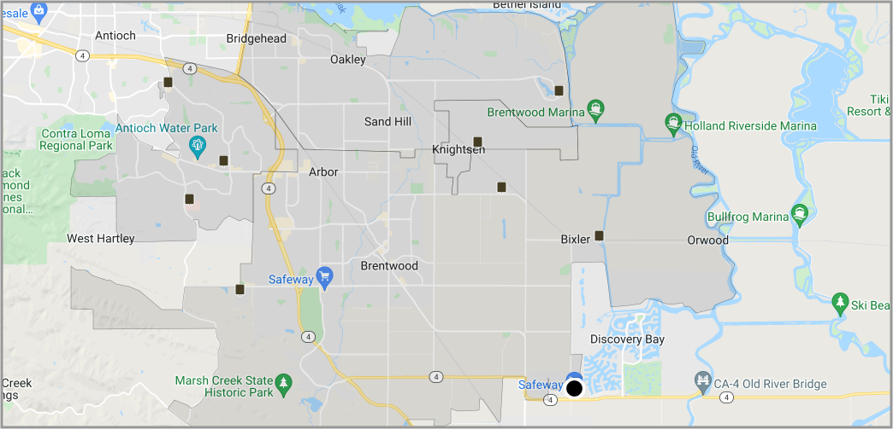

# Vehicles routing optimization with dimensions



We can use dimensions as constraints for our vehicles when we use DRO.

Let's say we have 8 packages to pick up and each of them has 60 units of weight, so the total units of weight are 8 x 60 = 480.

And we have two vehicles to consume the packages.

- A big vehicle which has a total of 400 units of weight
- A small vehicle that has a total of 150 units of weight

What we expected is that the packages will be assigned to two vehicles and each assignment won't exceed the maximum of a vehicle's weight constraint.

The following will show the procedures.


## Table of contents
- [Create the data](#create-the-data)
  - [Create a warehouse](#create-a-warehouse)
  - [Create a route](#create-a-route)
  - [Add stops to the route](#add-stops-to-the-route)
  - [Configure Assignees](#configure-assignees)
  - [Configure AssigneeVehicles](#configure-AssigneeVehicles)
- [Run stateless DRO](#run-stateless-dro)
- [Dimensions that are supported](#dimensions-that-are-supported)


## Create the data
### Create a warehouse

**Request example**

```
curl -k -H 'Authorization: <token>' https://isp.beans.ai/enterprise/v1/lists/warehouses -XPOST -d '{"warehouse":[{"list_warehouse_id":"55c40094-f1d9-45cb-a4c0-60811652a7d9","address":"401 Superior Way, Discovery Bay, CA 94505"}]}'
```

- It is important to set list_warehouse_id that is unique in your account.

```json
{
  "warehouse": [
    {
      "listWarehouseId": "55c40094-f1d9-45cb-a4c0-60811652a7d9",
      "address": "14840 CA-4, Discovery Bay, CA 94505"
    }
  ]
}
```

**Note**: Your list_warehouse_id and address would be different.

### Create a route

A grouping Route, although isn't required for optimization, is a convenient bucket to gather
stops to be optimized.

**Request example**

```
curl -k -H 'Authorization: <token>' -X POST 'https://isp.beans.ai/enterprise/v1/lists/routes' -d '{"route":[{"name":"Route ae8e","list_route_id":"fdeca64b-1e12-44e4-8b11-9f2c558b5761","status":"OPEN","date_str":"2023-02-21","warehouse":{"list_warehouse_id":"55c40094-f1d9-45cb-a4c0-60811652a7d9"}}]}'
```

- It is important to set the list_route_id that is unique in your account
- It is important to configure the date_str with a yyyy-MM-dd format

```json
{
    "route":[
        {
            "name": "Route fdec",
            "list_route_id": "fdeca64b-1e12-44e4-8b11-9f2c558b5761",
            "status": "OPEN",
            "date_str": "2023-02-21",
            "warehouse":
            {
                "list_warehouse_id": "55c40094-f1d9-45cb-a4c0-60811652a7d9"
            }
        }
    ]
}
```

**Note**: Your list_warehouse_id, list_route_id would be different.

### Add stops to the route

**Request example**

```
curl -k -H 'Authorization: <token>' https://isp.beans.ai/enterprise/v1/lists/items -XPOST --data '@assets/stops.json'
```

For each stop, we will set a dimension with 60 units of WEIGHT

```json
    {
        "listItemId": "fdec-2fd6f3f3ab12cebdddb97ca0f",
        "address": "101 American Ave, Brentwood, CA 94513",        
        "position": {
            "latitude": 37.92187,
            "longitude": -121.75555
        },
        
        // ....
        
        "dimensions": {
            "dims": [
                {
                    "t": "WEIGHT",
                    "v": "60"
                }
            ]
        }
    },
```

- You can see the payload detail here [assets/stops.json](assets/stops.json) which contains 8 stops in some cities in Califonia
- An important thing to note is that each stop contains the route reference to the route that was created above with route id `fdeca64b-1e12-44e4-8b11-9f2c558b5761`

Here's a visualization of the stops with a warehouse ( the big black dot ) we just created.



### Configure Assignees

To configure two drivers for delivery.

**Request**

```
curl -k -H 'Authorization: <token>' https://isp.beans.ai/enterprise/v1/lists/assignees -XPOST -d '{"assignee":[{"list_assignee_id":"6b3f-0a3889d0-a756","name":"Mercury I"},{"list_assignee_id":"6b3f-f6908a1b","name":"Mercury II"}]}'
```

- list_assignee_id should be unique in your account.

```json
{
  "assignee": [
    {
      "list_assignee_id": "6b3f-0a3889d0-a756",
      "name": "Mercury I"
    },
    {
      "list_assignee_id": "6b3f-f6908a1b",
      "name": "Mercury II"
    }
  ]
}
```

**Note**: Your list_assignee_id should be different.

### Configure AssigneeVehicles

To configure vehicles with dimensions

- A big vehicle with 400 units of WEIGHT
- A small vehicle with 150 units of WEIGHT

```json
{
    "vehicle":
    [
        {
            "listAssigneeId": "6b3f-0a3889d0-a756",
            "dimensions":
            {
                "dims":
                [
                    {
                        "t": "WEIGHT",
                        "v": "400"
                    }
                ]
            }
        },
        {
            "listAssigneeId": "6b3f-f6908a1b",
            "dimensions":
            {
                "dims":
                [
                    {
                        "t": "WEIGHT",
                        "v": "150"
                    }
                ]
            }
        }

    ]
}
```

**Note**: Your listAssgineeId should be different.

### Run stateless DRO

**The Simple Scenario consists of**

- 8 stops from the Route `fdeca64b-1e12-44e4-8b11-9f2c558b5761` above

The respective configurations for the above are at [assets/stateless-dro-request](assets/stateless-dro-request.json)  where the partial configuration is 

```json
"default_dimensions": {
    "dims": [
        {
            "t": "WEIGHT",
            "v": "0"
        }
    ]
}
```

We set the default WEIGHT dimension to 0 since we have already set the two vehicles with a WEIGHT dimension.

**Note**: The field **default_dimensions** is required when we want to use the dimension factor in the DRO algorithm.

**Request example**

```
curl -k -H 'Authorization: <token>' https://isp.beans.ai/enterprise/v1/dro/run -X POST --data '@assets/stateless-dro-request.json'
```

**Note**: the above assumes that the file `assets/stateless-dro-request.json` is relative to where the cURL is run. 

**Response example**
You can find the sample response at [assets/stateless-dro-response.json](assets/stateless-dro-response.json) where you can see the result with multiple segments ( assignee with packages )

Here's a visualization of the result, as we can see, the packages have been assigned to two vehicles without exceeding the maximum of vehicle's Weight


### Dimensions that are supported

- WEIGHT
- VOLUME
- COUNT

Please see the detail of [Dimension Object](https://www.beansroute.ai/route-api-v1.php#dimension-object)
