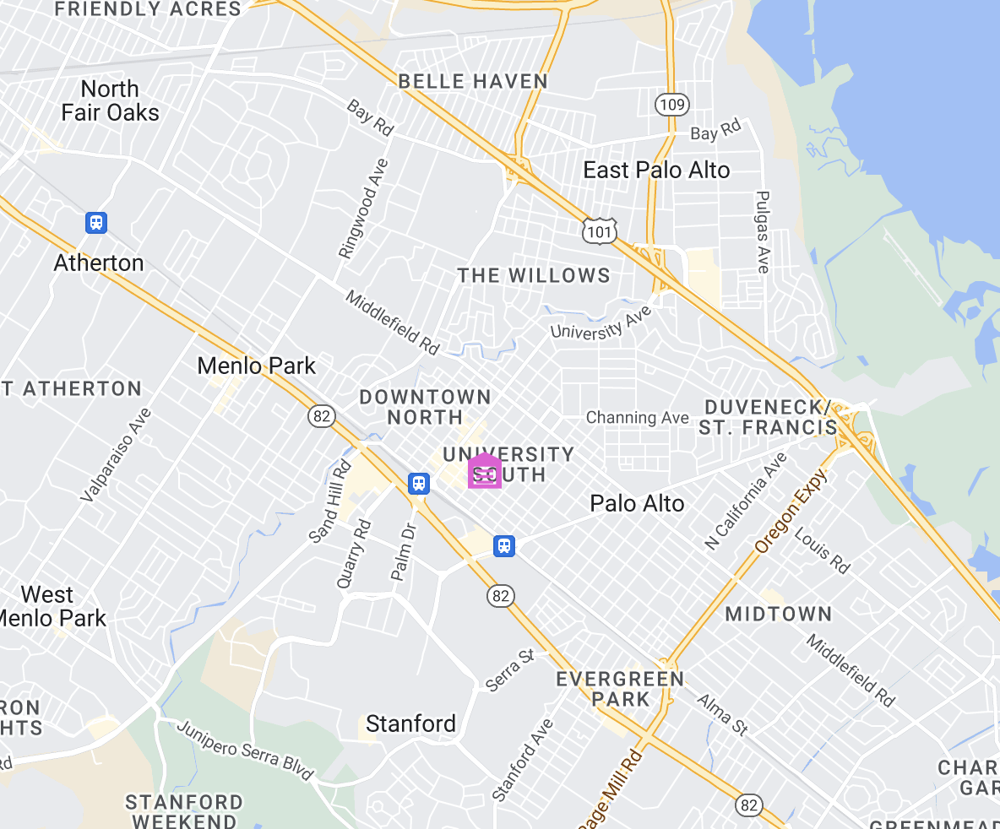
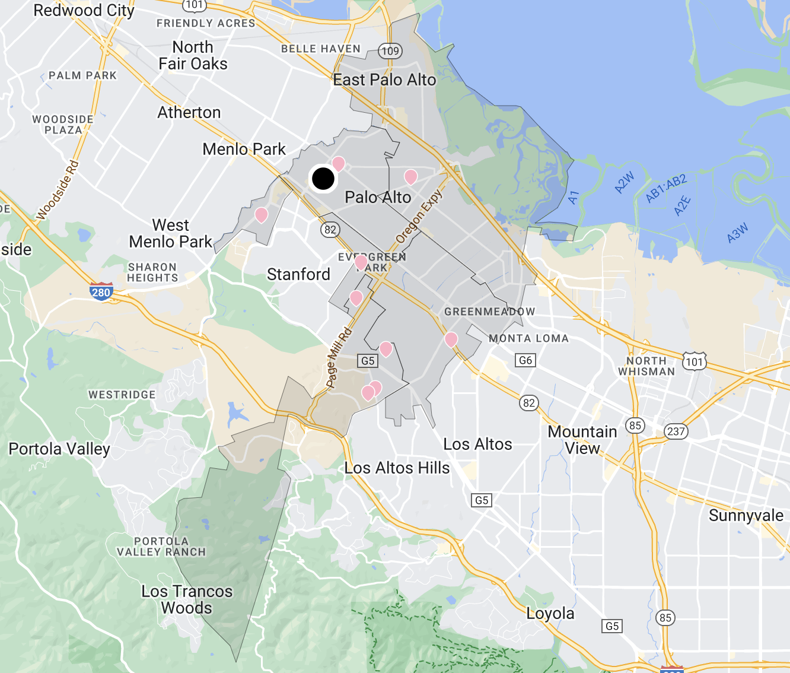

# Vehicles routing optimization with assignee minimum stops

Sometimes we would want our vehicles to have a minimum stops constraint that we would want each vehicle to visit,
and here's the tutorial for how we configure for this use case.

## Table of contents
- [Vehicles routing optimization with customized assignee location](#vehicles-routing-optimization-with-assignee-minimum-stops-constraints)
    - [Table of contents](#table-of-contents)
    - [Create the data](#create-the-data)
        - [Create a warehouse](#create-a-warehouse)
        - [Create a route](#create-a-route)
        - [Add stops to the route](#add-stops-to-the-route)
        - [Configure assignees](#configure-assignees)
        - [Run stateless DRO](#run-stateless-dro)


## Create the data
### Create a warehouse

**Request example**

```
POST https://isp.beans.ai/enterprise/v1/lists/warehouses
```

**Request Body**
- It is important to set list_warehouse_id to a value that is unique within your account.
```json
{
  "warehouse": [
    {
      "name": "Marathon",
      "listWarehouseId": "a13mzgslg8w9ngaw1h8r13",
      "address": "248 Homer Ave, Palo Alto, CA, United States"
    }
  ]
}
```

**Note**: Your account_buid, list_warehouse_id, address will be different from the example.

### Create a route

A grouping Route is not required for optimization, but it is a convenient way to 'bucket' stops that will be optimized.

**Request example**

```
POST https://isp.beans.ai/enterprise/v1/lists/routes
```

**Body**
- It is important to set list_route_id to a value that is unique within your account
- It is important to configure date_str with the yyyy-MM-dd format
```json
{
    "route":[
        {
            "name": "Via 101",
            "list_route_id": "134bgemjfdlp8k8cva8cx13",
            "status": "OPEN",
            "date_str": "2031-01-01",
            "warehouse":
            {
                "list_warehouse_id": "a13mzgslg8w9ngaw1h8r13"
            }
        }
    ]
}
```

**Note**: Your list_warehouse_id, list_route_id will be different from the example

Here's a visualization of the route with the warehouse




### Add stops to the route

**Request example**

```
POST https://isp.beans.ai/enterprise/v1/lists/items
```

**Request Body**
Please see the full payload at [assets/stops.json](assets/stops.json) which contains 9 stops.
- An important thing to note is that each stop contains the route reference to the route that was created above with route id `74d63f25-664e-4846-bb8d-a6c725fb5311`

Here's a visualization of the stops.

