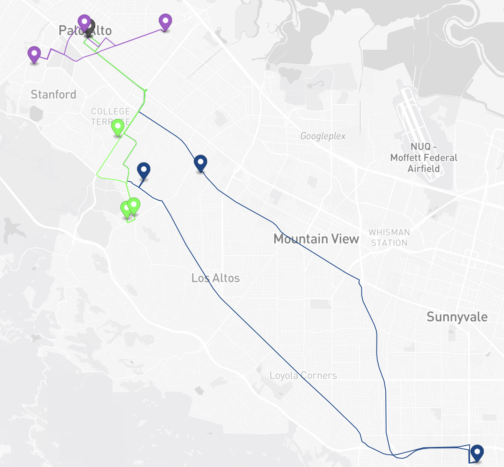
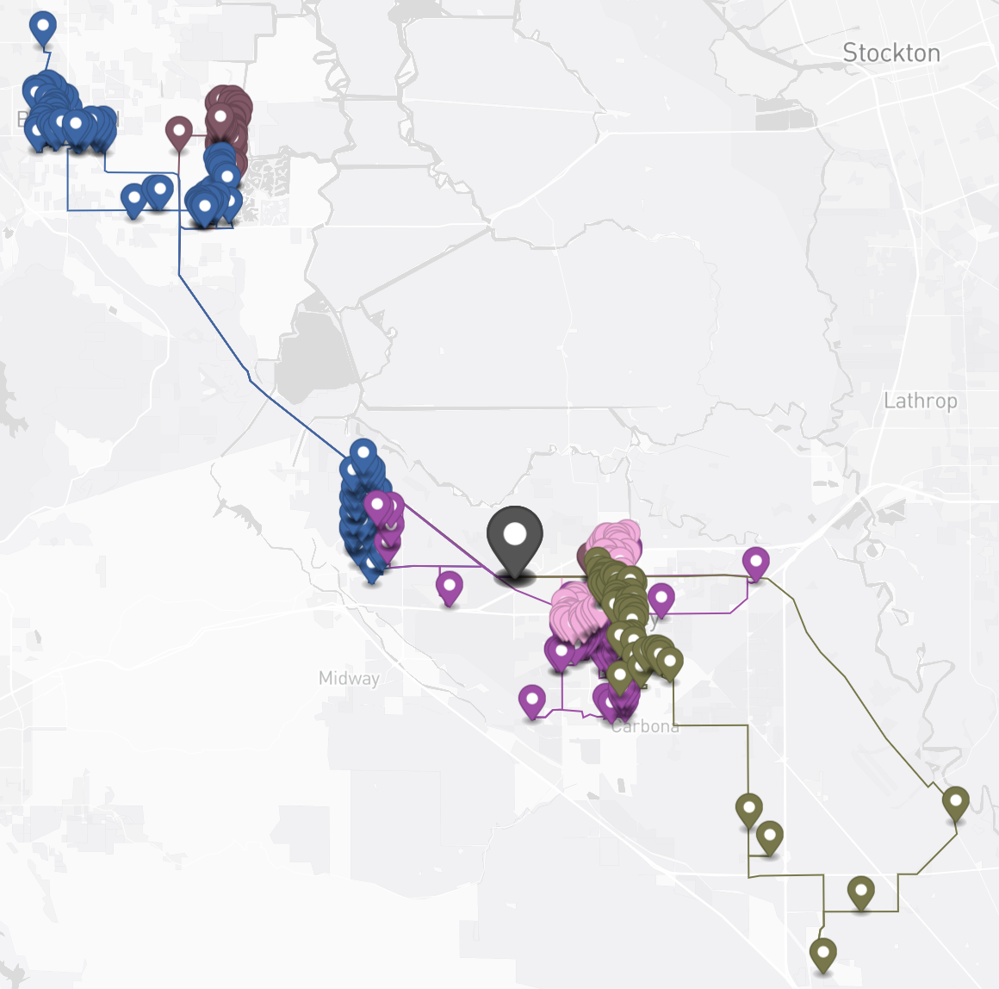

# Vehicles routing optimization with assignee minimum stops

Sometimes we would want our vehicles to adhere to a minimum number of stops; this tutorial will guide you through configuring this constraint.

## Table of contents
- [Vehicles routing optimization with assignee minimum stops](#vehicles-routing-optimization-with-assignee-minimum-stops-constraints)
    - [Table of contents](#table-of-contents)
    - [Create the data](#create-the-data)
        - [Create a warehouse](#create-a-warehouse)
        - [Create a route](#create-a-route)
        - [Add stops to the route](#add-stops-to-the-route)
        - [Configure assignees](#configure-assignees)
        - [Run stateless DRO](#run-stateless-dro)


## Create the data
### Create a warehouse

**Request example**

```
POST https://isp.beans.ai/enterprise/v1/lists/warehouses
```

**Request Body**
- It is important to set listWarehouseId to a value that is unique within your account.
```json
{
  "warehouse": [
    {
      "name": "Marathon",
      "listWarehouseId": "a13mzgslg8w9ngaw1h8r13",
      "address": "248 Homer Ave, Palo Alto, CA, United States"
    }
  ]
}
```

**Note**: Your account_buid, list_warehouse_id, address will be different from the example.

### Create a route

A grouping Route is not required for optimization, but it is a convenient way to 'bucket' stops that will be optimized.

**Request example**

```
POST https://isp.beans.ai/enterprise/v1/lists/routes
```

**Body**
- It is important to set list_route_id to a value that is unique within your account
- It is important to configure date_str with the yyyy-MM-dd format
```json
{
    "route":[
        {
            "name": "Via 101",
            "list_route_id": "134bgemjfdlp8k8cva8cx13",
            "status": "OPEN",
            "date_str": "2031-01-01",
            "warehouse":
            {
                "list_warehouse_id": "a13mzgslg8w9ngaw1h8r13"
            }
        }
    ]
}
```

**Note**: Your list_warehouse_id, list_route_id will be different from the example

### Add stops to the route

**Request example**

```
POST https://isp.beans.ai/enterprise/v1/lists/items
```

**Request Body**
Please see the full payload at [assets/stops.json](assets/stops.json) which contains 10 stops.
- An important thing to note is that each stop contains the route reference to the route that was created above with route id `134bgemjfdlp8k8cva8cx13`

Here's a visualization of the stops.


### Configure assignees

**Request example**

```
POST https://isp.beans.ai/enterprise/v1/lists/assignees
```

```json
{
  "assignee": [
    {
      "list_assignee_id": "6b3f-be278c75-1",
      "name": "Achilles I"
    },
    {
      "list_assignee_id": "6b3f-be278c75-2",
      "name": "Achilles II"
    },
    {
      "list_assignee_id": "6b3f-be278c75-3",
      "name": "Achilles III"
    }
  ]
}
```

**Note**: Your list_assignee_id(s) will be different from the example.


### Run stateless DRO

There are 2 ways that can be used in conjunction to set the minimum stops that each assignee must visit
1) Configure vehicle's min stops for each assignee

```json
    "assignee_with_vehicle": [
        {
            "list_assignee_id": "6b3f-be278c75-1",
            "capacity": 100,
            "assignee_min_stops": 3
        },
        {
            "list_assignee_id": "6b3f-be278c75-2",
            "capacity": 100,
            "assignee_min_stops": 3
        },
        {
            "list_assignee_id": "6b3f-be278c75-3",
            "capacity": 100,
        }
    ],
```
2) Configure the default assignee min stops from the main dro request
```json
{
  "items": [...],
  "assignee_with_vehicle": [...],
  "warehouse": {...},
  ....
  "default_assignee_min_stops": 3
}
      
```

- <b>default_assignee_min_stops</b>: int, non-negative value to set the minimum number of stops
specified in the vehicle, and if negative or if the field is not set, it will be defaulted to 0.

- <b>assignee_min_stops</b>: int, non-negative value to set the minimum number of stops
specified in the vehicle, and if negative, it will be defaulted to 0. 
If 0 or if the field not set, it will take the value of the default_assignee_min_stops.

**Request example**

```
POST https://isp.beans.ai/enterprise/v1/dro/run 
```
**Request Body**

Please see the full payload at [assets/stateless-dro-request](assets/stateless-dro-request.json)

Here is a visualization of the response, where the 10 stops have been split across the 3 vehicles,
that each have a minimum of 3 stops each.



**Response**

Please see the full response at [assets/stateless-dro-response](assets/stateless-dro-response.json)

**Request example 2**

Please see the full payload at [assets/stateless-dro-request_2](assets/stateless_dro_request_2.json)

Here is a visualization of the response, where the 359 stops have been split across the 5 vehicles,
that each have a minimum of 60 stops each.



**Response**

Please see the full response at [assets/stateless-dro-response_2](assets/stateless_dro_response_2.json)
