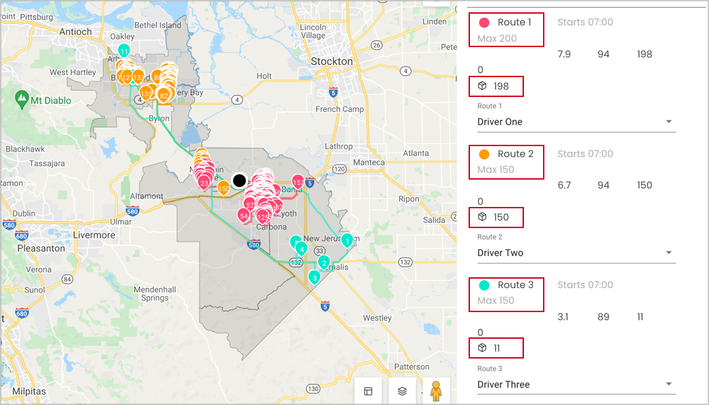

# Vehicles routing optimization with capacity constraint

For optimizing routes for vehicles, sometimes each one might have different capacity limitations.

This is an example of how to consume 359 packages by 5 drivers/vehicles without exceeding the capacity as soon as possible with DRO.

## Table of contents
- [Create the data](#create-the-data)
  - [Create a warehouse](#create-a-warehouse)
  - [Create a route](#create-a-route)
  - [Add stops to the route](#add-stops-to-the-route)
  - [Configure assignees](#configure-assignees)
- [Run stateless DRO](#run-stateless-dro)


## Create the data
### Create a warehouse

**Request example**

```
curl -k -H 'Authorization: <token>' https://isp.beans.ai/enterprise/v1/lists/warehouses -XPOST -d '{"warehouse":[{"list_warehouse_id":"d0686fa0-c24b-40c1-b81f-0615bfa3718a","address":"5655 Hood Way, Tracy, CA 95377"}]}'
```

- It is important to set list_warehouse_id that is unique in your account.

```json
{
  "warehouse": [
    {
      "listWarehouseId": "cabb46d6-776a-11ec-90d6-0242ac120003",
      "accountBuid": "{{your-account-buid}}",
      "address": "5655 Hood Way, Tracy, CA 95377"
    }
  ]
}
```

**Note**: Your account_buid, list_warehouse_id, address would be differ.

### Create a route

A grouping Route, although isn't required for optimization, is a convenient bucket to gather
stops to be optimized.

**Request example**

```
curl -k -H 'Authorization: <token>' -X POST 'https://isp.beans.ai/enterprise/v1/lists/routes' -d '{"route":[{"name":"Tutorial Route A","warehouse":{"list_warehouse_id":"cabb46d6-776a-11ec-90d6-0242ac120003"},"list_route_id":"bd17f760-e214-45e1-b8a6-787f8292724f","status":"OPEN","date_str":"2023-01-10"}]}'
```

- It is important to set the list_route_id that is unique in your account
- It is important to confgure the date_str with yyyy-MM-dd format

```json
{
    "route":[
        {
            "name": "Tutorial Route A",
            "warehouse":
            {
                "list_warehouse_id": "cabb46d6-776a-11ec-90d6-0242ac120003"
            },
            "list_route_id": "bd17f760-e214-45e1-b8a6-787f8292724f",
            "status": "OPEN",
            "date_str": "2023-01-10"
        }
    ]
}
```

**Note**: Your list_warehouse_id, list_route_id would be differ.

### Add stops to the route

**Request example**

```
curl -k -H 'Authorization: <token>' https://isp.beans.ai/enterprise/v1/lists/items -XPOST --data '@assets/stops.json'
```

- You will find file [assets/stops.json](assets/stops.json) containing 359stops in couples of cities in Califonia

- An important thing to note is that each stop contains the route reference to the route that was created above with route id `bd17f760-e214-45e1-b8a6-787f8292724f`

Here's a visualization of the stops with a warehouse ( the big black dot in the middle ) we just created.


### Configure assignees

Here's an example of configuring five assignees (drivers)

**Request example**

You can see the example data at [assets/assignees.json](assets/assignees.json)

```
curl -k -H 'Authorization: <token>' https://isp.beans.ai/enterprise/v1/lists/assignees -XPOST --data '@assets/assignees.json'
```

- list_assignee_id should be unique in your account.

```json
{
  "assignee": [
    {
      "list_assignee_id": "tu1-tutorial-driver-1",
      "name": "Driver One"
    },
    {
      "list_assignee_id": "tu1-tutorial-driver-2",
      "name": "Driver Two"
    },
    {
      "list_assignee_id": "tu1-tutorial-driver-3",
      "name": "Driver Three"
    },
    {
      "list_assignee_id": "tu1-tutorial-driver-4",
      "name": "Driver Four"
    },
    {
      "list_assignee_id": "tu1-tutorial-driver-5",
      "name": "Driver Five"
    }
  ]
}
```

**Note**: Your list_assignee_id should be differ.

### Run stateless DRO

**The Simple Scenario consists of**

- 359 stops from the Route `bd17f760-e214-45e1-b8a6-787f8292724f` above
- Up to 5 drivers (where optimization may not use all of them)
- Each driver has up to 6 hours of shift time
- Starting and Ending location can be flexible
- Each driver's package maximum capacity

The respective configurations for the above is at [assets/stateless-dro-request](assets/stateless-dro-request.json)  where the partial configuration is

```json
  "default_shift_start_time": "07:00",
  "default_shift_length": 6,
  "default_capacity": 0,
  "default_stop_time_seconds": 60,
  "default_dropoff_time_seconds": 60,
  "default_pickup_time_seconds": 60
```

Configure each driver's maximum capacity.

```json
    "assignee_with_vehicle":
    [
        {
            "list_assignee_id": "tu1-tutorial-driver-1",
            "capacity": 200
        },
        {
            "list_assignee_id": "tu1-tutorial-driver-2",
            "capacity": 150
        },
        {
            "list_assignee_id": "tu1-tutorial-driver-3",
            "capacity": 150
        },
        {
            "list_assignee_id": "tu1-tutorial-driver-4",
            "capacity": 50
        },
        {
            "list_assignee_id": "tu1-tutorial-driver-5",
            "capacity": 50
        }
    ],
```

**Request example**

```
curl -k -H 'Authorization: <token>' https://isp.beans.ai/enterprise/v1/dro/run -X POST --data '@assets/stateless-dro-request.json'
```

**Note**: the above assumes that the file `assets/stateless-dro-request.json` is relative to where the cURL is run. The `--data '@xxx'` option instructed cURL to read the file as the body of the POST request.

**Response**
You can find the sample response at [assets/stateless-dro-response.json](assets/stateless-dro-response.json) where you can see the result with multiple segments ( assignee with packages )

The following is an visualized result of DRO, all 359 stops have been assigned to three drivers with different routes, 
and each of them is within the maximum capacity.

- Route 1 - 198 packages
- Route 2 - 150 packages
- Route 3 - 11 packages




