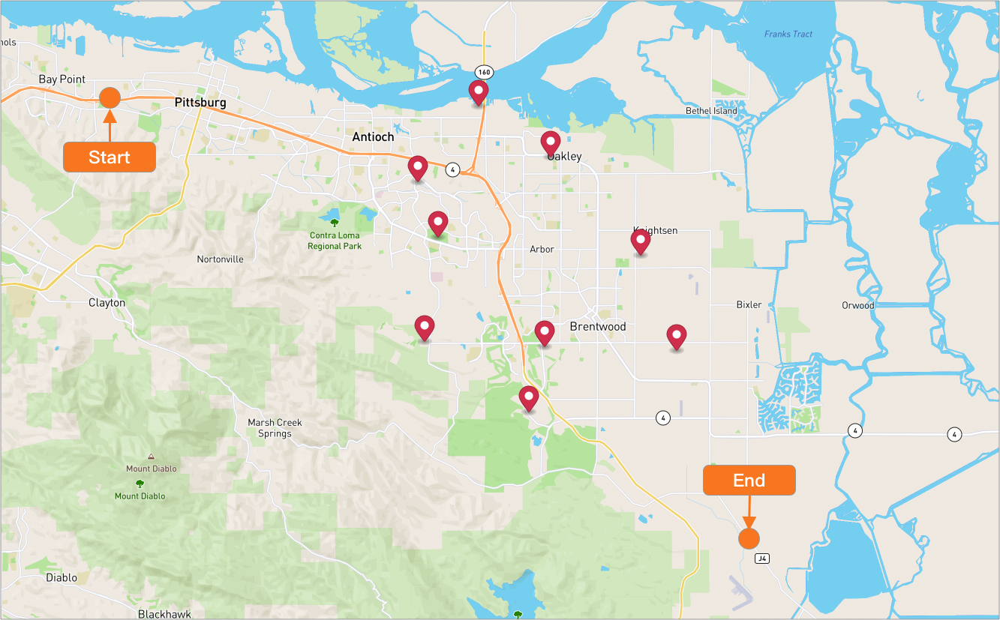
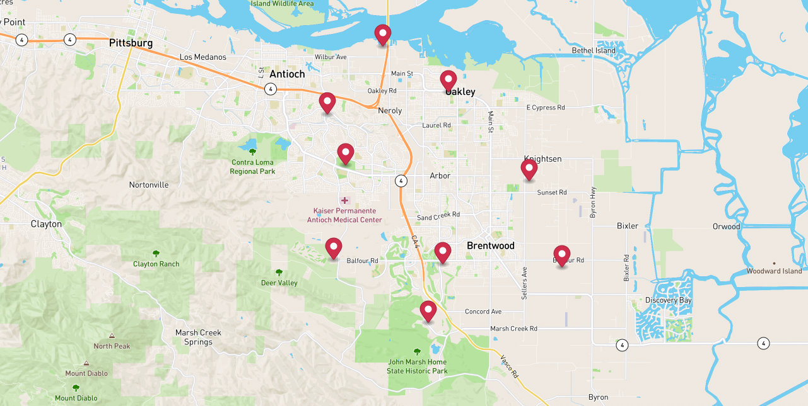
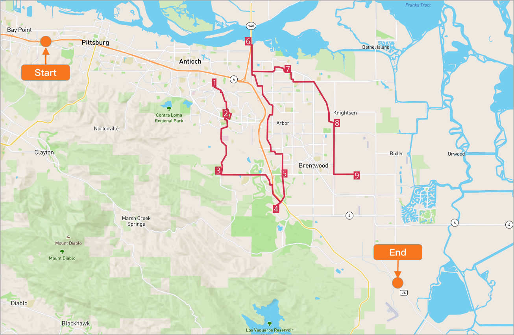

# Vehicles routing optimization with customized assignee location


Sometimes our assignees won't start nor end at the warehouse, and here's the tutorial for how we configure for this use case.

## Table of contents
- [Vehicles routing optimization with customized assignee location](#vehicles-routing-optimization-with-customized-assignee-location)
  - [Table of contents](#table-of-contents)
  - [Create the data](#create-the-data)
    - [Create a warehouse](#create-a-warehouse)
    - [Create a route](#create-a-route)
    - [Add stops to the route](#add-stops-to-the-route)
    - [Configure assignees](#configure-assignees)
    - [Run stateless DRO](#run-stateless-dro)


## Create the data
### Create a warehouse

**Request example**

```
POST https://isp.beans.ai/enterprise/v1/lists/warehouses
```

**Request Body**
- It is important to set list_warehouse_id to a value that is unique within your account.
```json
{
  "warehouse": [
    {
      "name": "Thermopylae",
      "listWarehouseId": "6f4f7bf9-b878-4eda-b01d-17dfcfcdadc3",
      "address": "2550 S Tracy Blvd, Tracy, CA 95376, United States"
    }
  ]
}
```

**Note**: Your account_buid, list_warehouse_id, address will be different from the example.

### Create a route

A grouping Route is not required for optimization, but it is a convenient way to 'bucket' stops that will be optimized.

**Request example**

```
POST https://isp.beans.ai/enterprise/v1/lists/routes
```

**Body**
- It is important to set list_route_id to a value that is unique within your account
- It is important to configure date_str with the yyyy-MM-dd format
```json
{
    "route":[
        {
            "name": "Via Emilia 74d63",
            "list_route_id": "74d63f25-664e-4846-bb8d-a6c725fb5311",
            "status": "OPEN",
            "date_str": "2031-02-21",
            "warehouse":
            {
                "list_warehouse_id": "6f4f7bf9-b878-4eda-b01d-17dfcfcdadc3"
            }
        }
    ]
}
```

**Note**: Your list_warehouse_id, list_route_id will be different from the example

### Add stops to the route

**Request example**

```
POST https://isp.beans.ai/enterprise/v1/lists/items
```

**Request Body**
Please see the full payload at [assets/stops.json](assets/stops.json) which contains 9 stops.
- An important thing to note is that each stop contains the route reference to the route that was created above with route id `74d63f25-664e-4846-bb8d-a6c725fb5311`

Here's a visualization of the stops.



### Configure assignees

**Request example**

```
POST https://isp.beans.ai/enterprise/v1/lists/assignees
```

```json
{
  "assignee": [
    {
      "list_assignee_id": "6b3f-0a3889d0-a756",
      "name": "Mercury I"
    }
  ]
}
```

**Note**: Your list_assignee_id will be different from the example.

### Run stateless DRO


**The Simple Scenario consists of**
- 9 stops from the above Route `bd17f760-e214-45e1-b8a6-787f8292724f`
- The assignee will driver star from the left and end at the right.

The configurations for above are in [assets/stateless-dro-request](assets/stateless-dro-request.json) while the partial configuration is:

```json
    "default_shift_start_time": "07:00",
    "default_shift_length": 8,
    "default_capacity": 0,
    "default_stop_time_seconds": 60,
    "use_assignees_start_address": true,
    "use_assignees_end_address": true
```

Configure driver's start & end location.

```json
    "assignee_with_vehicle": [
        {
            "list_assignee_id": "6b3f-be278c75",
            "capacity": 20,
            "saddress": "1309 San Juan Ave, Stockton, CA 95203, United States",
            "sposition": {
                "lat": 37.961097341946974,
                "lng": -121.32272899127663
            },
            "eaddress": "1500 Solano Ave, Albany, CA 94707, United States",
            "eposition": {
                "lat": 37.89145810477322,
                "lng": -122.28657757517325
            }
        }
    ],
```

**Request example**

```
POST https://isp.beans.ai/enterprise/v1/dro/run 
```
**Request Body**

Please see the full payload at [assets/stateless-dro-request](assets/stateless-dro-request.json)

**Response**

You can find the sample response at [assets/stateless-dro-response.json](assets/stateless-dro-response.json) You can see the result with multiple segments ( assignee with stops )

Here's a visualization of the result

As we can see, the fist stop is on the left where is near the assignee's start location and the last stop is close to the assignee's end location.



