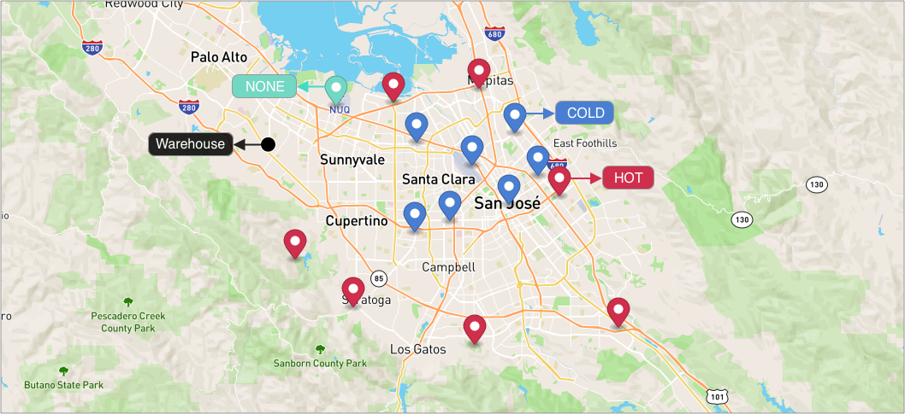
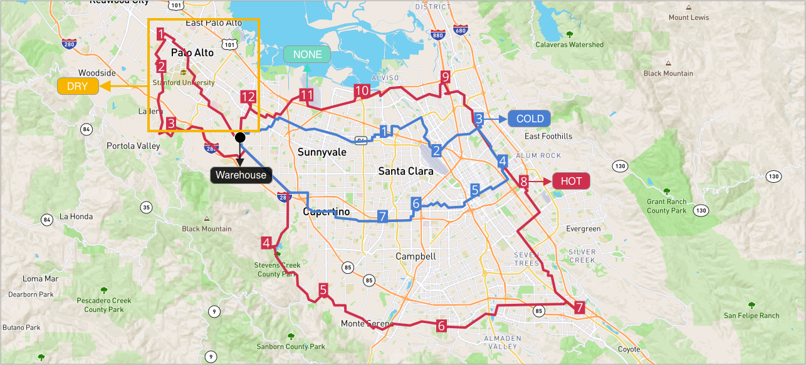

# Vehicles routing optimization with flavors


## Table of contents
- [Create the data](#create-the-data)
  - [Create a warehouse](#create-a-warehouse)
  - [Create a route](#create-a-route)
  - [Add stops to the route](#add-stops-to-the-route)
  - [Configure Assignees](#configure-assignees)
  - [Configure AssigneeVehicles](#configure-AssigneeVehicles)
- [Run stateless DRO](#run-stateless-dro)
- [Apply DRO](#apply-dro)
- [Run stateful DRO](#run-stateful-dro)
- [About Flavors](#about-flavors)


## Create the data
### Create a warehouse

**Request example**

```
curl -k -H 'Authorization: <token>' https://isp.beans.ai/enterprise/v1/lists/warehouses -XPOST -d '{"warehouse":[{"name":"Pompeii","listWarehouseId":"fb364c4a-abe5-40d0-a846-63ae4364f0cd","address":"100 State St, Los Altos, CA 94022, United States"}]}'
```

- It is important to set list_warehouse_id that is unique in your account.

```json
{
  "warehouse": [
    {
      "name": "Pompeii",
      "listWarehouseId": "fb364c4a-abe5-40d0-a846-63ae4364f0cd",
      "address": "100 State St, Los Altos, CA 94022, United States"
    }
  ]
}
```

**Note**: Your list_warehouse_id and address would be different.

### Create a route

A grouping Route, although isn't required for optimization, is a convenient bucket to gather
stops to be optimized.

**Request example**

```
curl -k -H 'Authorization: <token>' -X POST 'https://isp.beans.ai/enterprise/v1/lists/routes' -d '{"route":[{"name":"Via Sacra","list_route_id":"4a8009b1-d9f7-4e02-b656-24108cc8ac7f","status":"OPEN","date_str":"2023-02-21","warehouse":{"list_warehouse_id":"fb364c4a-abe5-40d0-a846-63ae4364f0cd"}}]}'
```

- It is important to set the list_route_id that is unique in your account
- It is important to configure the date_str with a yyyy-MM-dd format

```json
{
    "route":[
        {
            "name": "Via Sacra",
            "list_route_id": "c44becb4-a4c4-4fe1-a4e7-722190f5d604",
            "status": "OPEN",
            "date_str": "2023-02-21",
            "warehouse":
            {
                "list_warehouse_id": "fb364c4a-abe5-40d0-a846-63ae4364f0cd"
            }
        }
    ]
}
```

**Note**: Your list_warehouse_id, list_route_id would be different.

### Add stops to the route

**Request example**

```
curl -k -H 'Authorization: <token>' https://isp.beans.ai/enterprise/v1/lists/items -XPOST --data '@assets/stops.json'
```

```json
{
    "item":
    [
    	  ......
    	  
        {
            "list_item_id": "4a80-2fd6f3f3ab12cebdddb97ca0f",
            "address": "13100 Montebello Rd, Cupertino, CA 95014, United States",
            "route":
            {
                "list_route_id": "c44becb4-a4c4-4fe1-a4e7-722190f5d604"
            },
            "type": "DROPOFF",
            "flavors":"HOT"
        },
        {
            "list_item_id": "4a80-fae5d3b6b9c9f2f1a14c43b0a1",
            "address": "2732 Augustine Dr Ste 1600, Santa Clara, CA 95054, United States",
            "route":
            {
                "list_route_id": "c44becb4-a4c4-4fe1-a4e7-722190f5d604"
            },
            "type": "DROPOFF",
            "flavors":"COLD"
        },
        
        ......
        
        {
            "list_item_id": "ca8d-fae5d3b6b9c9f2f1a14c43b0a8",
            "address": "158 Cody Rd, Mountain View, CA 94043, United States",
            "route":
            {
                "list_route_id": "c44becb4-a4c4-4fe1-a4e7-722190f5d604"
            },
            "type": "DROPOFF",
            "flavors":""
        }
    ]
}
```

- You can see the payload detail here [assets/stops.json](assets/stops.json) which contains 15 stops which 7 have a HOT flavor, 7 have a COLD flavor and 1 with empty flavor.
- An important thing to note is that each stop contains the route reference to the route that was created above with route id `c44becb4-a4c4-4fe1-a4e7-722190f5d604`

Here's a visualization of the result, black dot warehouse, blue stops with COLD flavor, red stops with HOT flavor and green stop without any flavor.



### Configure Assignees

To configure two drivers for delivery.

**Request**

```
curl -k -H 'Authorization: <token>' https://isp.beans.ai/enterprise/v1/lists/assignees -XPOST -d '{"assignee":[{"list_assignee_id":"ca8d-0a3889d0-a756","name":"Proximo"},{"list_assignee_id":"ca8d-f6908a1b","name":"Maximus"}]}'
```

- list_assignee_id should be unique in your account.

```json
{
  "assignee": [
    {
      "list_assignee_id": "ca8d-0a3889d0-a756",
      "name": "Proximo"

    },
    {
      "list_assignee_id": "ca8d-f6908a1b",
      "name": "Maximus"
    }
  ]
}
```

**Note**: Your list_assignee_id should be different.

### Configure AssigneeVehicles
Let's configure two vehicles for delivery.

```json
{
    "vehicle":
    [
        {
            "listAssigneeId": "ca8d-0a3889d0-a756"
        },
        {
            "listAssigneeId": "ca8d-f6908a1b"
        }

    ]
}
```

**Note**: Your listAssgineeId should be different.

### Run stateless DRO

**The Simple Scenario consists of**

- 15 stops from the Route `c44becb4-a4c4-4fe1-a4e7-722190f5d604` above
- One vehicle is able to deliver HOT, DRY packages
- One vehicle is able to deliver COLD packages

The full configurations are at [assets/stateless-dro-request](assets/stateless-dro-request.json) where the partial configuration is 

```json
"assignee_with_vehicle": [
    {
        "list_assignee_id": "ca8d-0a3889d0-a756",
        "flavors": "HOT,DRY"
    },
    {
        "list_assignee_id": "ca8d-f6908a1b",
        "flavors": "COLD"
    }
]
```

**Request example**

```
curl -k -H 'Authorization: <token>' https://isp.beans.ai/enterprise/v1/dro/run -X POST --data '@assets/stateless-dro-request.json'
```

**Note**: the above assumes that the file `assets/stateless-dro-request.json` is relative to where the cURL is run. 

**Response example**

You can find the sample response at [assets/stateless-dro-response.json](assets/stateless-dro-response.json) where you can see the result with multiple segments ( assignee with packages )

Here's a visualization of the result, as we can see, the packages have been devided into two routes

- Blue Route for delivering cold packages
- Gray Route for delivering Hot packages
- The stop (ca8d-fae5d3b6b9c9f2f1a14c43b0a8) without any flavors has also been assigned to the blue route.


### Apply DRO
**Request example**
```
curl -k -H 'Authorization: <token>' https://isp.beans.ai/enterprise/v1/dro/apply -X POST --data '@assets/apply-stateless-dro-request.json'
```
**Note**: 
- The above assumes that the file `assets/apply-stateless-dro-request.json` is relative to where the cURL is run. 
- The example payload can be found at [apply-stateless-dro-request.json](assets/apply-stateless-dro-request.json)

**Result**

After we got the successful response, we will see two new routes which have been assigned with packages according to the flavors constraints.


### Run stateful DRO
Now let's try to add 4 stops with flavor DRY
and run the stateful DRO with the generated routes.


**Request example**
```
curl -k -H 'Authorization: <token>' https://isp.beans.ai/enterprise/v1/dro/run-stateful -X POST --data '@assets/stateful-dro-request.json'
```
**Notes**:
- The above assumes that the file `assets/stateful-dro-request.json` is relative to where the cURL is run. 
- The example payload can be found at [stateful-dro-request.json](assets/stateful-dro-request.json)

**Result**
Here's a visualization of result.
- Stops with flavors HOT and DRY have been assigned to ListVehicle which has flavors "HOT,DRY"
- Stops with flavors COLD have been assigned to ListVehicle which has flavors "COLD"
- And the Stop with empty flavors has also been assigned to the vehicle according to the algorithm



so, if we are satisfied with the result, we can do apply with the response like we did above.

### About flavors
Both ListItem and AssigneVehicles are supporting multiple flavors with a comma separated list.

AssigneeVehicle Example

```json
{
    "list_assignee_id": "ca8d-f6908a1b",
    "flavors": "COLD,HOT,FRAGILE"
}
```
So if the AssigneeVehicle has flavors of cold, hot, fragile means it can support
- ListItem with COLD flavors
- ListItem with HOT and FRAGILE flavors

But if there is a ListItem with flavor "LIQUID" in the DRO request with which no AssigneeVehicle can fit, the algorithm will return a failure result.

