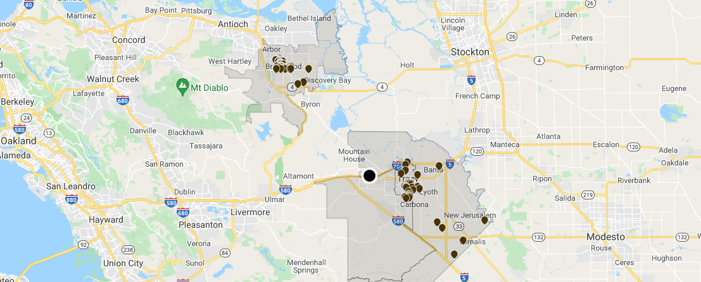
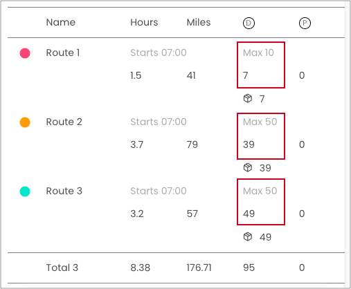
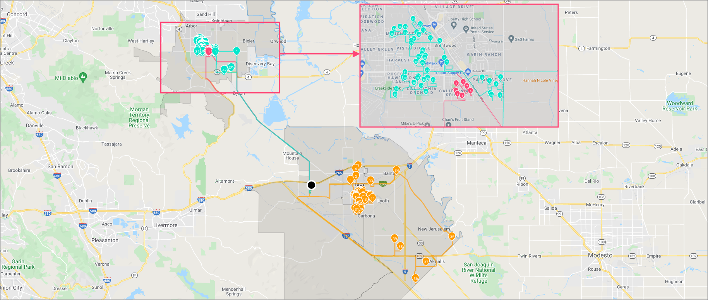

# Vehicles routing optimization with floating drivers



Businesses need to be flexible to adapt to rapid changes in their staffing. They also sometimes need to plan in advance, without assigning any one specific driver to a task.

Let's assume that we've received a manifest of 95 packages to-be-delivered for the day, along with 3 drivers who will work for 4 hours a day, and 3 trucks with different capacities.

- Car One - capacity of 10
- Car Two - capacity of 50
- Car Three - capacity of 50
- Three drivers - each works 4 hours a day.


## Table of contents
- [Vehicles routing optimization with floating drivers](#vehicles-routing-optimization-with-floating-drivers)
  - [Table of contents](#table-of-contents)
  - [Create the data](#create-the-data)
    - [Create a warehouse](#create-a-warehouse)
    - [Create a route](#create-a-route)
    - [Add stops to the route](#add-stops-to-the-route)
    - [Run stateless DRO](#run-stateless-dro)

## Create the data
### Create a warehouse

**Request example**

```
curl -k -H 'Authorization: <token>' https://isp.beans.ai/enterprise/v1/lists/warehouses -XPOST -d '{"warehouse":[{"list_warehouse_id":"cabb46d6-776a-11ec-90d6-0242ac120003","address":"401 Superior Way, Discovery Bay, CA 94505"}]}'
```

- It is important to set list_warehouse_id to a value that is unique within your account.

```json
{
  "warehouse": [
    {
      "listWarehouseId": "cabb46d6-776a-11ec-90d6-0242ac120003",
      "accountBuid": "{{your-account-buid}}",
      "address": "401 Superior Way, Discovery Bay, CA 94505"
    }
  ]
}
```

**Note**: Your account_buid, list_warehouse_id, address will be different from the example

### Create a route

A grouping Route is not required for optimization, but it is a convenient way to 'bucket' stops that will be optimized.

**Request example**

```
curl -k -H 'Authorization: <token>' -X POST 'https://isp.beans.ai/enterprise/v1/lists/routes' -d '{"route":[{"name":"Tu Route ea29","warehouse":{"list_warehouse_id":"cabb46d6-776a-11ec-90d6-0242ac120003"},"list_route_id":"f07d7425-1776-4abc-9790-35cb1a0696aa","status":"OPEN","date_str":"2023-01-10"}]}'
```

- It is important to set list_route_id to a value that is unique within your account
- It is important to configure date_str with the yyyy-MM-dd format

```json
{
    "route":[
        {
            "name": "Tu Route 1d8e",
            "warehouse":
            {
                "list_warehouse_id": "cabb46d6-776a-11ec-90d6-0242ac120003"
            },
            "list_route_id": "f07d7425-1776-4abc-9790-35cb1a0696aa",
            "status": "OPEN",
            "date_str": "2023-01-10"
        }
    ]
}
```

**Note**: Your list_warehouse_id, list_route_id will be different from the example

### Add stops to the route

**Request example**

```
curl -k -H 'Authorization: <token>' https://isp.beans.ai/enterprise/v1/lists/items -XPOST --data '@assets/stops.json'
```

- The file [assets/stops.json](assets/stops.json) contains 95 stops in a few cities in California

- An important thing to note is that each stop contains the route reference to the route that was created above with route id `f07d7425-1776-4abc-9790-35cb1a0696aa`

Here's a visualization of the stops with a warehouse ( the big black dot in the middle ) we just created.


### Run stateless DRO

**The Simple Scenario consists of**

- 95 stops from the above Route `f07d7425-1776-4abc-9790-35cb1a0696aa`
- Three drivers/vehicles with different capacities
- Each driver's shift length is 4 hours
- Each driver will start to work at 07:00

The configurations for above are at [assets/stateless-dro-request](assets/stateless-dro-request.json) The partial configuration is:

```json
    "assignee_with_vehicle":
    [
        {
            "list_assignee_id": "extra-driver-0",
            "capacity": 10
        },
        {
            "list_assignee_id": "extra-driver-1",
            "capacity": 50
        },
        {
            "list_assignee_id": "extra-driver-2",
            "capacity": 50
        }
    ],
    "default_shift_start_time": "07:00",
    "default_shift_length": 4
```

**Request example**

```
curl -k -H 'Authorization: <token>' https://isp.beans.ai/enterprise/v1/dro/run -X POST --data '@assets/stateless-dro-request.json'
```

**Note**: The above assumes that the file `assets/stateless-dro-request.json` is relative to where cURL is run. The `--data '@xxx'` option instructs cURL to read the file as the body of the POST request.

**Response example**
You can find the sample response at [assets/stateless-dro-response.json](assets/stateless-dro-response.json) You can see the result with multiple segments ( assignee with packages )

A visualization of the assignment



A visualization of the optimized routes.




