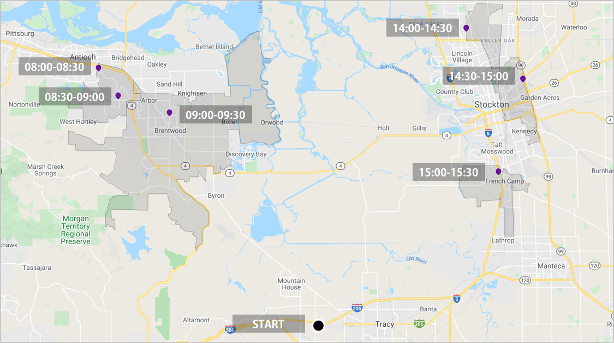
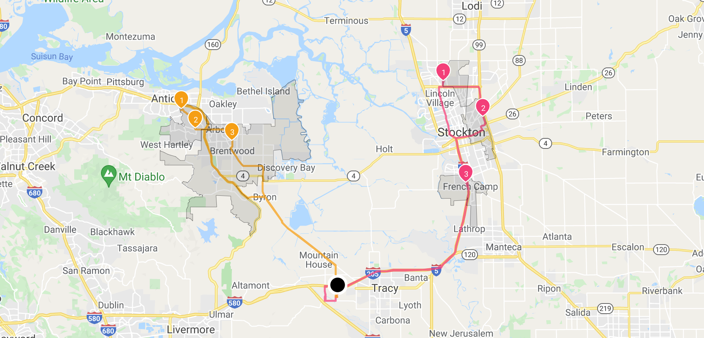

# Vehicles routing optimization with shift time



Along with the business development, we will have more and more partners working together,

then we start to schedule the working hour to keep the bussiness working effeciently.

We have talked about [packages delivering with time window](https://github.com/beansai/beans-tutorials/tree/main/dynamic-routes-optimization/vehicles-routing-optimization-with-time-windows), and in this tutorial we will include time shift factor.

Let's assume we have two drivers to deliver 6 packages which we can see from the map above.

- Driver One - Start work at 07:00 for 4 hours.
- Driver Two - Start work at 13:00 for 4 hours.
- Left side of the map - packages need to be delivered in the morning.
- Right side of the map - packages need to be delivered in the afternoon.


## Table of contents
- [Create the data](#create-the-data)
  - [Create a warehouse](#create-a-warehouse)
  - [Create a route](#create-a-route)
  - [Add stops to the route](#add-stops-to-the-route)
  - [Configure assignees](#configure-assignees)
- [Run stateless DRO](#run-stateless-dro)


## Create the data
### Create a warehouse

**Request example**

```
curl -k -H 'Authorization: <token>' https://isp.beans.ai/enterprise/v1/lists/warehouses -XPOST -d '{"warehouse":[{"list_warehouse_id":"cabb46d6-776a-11ec-90d6-0242ac120003","address":"401 Superior Way, Discovery Bay, CA 94505"}]}'
```

- It is important to set list_warehouse_id that is unique in your account.

```json
{
  "warehouse": [
    {
      "listWarehouseId": "cabb46d6-776a-11ec-90d6-0242ac120003",
      "accountBuid": "{{your-account-buid}}",
      "address": "401 Superior Way, Discovery Bay, CA 94505"
    }
  ]
}
```

**Note**: Your account_buid, list_warehouse_id, address would be differ.

### Create a route

A grouping Route, although isn't required for optimization, is a convenient bucket to gather
stops to be optimized.

**Request example**

```
curl -k -H 'Authorization: <token>' -X POST 'https://isp.beans.ai/enterprise/v1/lists/routes' -d '{"route":[{"name":"Tu Route ea29","warehouse":{"list_warehouse_id":"cabb46d6-776a-11ec-90d6-0242ac120003"},"list_route_id":"e6d3785d-ffb0-40f6-b1c4-00793bb276f1","status":"OPEN","date_str":"2023-01-10"}]}'
```

- It is important to set the list_route_id that is unique in your account
- It is important to confgure the date_str with yyyy-MM-dd format

```json
{
    "route":[
        {
            "name": "Tu Route ea29",
            "warehouse":
            {
                "list_warehouse_id": "cabb46d6-776a-11ec-90d6-0242ac120003"
            },
            "list_route_id": "e6d3785d-ffb0-40f6-b1c4-00793bb276f1",
            "status": "OPEN",
            "date_str": "2023-01-10"
        }
    ]
}
```

**Note**: Your list_warehouse_id, list_route_id would be differ.

### Add stops to the route

**Request example**

```
curl -k -H 'Authorization: <token>' https://isp.beans.ai/enterprise/v1/lists/items -XPOST --data '@assets/stops.json'
```

- You will find file [assets/stops.json](assets/stops.json) containing 9 stops in couples of cities in Califonia

- An important thing to note is that each stop contains the route reference to the route that was created above with route id `e6d3785d-ffb0-40f6-b1c4-00793bb276f1`

Here's a visualization of the stops with a warehouse ( the big black dot in the middle ) we just created.


### Configure assignees

To configure one driver for delivering.

**Request**

```
curl -k -H 'Authorization: <token>' https://isp.beans.ai/enterprise/v1/lists/assignees -XPOST -d '{"assignee":[{"list_assignee_id":"tu1-tutorial-driver-1","name":"Driver One"},{"list_assignee_id":"tu1-tutorial-driver-2","name":"Driver Two"}]}'
```

- list_assignee_id should be unique in your account.

```json
{
  "assignee": [
    {
      "list_assignee_id": "tu1-tutorial-driver-1",
      "name": "Driver One"
    },
    {
      "list_assignee_id": "tu1-tutorial-driver-2",
      "name": "Driver Two"
    }
  ]
}
```

**Note**: Your list_assignee_id should be differ.

### Run stateless DRO

**The Simple Scenario consists of**

- 6 stops from the Route `e6d3785d-ffb0-40f6-b1c4-00793bb276f1` above
- Driver shift length is 4 hours.
- Driver one start shift time at 07:00.
- Driver two start shift time at 13:00.

The respective configurations for the above is at [assets/stateless-dro-request](assets/stateless-dro-request.json)  where the partial configuration is

```json
    "assignee_with_vehicle":
    [
        {
            "list_assignee_id": "tu1-tutorial-driver-1",
            "shift_start_time": "07:00"
        },
        {
            "list_assignee_id": "tu1-tutorial-driver-2",
            "shift_start_time": "13:00"
            
        }
    ],
    "default_shift_length": 4
```

**Request example**

```
curl -k -H 'Authorization: <token>' https://isp.beans.ai/enterprise/v1/dro/run -X POST --data '@assets/stateless-dro-request.json'
```

**Note**: the above assumes that the file `assets/stateless-dro-request.json` is relative to where the cURL is run. The `--data '@xxx'` option instructed cURL to read the file as the body of the POST request.

**Response example**
You can find the sample response at [assets/stateless-dro-response.json](assets/stateless-dro-response.json) where you can see the result with multiple segments ( assignee with packages )

Here's a visualization of map, we can find the stops' visiting sequence are related to the time window and shift time.




