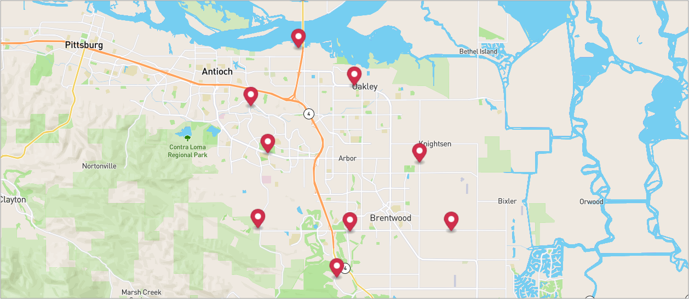
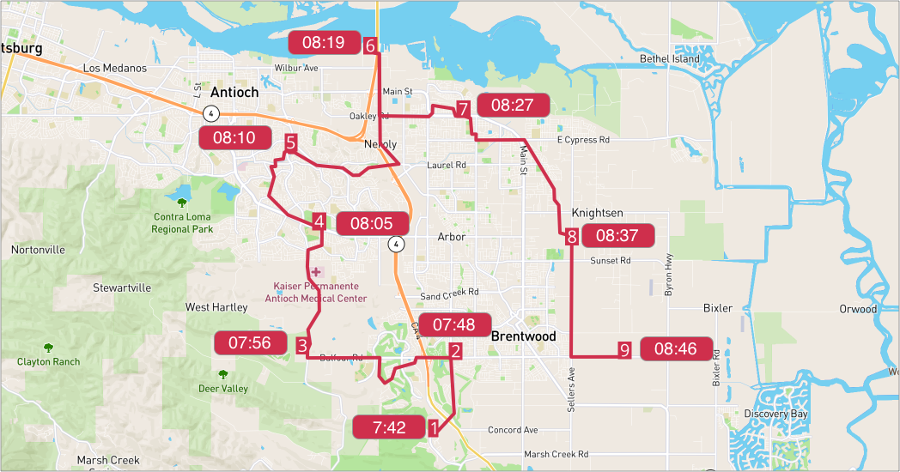

# Vehicles routing optimization with stop time

## Table of contents
- [Create the data](#create-the-data)
  - [Create a warehouse](#create-a-warehouse)
  - [Create a route](#create-a-route)
  - [Add stops to the route](#add-stops-to-the-route)
  - [Configure Assignees](#configure-assignees)
  - [Configure AssigneeVehicles](#configure-AssigneeVehicles)
- [Run stateless DRO](#run-stateless-dro)

## Create the data
### Create a warehouse

**Request example**

```
curl -k -H 'Authorization: <token>' https://isp.beans.ai/enterprise/v1/lists/warehouses -XPOST -d '{"warehouse":[{"name":"Pompeii","listWarehouseId":"fb364c4a-abe5-40d0-a846-63ae4364f0cd","address":"2550 S Tracy Blvd, Tracy, CA 95376, United States"}]}'
```

- It is important to set list_warehouse_id that is unique in your account.

```json
{
  "warehouse": [
    {
      "name": "Pompeii",
      "listWarehouseId": "fb364c4a-abe5-40d0-a846-63ae4364f0cd",
      "address": "2550 S Tracy Blvd, Tracy, CA 95376, United States"
    }
  ]
}
```

**Note**: Your list_warehouse_id and address would be different.

### Create a route

A grouping Route, although isn't required for optimization, is a convenient bucket to gather
stops to be optimized.

**Request example**

```
curl -k -H 'Authorization: <token>' -X POST 'https://isp.beans.ai/enterprise/v1/lists/routes' -d '{"route":[{"name":"Via Aurelia","list_route_id":"542489ae-8413-43fb-8206-2da499b49020","status":"OPEN","date_str":"2023-02-21","warehouse":{"list_warehouse_id":"fb364c4a-abe5-40d0-a846-63ae4364f0cd"}}]}'
```

- It is important to set the list_route_id that is unique in your account
- It is important to configure the date_str with a yyyy-MM-dd format

```json
{
    "route":[
        {
            "name": "Via Aurelia",
            "list_route_id": "542489ae-8413-43fb-8206-2da499b49020",
            "status": "OPEN",
            "date_str": "2023-02-21",
            "warehouse":
            {
                "list_warehouse_id": "fb364c4a-abe5-40d0-a846-63ae4364f0cd"
            }
        }
    ]
}
```

**Note**: Your list_warehouse_id, list_route_id would be different.

### Add stops to the route

**Request example**

```
curl -k -H 'Authorization: <token>' https://isp.beans.ai/enterprise/v1/lists/items -XPOST --data '@assets/stops.json'
```

- You can see the payload detail here [assets/stops.json](assets/stops.json) which contains 9 stops.
- An important thing to note is that each stop contains the route reference to the route that was created above with route id `542489ae-8413-43fb-8206-2da499b49020`

Here's a visualization of the result, as we can see there are red stops and a black warehouse on the map.



### Configure Assignees

To configure driver for delivery.

**Request**

```
curl -k -H 'Authorization: <token>' https://isp.beans.ai/enterprise/v1/lists/assignees -XPOST -d '{"assignee":[{"list_assignee_id":"ca8d-f6908a1b","name":"Maximus"}]}'
```

- list_assignee_id should be unique in your account.

```json
{
  "assignee": [
    {
      "list_assignee_id": "ca8d-f6908a1b",
      "name": "Maximus"
    }
  ]
}
```

**Note**: Your list_assignee_id should be different.

### Configure AssigneeVehicles
Let's configure a vehicle for delivery.

```json
{
    "vehicle":
    [
        {
            "listAssigneeId": "ca8d-f6908a1b"
        }

    ]
}
```

**Note**: Your listAssgineeId should be different.

### Run stateless DRO

**The Simple Scenario consists of**

- 9 stops from the Route `542489ae-8413-43fb-8206-2da499b49020`

The full configurations are at [assets/stateless-dro-request](assets/stateless-dro-request.json) where the partial configuration is 

```json
    "default_stop_time_seconds": 60 //seconds
```

**Request example**

```
curl -k -H 'Authorization: <token>' https://isp.beans.ai/enterprise/v1/dro/run -X POST --data '@assets/stateless-dro-request.json'
```

**Note**: the above assumes that the file `assets/stateless-dro-request.json` is relative to where the cURL is run. 

**Response example**

You can find the sample response at [assets/stateless-dro-response.json](assets/stateless-dro-response.json) where you can see the result with multiple segments ( assignee with packages )

Here's a visualization of the result.

1 - When we set stop time to 60 seconds


2 - When we set stop time to 1200 seconds
