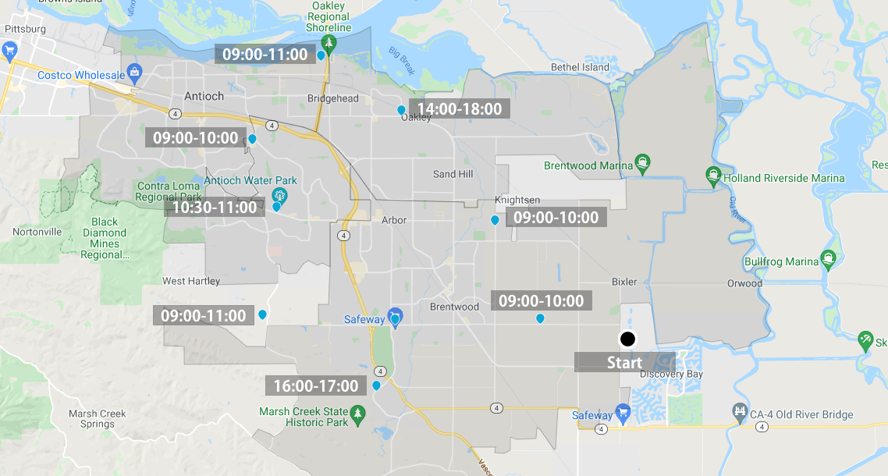
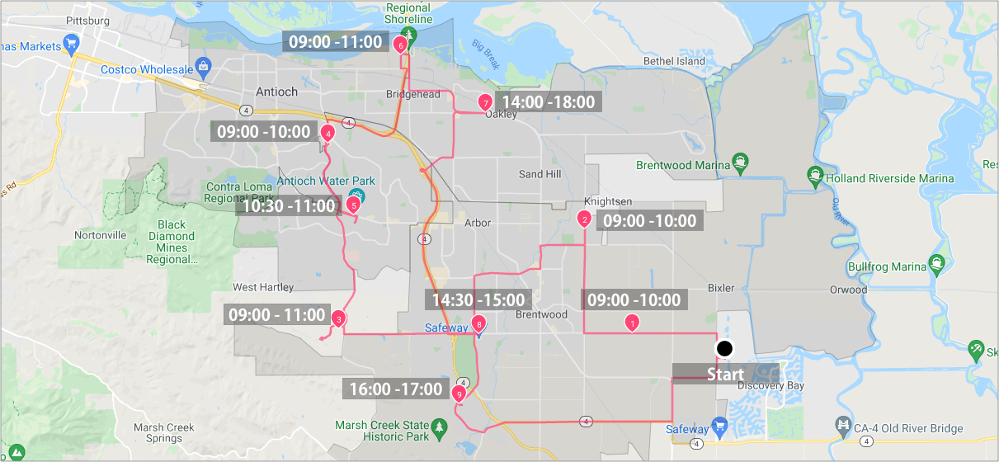

# Vehicles routing optimization with time windows



Customers have specific time window for visiting is also a common scenario of delivery service.

This is an example of how we optimize routes for vehicles to deliver packages with 9 stops which have different time window.


## Table of contents
- [Create the data](#create-the-data)
  - [Create a warehouse](#create-a-warehouse)
  - [Create a route](#create-a-route)
  - [Add stops to the route](#add-stops-to-the-route)
  - [Configure assignees](#configure-assignees)
- [Run stateless DRO](#run-stateless-dro)


## Create the data
### Create a warehouse

**Request example**

```
curl -k -H 'Authorization: <token>' https://isp.beans.ai/enterprise/v1/lists/warehouses -XPOST -d '{"warehouse":[{"list_warehouse_id":"b3dfdc19-777c-44e6-85a3-e2b9296d4ac0","address":"401 Superior Way, Discovery Bay, CA 94505"}]}'
```

- It is important to set list_warehouse_id that is unique in your account.

```json
{
  "warehouse": [
    {
      "listWarehouseId": "b3dfdc19-777c-44e6-85a3-e2b9296d4ac0",
      "accountBuid": "{{your-account-buid}}",
      "address": "401 Superior Way, Discovery Bay, CA 94505"
    }
  ]
}
```

**Note**: Your account_buid, list_warehouse_id, address would be differ.

### Create a route

A grouping Route, although isn't required for optimization, is a convenient bucket to gather
stops to be optimized.

**Request example**

```
curl -k -H 'Authorization: <token>' -X POST 'https://isp.beans.ai/enterprise/v1/lists/routes' -d '{"route":[{"name":"Tu Route ea29","warehouse":{"list_warehouse_id":"b3dfdc19-777c-44e6-85a3-e2b9296d4ac0"},"list_route_id":"ea2928e6-2548-412b-8b19-7f1043324ec3","status":"OPEN","date_str":"2023-01-10"}]}'
```

- It is important to set the list_route_id that is unique in your account
- It is important to configure the date_str with yyyy-MM-dd format

```json
{
    "route":[
        {
            "name": "Tu Route ea29",
            "warehouse":
            {
                "list_warehouse_id": "b3dfdc19-777c-44e6-85a3-e2b9296d4ac0"
            },
            "list_route_id": "ea2928e6-2548-412b-8b19-7f1043324ec3",
            "status": "OPEN",
            "date_str": "2023-01-10"
        }
    ]
}
```

**Note**: Your list_warehouse_id, list_route_id would be differ.

### Add stops to the route

**Request example**

```
curl -k -H 'Authorization: <token>' https://isp.beans.ai/enterprise/v1/lists/items -XPOST --data '@assets/stops.json'
```

- You will find file [assets/stops.json](assets/stops.json) containing 9 stops in couples of cities in Califonia

- An important thing to note is that each stop contains the route reference to the route that was created above with route id `ea2928e6-2548-412b-8b19-7f1043324ec3`

Here's a visualization of the stops with a warehouse ( the big black dot in the middle ) we just created.


### Configure assignees

To configure one driver for delivering.

**Request**

```
curl -k -H 'Authorization: <token>' https://isp.beans.ai/enterprise/v1/lists/assignees -XPOST -d '{"assignee":[{"list_assignee_id":"tu1-tutorial-driver-1","name":"Driver One"}]}'
```

- list_assignee_id should be unique in your account.

```json
{
  "assignee": [
    {
      "list_assignee_id": "tu1-tutorial-driver-1",
      "name": "Driver One"
    }
  ]
}
```

**Note**: Your list_assignee_id should be differ.

### Run stateless DRO

**The Simple Scenario consists of**

- 9 stops from the Route `ea2928e6-2548-412b-8b19-7f1043324ec3` above
- Driver shift length is 8 hours.
- Driver start shift time is 9:00
- Driver has no maximum package limitation.

The respective configurations for the above is at [assets/stateless-dro-request](assets/stateless-dro-request.json)  where the partial configuration is

```json
  "default_shift_start_time": "09:00",
  "default_shift_length": 8,
  "default_capacity": 0,
  "default_stop_time_seconds": 60,
  "default_dropoff_time_seconds": 60,
  "default_pickup_time_seconds": 60,
  "optimize_for": "DISTANCE"
```

**Request example**

```
curl -k -H 'Authorization: <token>' https://isp.beans.ai/enterprise/v1/dro/run -X POST --data '@assets/stateless-dro-request.json'
```

**Note**: the above assumes that the file `assets/stateless-dro-request.json` is relative to where the cURL is run. The `--data '@xxx'` option instructed cURL to read the file as the body of the POST request.

**Response example**
You can find the sample response at [assets/stateless-dro-response.json](assets/stateless-dro-response.json) where you can see the result with multiple segments ( assignee with packages )

Here's a visualization of map, we can find the stops' visiting sequence are related to the time window.




