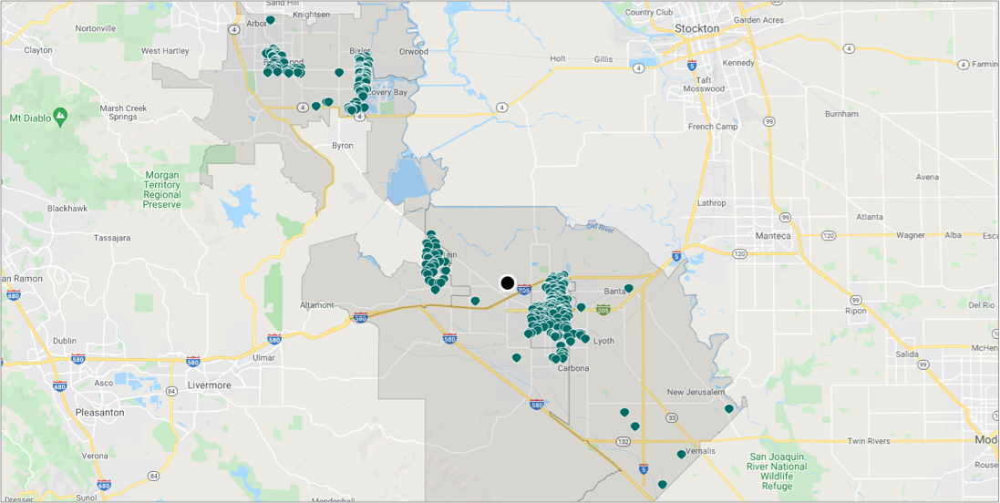
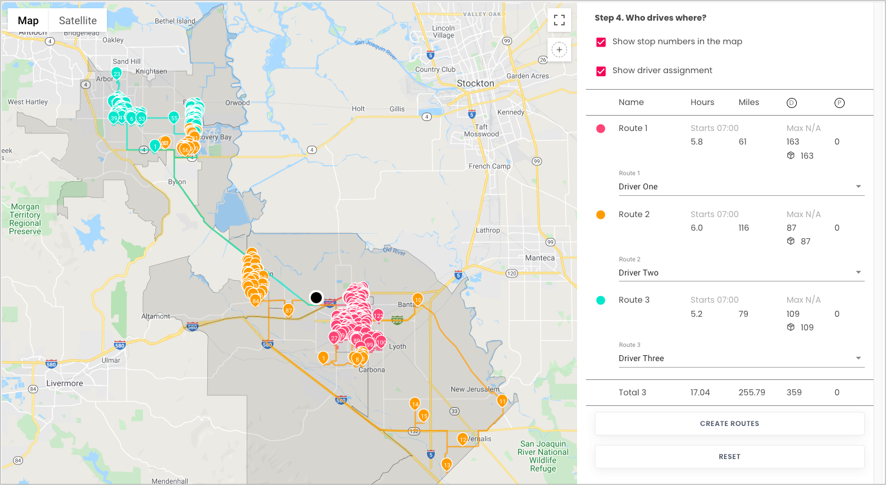

# Vehicles routing optimization



For drivers working at a logistics company, a common daily routine involves: gathering at a warehouse, loading packages onto a truck, visiting locations to pickup/dropoff packages, and returning to a warehouse after completing their stops.

Below is an example of using DRO to optimize the routes that drivers take, such that they can complete all of their deliveries as quickly as possible.

We can also see route optimizations with different constraints.

- [Capacity constraint](https://github.com/beansai/beans-tutorials/tree/main/dynamic-routes-optimization/vehicles-routing-optimization-with-capacity-constraint) determine which vehicles have maximum capacities for items they can carry.
- [Time windows](https://github.com/beansai/beans-tutorials/tree/main/dynamic-routes-optimization/vehicles-routing-optimization-with-time-windows) determine which locations need to be visited in a specfic time window.

## Table of contents
- [Vehicles routing optimization](#vehicles-routing-optimization)
  - [Table of contents](#table-of-contents)
  - [Vehicles routing optimization with DRO](#vehicles-routing-optimization-with-dro)
    - [Create the data](#create-the-data)
      - [Create a warehouse](#create-a-warehouse)
    - [Create a route](#create-a-route)
    - [Add stops to the route](#add-stops-to-the-route)
    - [Configure assignees](#configure-assignees)
    - [Run stateless DRO](#run-stateless-dro)


## Vehicles routing optimization with DRO

The following example will show how to do vehicles routing optimizations with DRO.

### Create the data

#### Create a warehouse

**Request example**

```
curl -k -H 'Authorization: <token>' https://isp.beans.ai/enterprise/v1/lists/warehouses -XPOST -d '{"warehouse":[{"list_warehouse_id":"d0686fa0-c24b-40c1-b81f-0615bfa3718a","address":"5655 Hood Way, Tracy, CA 95377"}]}'
```

- It is important to set list_warehouse_id to a value that is unique within your account.

```json
{
  "warehouse": [
    {
      "listWarehouseId": "cabb46d6-776a-11ec-90d6-0242ac120003",
      "accountBuid": "{{your-account-buid}}",
      "address": "5655 Hood Way, Tracy, CA 95377"
    }
  ]
}
```

**Note**: Your account_buid, list_warehouse_id, address will be different from the example.

### Create a route

A grouping Route is not required for optimization, but it is a convenient way to 'bucket' stops that will be optimized.

**Request example**

```
curl -k -H 'Authorization: <token>' -X POST 'https://isp.beans.ai/enterprise/v1/lists/routes' -d '{"route":[{"name":"Tutorial Route A","warehouse":{"list_warehouse_id":"cabb46d6-776a-11ec-90d6-0242ac120003"},"list_route_id":"eab60a1e-f773-480f-87b5-1f968a1a26b9","status":"OPEN","date_str":"2023-01-10"}]}'
```

- It is important to set list_route_id to a value that is unique within your account
- It is important to confgure date_str with the yyyy-MM-dd format

```json
{
    "route":[
        {
            "name": "Tutorial Route A",
            "warehouse":
            {
                "list_warehouse_id": "cabb46d6-776a-11ec-90d6-0242ac120003"
            },
            "list_route_id": "cdd60756-b662-404f-be64-af33b317ac60",
            "status": "OPEN",
            "date_str": "2023-01-10"
        }
    ]
}
```

**Note**: Your list_warehouse_id, list_route_id will be different from the example.

### Add stops to the route

**Request example**

```
curl -k -H 'Authorization: <token>' https://isp.beans.ai/enterprise/v1/lists/items -XPOST --data '@assets/stops.json'
```

- This file [assets/stops.json](assets/stops.json) contains 359 stops in a few cities in Califonia.

- An important thing to note is that each stop contains the route reference to the route that was created above with route id `eab60a1e-f773-480f-87b5-1f968a1a26b9`

### Configure assignees

Here's an example of configuring assignees (drivers)

**Request example**

You can see the example data at [assets/assignees.json](assets/assignees.json)

```
curl -k -H 'Authorization: <token>' https://isp.beans.ai/enterprise/v1/lists/assignees -XPOST --data '@assets/assignees.json'
```

- list_assignee_id should be unique within your account.

```json
{
  "assignee": [
    {
      "list_assignee_id": "tu1-tutorial-driver-1",
      "name": "Driver One"
    },
    {
      "list_assignee_id": "tu1-tutorial-driver-2",
      "name": "Driver Two"
    },
    {
      "list_assignee_id": "tu1-tutorial-driver-3",
      "name": "Driver Three"
    },
    {
      "list_assignee_id": "tu1-tutorial-driver-4",
      "name": "Driver Four"
    },
    {
      "list_assignee_id": "tu1-tutorial-driver-5",
      "name": "Driver Five"
    }
  ]
}
```

**Note**: Your list_assignee_id will be different from this example.

### Run stateless DRO

**The Simple Scenario consists of**

- 359 stops from the above Route `eab60a1e-f773-480f-87b5-1f968a1a26b9`
- Up to 5 drivers (where optimization may not be used on all of them)
- Each driver has up to 6 hours of shift time
- Each driver's shift starts at 7:00

The configurations for above are in [assets/stateless-dro-request](assets/stateless-dro-request.json) The partial configuration bit is:

```json
  "default_shift_start_time": "07:00",
  "default_shift_length": 6,
  "default_capacity": 0,
  "default_stop_time_seconds": 60,
  "default_dropoff_time_seconds": 60,
  "default_pickup_time_seconds": 60,
```

**Request example**

```
curl -k -H 'Authorization: <token>' https://isp.beans.ai/enterprise/v1/dro/run -X POST --data '@assets/stateless-dro-request.json'
```

**Note**: The above assumes that the file `assets/stateless-dro-request.json` is relative to where cURL is run. The `--data '@xxx'` option instructs cURL to read the file as the body of the POST request.

**Response**
You can find the sample response at [assets/stateless-dro-response.json](assets/stateless-dro-response.json) You can see the result with multiple segments ( assignee with packages )

Here's a visualization of the DRO result.


