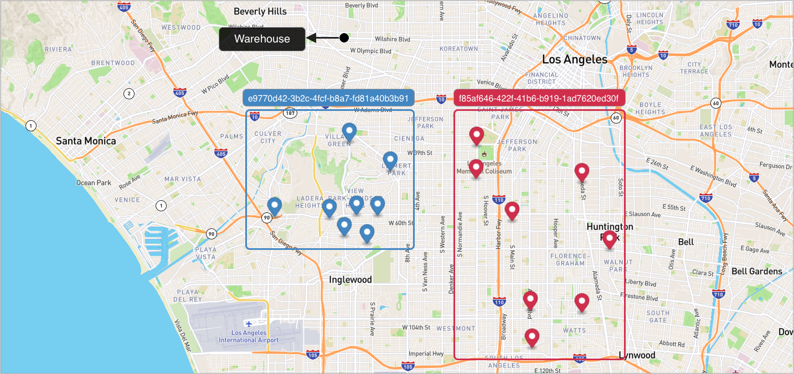
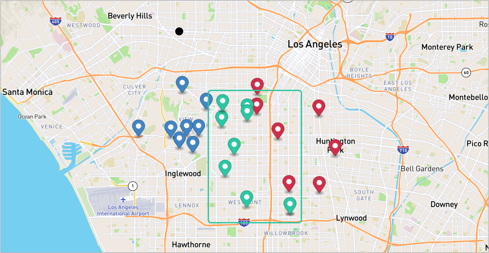

# What-if Routes computations
Given a small list of stops (let's say N stops) and some routes (let's say M routes), Beans Optimizations can be leveraged to determined the best distribution of those N stops onto those M routes given the constraints via [Stateful Route Optimization](https://github.com/beansai/beans-tutorials/tree/main/dynamic-routes-optimization)

However, another important use case for route estimation is to determine the cost differences (in time and distance) that those N stops on each of the M routes.

In other words, if those N stops were grouped together and MUST be serviced by a single route, what would be the delta costs in time and distance for each of the M routes?

This is termed "what-if" routes computations.

Beans has provided an API that would assist in this computation.

## Table of contents
- [Create the data](#create-the-data)
  - [Create a warehouse](#create-a-warehouse)
  - [Create routes](#create-routes)
  - [Add stops to the routes](#add-stops-to-the-routes)
- [Run What If](#run-what-if)
- [Run What If asynchronous](#run-what-if-asynchronous)
  - [Single stop among selected routes](#single-stop-among-selected-routes)
  - [Single Stop among all open routes](#single-stop-among-all-open-routes)
  - [Multiple Stops among selected routes](#multiple-stops-among-selected-routes)
- [Some Important Notes](#some-important-notes)

## Create the data
### Create a warehouse

**Request Example**

```
curl -k -H 'Authorization: <token>' https://isp.beans.ai/enterprise/v1/lists/warehouses -XPOST -d '{"warehouse":[{"name":"Thermopylae","listWarehouseId":"5905 Wilshire Blvd, Los Angeles, CA 90036, United States","address":"2550 S Tracy Blvd, Tracy, CA 95376, United States"}]}'
```

- It is important to set list_warehouse_id that is unique in your account.

```json
{
  "warehouse": [
    {
      "name": "Thermopylae",
      "listWarehouseId": "d56bb78a-cdcb-4cfb-975a-597bb2b468f0",
      "address": "5905 Wilshire Blvd, Los Angeles, CA 90036, United States"
    }
  ]
}
```

**Note**: Your list_warehouse_id and address would be different.

### Create routes

A grouping Route, although isn't required for optimization, is a convenient bucket to gather
stops to be optimized.

**Request Example**

```
curl -k -H 'Authorization: <token>' -X POST 'https://isp.beans.ai/enterprise/v1/lists/routes' -d '{"route":[{"name":"Via Emilia","list_route_id":"e9770d42-3b2c-4fcf-b8a7-fd81a40b3b91","status":"OPEN","date_str":"2023-02-21","warehouse":{"list_warehouse_id":"d56bb78a-cdcb-4cfb-975a-597bb2b468f0"}},{"name":"Via Cassia","list_route_id":"f85af646-422f-41b6-b919-1ad7620ed30f","status":"OPEN","date_str":"2023-02-21","warehouse":{"list_warehouse_id":"d56bb78a-cdcb-4cfb-975a-597bb2b468f0"}}]}'
```

- It is important to set the list_route_id that is unique in your account
- It is important to configure the date_str with a yyyy-MM-dd format

```json
{
    "route":[
        {
            "name": "Via Emilia",
            "list_route_id": "e9770d42-3b2c-4fcf-b8a7-fd81a40b3b91",
            "status": "OPEN",
            "date_str": "2023-02-21",
            "warehouse":
            {
                "list_warehouse_id": "d56bb78a-cdcb-4cfb-975a-597bb2b468f0"
            }
        },
        {
            "name": "Via Cassia",
            "list_route_id": "f85af646-422f-41b6-b919-1ad7620ed30f",
            "status": "OPEN",
            "date_str": "2023-02-21",
            "warehouse":
            {
                "list_warehouse_id": "d56bb78a-cdcb-4cfb-975a-597bb2b468f0"
            }
        }
    ]
}
```

**Note**: Your list_warehouse_id, list_route_id would be different.

### Add stops to the routes
**Request Example**

```
curl -k -H 'Authorization: <token>' https://isp.beans.ai/enterprise/v1/lists/items -XPOST --data '@assets/stops.json'
```

- You can see the payload detail here [assets/stops.json](assets/stops.json) which contains 8 stops for each route.
- An important thing to note is that each stop contains the route reference to the route that was created above with route id.

Here's a visualization of the result, as we can see there are red stops and a black warehouse on the map.



### Run What If
We have two routes and each of them has 8 stops, let's try to determine the delta cost with another 8 stops.



**Request Example**
```
curl -k -H 'Authorization: <token>' https://isp.beans.ai/enterprise/v1/lists/route_whatif -XPOST --data '@assets/what-if-request.json'
```
You can see the full payload here [what-if-request.json](assets/what-if-request.json) while the partial is
```json
{
    "item": [
          {
              "list_item_id": "dc8aab06-3549-4e70-a9d4-de3989361fa9-01",
              "address": "620 E 111th Pl, Los Angeles, CA 90059, United States"
          },
          {
              "list_item_id": "dc8aab06-3549-4e70-a9d4-de3989361fa9-02",
              "address": "4407 Normandie Ave, Los Angeles, CA 90037, United States"
          },
          
          ...
    ],
    "listRouteIds":[
        "e9770d42-3b2c-4fcf-b8a7-fd81a40b3b91",
        "f85af646-422f-41b6-b919-1ad7620ed30f"
    ],
    "route_size_limit": 50,
    "request_id": "cdca9d95-6ee7-454a-804a-fb3d38fb93de",
    "include_multi_day_window_stops":false
  }
```

- item (required)
  - An array of stops
- list_route_ids (optional)
  - An array of existing route IDs in the system. If a route ID does not exist in the system, it would be ignored
- - If this is NOT specified, then, ALL open routes are considered, which could be very expansive depending on the number of open routes
- route_size_limit (optional, though strongly recommended) 
  - The upper limit of the number of items in a route for that route to be considered. So, for example, if e9770d42-3b2c-4fcf-b8a7-fd81a40b3b91 has 50 stops, that route would NOT be considered 
- request_id (optional, though strongly recommended)
  - The ID to identify this request, can be used to query the status later.
- use_warehouse_as_terminal (optional)
  - Default to false would render the route to be computed to "end anywhere". If it is set the true, then, the warehouse specified on the route would be used as the terminal of the route.
- include_multi_day_window_stops (optional)
  - Default to false would remove the stops from request (and not from route) where the gap between deliver_from and deliver_by is more than 24 hours. This is to guard against the situation where a stop may be fulfilled anytime within the next 5 days, for instance.
  - If this is set to true, such stops would be included in the route computation, and the system would currently attempt to honor that stop within the single day
**Response Example**

You can see the full payload here [what-if-response.json](assets/what-if-response.json) while the partial is
```json
"result": {
    "routes": [
        {
            "listRouteId": "f85af646-422f-41b6-b919-1ad7620ed30f",
            "deltaDistanceM": 6992.0,
            "deltaTimeS": 1535.0
        },
        {
            "listRouteId": "e9770d42-3b2c-4fcf-b8a7-fd81a40b3b91",
            "deltaDistanceM": 28711.0,
            "deltaTimeS": 2440.0
        }
    ]
}
```


## Run What If asynchronous

We can also do asynchronous request when the calculation is complicated which may take a long while.

### Single stop among selected routes

This is an example where a single stop is to be determined among couples of routes to compute the delta costs.

**Request Example**

```
curl -k -H 'Authorization: <token>' https://isp.beans.ai/enterprise/v1/lists/route_whatif_async -XPOST --data 'payload'
```

```json
{
  "item": [
    {
      "listItemId": "dd0f9713-6377-4fcc-83c8-038c339802a8",
      "address": "3 Sky Lodge Drive, Moose River, ME 04945"
    }
  ],
  "list_route_ids": [
    "fdac7bcc75cd3e1a8d763f050a8ba6d2",
    "a31320dd56a83c58b7d647a1b29a8c97",
    "3a26ff50fb3830b8be7f3d50e0b5e0fa"
  ],
  "route_size_limit": 60,
  "request_id": "35b4284e-1d07-483a-ac4a-c2bd6d9969aa",
  "use_warehouse_as_terminal": false,
  "include_multi_day_window_stops":false
}
```

- item (required)
  - An array of stops
- list_route_ids (optional)
  - An array of existing route IDs in the system. If a route ID does not exist in the system, it would be ignored
- - If this is NOT specified, then, ALL open routes are considered, which could be very expansive depending on the number of open routes
- route_size_limit (optional, though strongly recommended) 
  - The upper limit of the number of items in a route for that route to be considered. So, for example, if 3a26ff50fb3830b8be7f3d50e0b5e0fa has 60 stops, that route would NOT be considered 
- request_id (required)
  - The ID to identify this request, can be used to query the status later.
- use_warehouse_as_terminal (optional)
  - Default to false would render the route to be computed to "end anywhere". If it is set the true, then, the warehouse specified on the route would be used as the terminal of the route.
- include_multi_day_window_stops (optional)
  - Default to false would remove the stops from request (and not from route) where the gap between deliver_from and deliver_by is more than 24 hours. This is to guard against the situation where a stop may be fulfilled anytime within the next 5 days, for instance.
  - If this is set to true, such stops would be included in the route computation, and the system would currently attempt to honor that stop within the single day

**Response Example**
```json
{
  "item": [
    {
      "listItemId": "dd0f9713-6377-4fcc-83c8-038c339802a8",
      "address": "3 Sky Lodge Drive, Moose River, ME 04945"
    }
  ],
  "listRouteIds": [
    "fdac7bcc75cd3e1a8d763f050a8ba6d2",
    "a31320dd56a83c58b7d647a1b29a8c97",
    "3a26ff50fb3830b8be7f3d50e0b5e0fa"
  ],
  "routeSizeLimit": 60,
  "requestId": "35b4284e-1d07-483a-ac4a-c2bd6d9969aa",
  "asynchronous": true,
  "internalRef": "8564a7d505704daaa4a4ea8269f7292c",
  "startTimeEpoch": 1637592559,
  "message": "Initiated at 2021-11-22T14:49:19.483Z"
}
```
The request itself would be returned as a response with additional system configured fields for the asynchronous endpoint.
- asynchronous - whether or not the request was asynchornous
- internalRef - the internal ID
- startTimeEpoch - when the request was submitted to the system in epoch time
- message - human readable messages and some information

Since this is an asynchronous request, let's pull its status with the request ID that we specified

**Request Example**

```
curl -H 'authorization: <token>' \
https://isp.beans.ai/enterprise/v1/lists/route_whatif_async/35b4284e-1d07-483a-ac4a-c2bd6d9969aa
```
**Response Example**
```json
{
  "item": [
    {
      "listItemId": "dd0f9713-6377-4fcc-83c8-038c339802a8",
      "address": "3 Sky Lodge Drive, Moose River, ME 04945"
    }
  ],
  "listRouteIds": [
    "fdac7bcc75cd3e1a8d763f050a8ba6d2",
    "a31320dd56a83c58b7d647a1b29a8c97",
    "3a26ff50fb3830b8be7f3d50e0b5e0fa"
  ],
  "routeSizeLimit": 60,
  "requestId": "35b4284e-1d07-483a-ac4a-c2bd6d9969aa",
  "asynchronous": true,
  "internalRef": "8564a7d505704daaa4a4ea8269f7292c",
  "startTimeEpoch": 1637592559,
  "endTimeEpoch": 1637592566,
  "result": {
    "routes": [
      {
        "listRouteId": "fdac7bcc75cd3e1a8d763f050a8ba6d2",
        "deltaDistanceM": 487,
        "deltaTimeS": 116.09999999999854
      },
      {
        "listRouteId": "a31320dd56a83c58b7d647a1b29a8c97",
        "deltaDistanceM": 240739.6999999999,
        "deltaTimeS": 13549.299999999996
      },
      {
        "listRouteId": "3a26ff50fb3830b8be7f3d50e0b5e0fa",
        "deltaDistanceM": 254818.49999999988,
        "deltaTimeS": 13519.500000000004
      }
    ]
  },
  "message": "Completed"
}
```
With only a few routes, the response is fairly fast, and thus, we did not get an opportunity to see the intermediate results (we will see that later). In this case, we have
- endTimeEpoch - when the request was completed
- result.routes - containing the list of routes and their delta costs in distance and time

### Single Stop among all open routes

**Request Example**

```json
{
  "item": [
    {
      "listItemId": "dd0f9713-6377-4fcc-83c8-038c339802a8",
      "address": "3 Sky Lodge Drive, Moose River, ME 04945"
    }
  ],
  "route_size_limit": 150,
  "request_id": "7977ef0d-f3d1-4ef1-877e-c2a1a32f3005"
}
```

Similarly, the initial request submission response on 
asynchronous method is
```json
{
  "item": [
    {
      "listItemId": "dd0f9713-6377-4fcc-83c8-038c339802a8",
      "address": "3 Sky Lodge Drive, Moose River, ME 04945"
    }
  ],
  "routeSizeLimit": 150,
  "requestId": "7977ef0d-f3d1-4ef1-877e-c2a1a32f3005",
  "asynchronous": true,
  "internalRef": "a4d24d58fba44a379780efd2a1f1a43f",
  "startTimeEpoch": 1637594735,
  "message": "Initiated at 2021-11-22T15:25:35.326Z"
}
```

Now, we can obtain the intermediate results
**Request Example**
```
curl -H 'authorization: <token>' \
https://isp.beans.ai/enterprise/v1/lists/route_whatif_async/7977ef0d-f3d1-4ef1-877e-c2a1a32f3005
```

**Response Example**
```json
{
  "item": [
    {
      "listItemId": "dd0f9713-6377-4fcc-83c8-038c339802a8",
      "address": "3 Sky Lodge Drive, Moose River, ME 04945"
    }
  ],
  "routeSizeLimit": 150,
  "requestId": "7977ef0d-f3d1-4ef1-877e-c2a1a32f3005",
  "asynchronous": true,
  "internalRef": "a4d24d58fba44a379780efd2a1f1a43f",
  "startTimeEpoch": 1637594735,
  "message": "There are 113 routes where 2 are not suitable and 1 are possibilities"
}
```
So, the system identified 113 routes whose stop limits fall within the route size limit while OPEN (that is a lot, and will take a long time to process!)

After some time...

```json
{
  "item": [
    {
      "listItemId": "dd0f9713-6377-4fcc-83c8-038c339802a8",
      "address": "3 Sky Lodge Drive, Moose River, ME 04945"
    }
  ],
  "routeSizeLimit": 150,
  "requestId": "7977ef0d-f3d1-4ef1-877e-c2a1a32f3005",
  "asynchronous": true,
  "internalRef": "a4d24d58fba44a379780efd2a1f1a43f",
  "startTimeEpoch": 1637594735,
  "message": "There are 113 routes where 13 are not suitable and 21 are possibilities"
}
```

After some time...
```json
{
  "item": [
    {
      "listItemId": "dd0f9713-6377-4fcc-83c8-038c339802a8",
      "address": "3 Sky Lodge Drive, Moose River, ME 04945"
    }
  ],
  "routeSizeLimit": 150,
  "requestId": "7977ef0d-f3d1-4ef1-877e-c2a1a32f3005",
  "asynchronous": true,
  "internalRef": "a4d24d58fba44a379780efd2a1f1a43f",
  "startTimeEpoch": 1637594735,
  "message": "There are 113 routes where 24 are not suitable and 45 are possibilities"
}
```

After long time...
```json
{
  "item": [
    {
      "listItemId": "dd0f9713-6377-4fcc-83c8-038c339802a8",
      "address": "3 Sky Lodge Drive, Moose River, ME 04945"
    }
  ],
  "routeSizeLimit": 150,
  "requestId": "7977ef0d-f3d1-4ef1-877e-c2a1a32f3005",
  "asynchronous": true,
  "internalRef": "a4d24d58fba44a379780efd2a1f1a43f",
  "startTimeEpoch": 1637594735,
  "endTimeEpoch": 1637595545,
  "result": {
    "routes": [
      {
        "listRouteId": "fdac7bcc75cd3e1a8d763f050a8ba6d2",
        "deltaDistanceM": 487,
        "deltaTimeS": 116.09999999999854
      },
      {
        "listRouteId": "d9b09c4249f53507bbea8f507e219a7e",
        "deltaDistanceM": 85118.79999999999,
        "deltaTimeS": 4805.899999999998
      },
      {
        "listRouteId": "361115e508e135baa1ed89825c15b9ab",
        "deltaDistanceM": 177018.59999999998,
        "deltaTimeS": 9474.299999999992
      },
      {
        "listRouteId": "a31320dd56a83c58b7d647a1b29a8c97",
        "deltaDistanceM": 240739.6999999999,
        "deltaTimeS": 13549.299999999996
      },
      {
        "listRouteId": "3a26ff50fb3830b8be7f3d50e0b5e0fa",
        "deltaDistanceM": 254818.49999999988,
        "deltaTimeS": 13519.500000000004
      },
... //snipped
```
All the computable routes would be listed.

### Multiple Stops among selected routes
Instead of a single stop, let's say that we have 3 stops to be determined.
**Request Example**
```json
{
  "item": [
    {
      "listItemId": "dd0f9713-6377-4fcc-83c8-038c339802a8",
      "address": "3 Sky Lodge Drive, Moose River, ME 04945"
    },
    {
      "listItemId": "16e051d2-639d-445e-bc05-4f03145bd144",
      "address": "5600 Mayflower Hill Dr, Waterville, ME 04901"
    },
    {
      "listItemId": "0d7505b3-74e2-4583-9403-423cfd11de3d",
      "address": "200 Kennedy Memorial Dr, Waterville, ME 04901"
    }
  ],
  "list_route_ids": [
    "fdac7bcc75cd3e1a8d763f050a8ba6d2",
    "a31320dd56a83c58b7d647a1b29a8c97",
    "3a26ff50fb3830b8be7f3d50e0b5e0fa"
  ],
  "route_size_limit": 60,
  "request_id": "473b3792-7d50-4756-981f-c45db5274f74"
}
```

**Response Example**
```json
{
  "item": [
    {
      "listItemId": "dd0f9713-6377-4fcc-83c8-038c339802a8",
      "address": "3 Sky Lodge Drive, Moose River, ME 04945"
    },
    {
      "listItemId": "16e051d2-639d-445e-bc05-4f03145bd144",
      "address": "5600 Mayflower Hill Dr, Waterville, ME 04901"
    },
    {
      "listItemId": "0d7505b3-74e2-4583-9403-423cfd11de3d",
      "address": "200 Kennedy Memorial Dr, Waterville, ME 04901"
    }
  ],
  "listRouteIds": [
    "fdac7bcc75cd3e1a8d763f050a8ba6d2",
    "a31320dd56a83c58b7d647a1b29a8c97",
    "3a26ff50fb3830b8be7f3d50e0b5e0fa"
  ],
  "routeSizeLimit": 60,
  "requestId": "473b3792-7d50-4756-981f-c45db5274f74",
  "asynchronous": true,
  "internalRef": "22e81e31c7da46a6949da6fb9b80cc6b",
  "startTimeEpoch": 1637597462,
  "endTimeEpoch": 1637597471,
  "result": {
    "routes": [
      {
        "listRouteId": "fdac7bcc75cd3e1a8d763f050a8ba6d2",
        "deltaDistanceM": 5456.199999999953,
        "deltaTimeS": 860.8000000000029
      },
      {
        "listRouteId": "a31320dd56a83c58b7d647a1b29a8c97",
        "deltaDistanceM": 238996.60000000003,
        "deltaTimeS": 13807.999999999993
      },
      {
        "listRouteId": "3a26ff50fb3830b8be7f3d50e0b5e0fa",
        "deltaDistanceM": 269805.69999999995,
        "deltaTimeS": 14814.3
      }
    ]
  },
  "message": "Completed"
}
```
One can see the delta costs between the routes!


## Some Important Notes
- if a route does not have "deltaDistanceM" and "deltaTimeS", then, it is 0 (default value). This often happens when the stops to be added already exist on that route
- delta distance and time can be negative, suggesting reductions
- reduction in one DOES NOT imply reduction in another
  - for example, if a distance is reduced, but with more city driving, then, the time may be increased (sometimes quite dramatically)
- It is critical to look at both distance and time deltas to pick one that achieve proper balance. Thus, if a route has both smallest delta distance and smallest delta time, that is often a good route.
  - However, if the smallest delta distance route is not the same as the smallest delta time, it is often the case that the smallest delta time is a better route