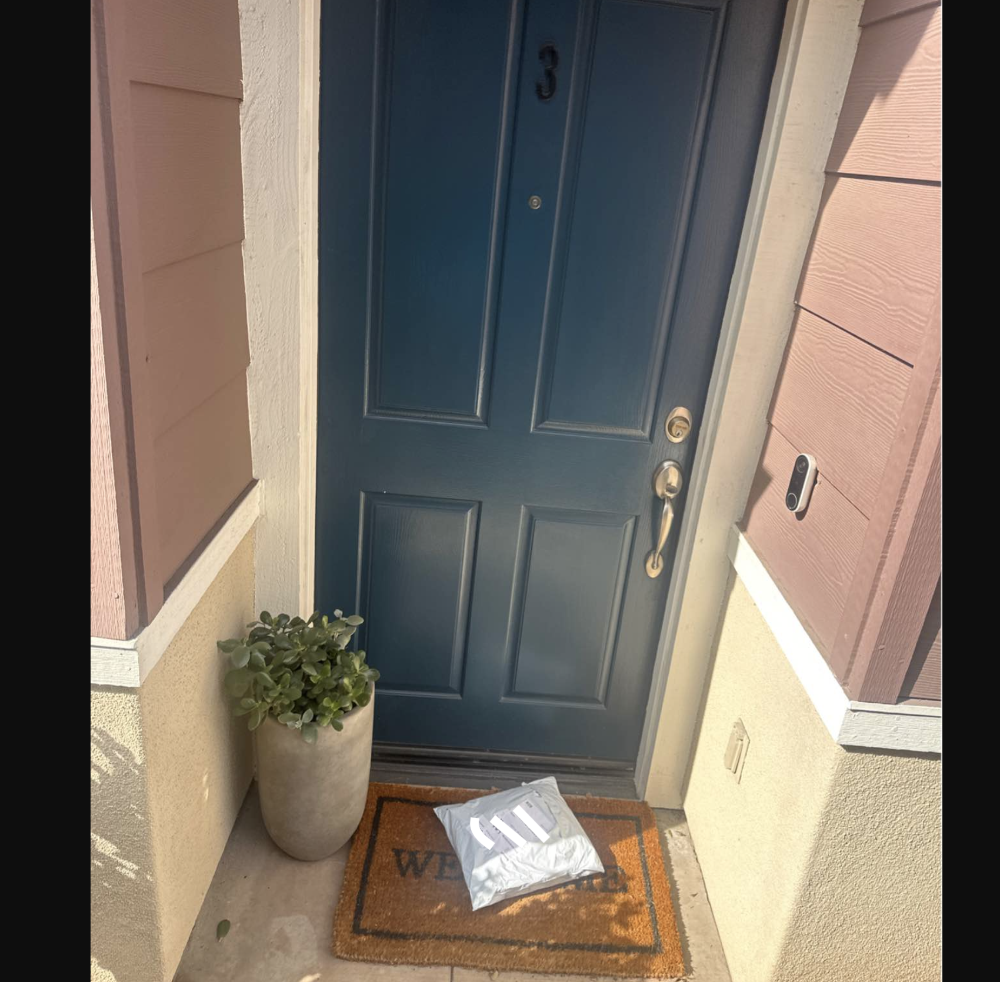
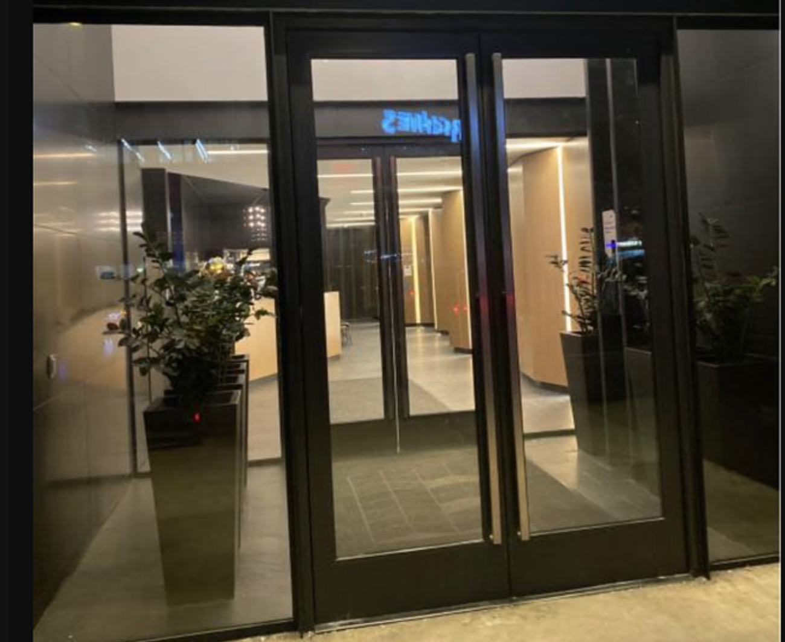

# Proof of delivery Image Quality

Proof of delivery images are pictures taken by delivery partners to demonstrate that packages have been dropped of at the intended location. This intelligence tool is an RPC that would take an image and provide a score and a feedback on how good that image is.

In general, a good image would have components
   - a package
   - some sort of dwellings
   - well lighted
 
For example,  is a good Proof of delivery image, while  is not a good one.

**Request Example**

```
GET https://isp.beans.ai/enterprise/v1/ai/pod_quality?url=xyz
```
- normal Authorization header for your account
- xyz = URLEncoded of the link to the image, for example, URLEncode(https://example.com/image.jpg) = https%3A%2F%2Fexample.com%2Fimage.jpg

**Response Example**

```json
{
  "classifierModelId": "8642818902272770048",
  "detectorModelId": "849339747108126720",
  "feedback": "Package is visible and well-lit on the porch.",
  "score": 3
}
```
| Field | Type | Default | Description |
| --- | --- | --- | --- |
| **classifierModelId** | string | The model ID | The identifier of the classification model that was used |
| **detectorModelId** | string | The model ID | The identifier of the detector model that was used |
| **feedback** | string | "" | Human readable information to denote the POD quality of the image |
| **score** | integer | 0 | 3 is good, 0 is bad, 1 and 2 are in between |


**Notes on the implementation**
- the system would have a cache to support repeated request on the same image
- Currently, the underlying models may be dynamic, and may be refreshed automatically based on real world heuristics