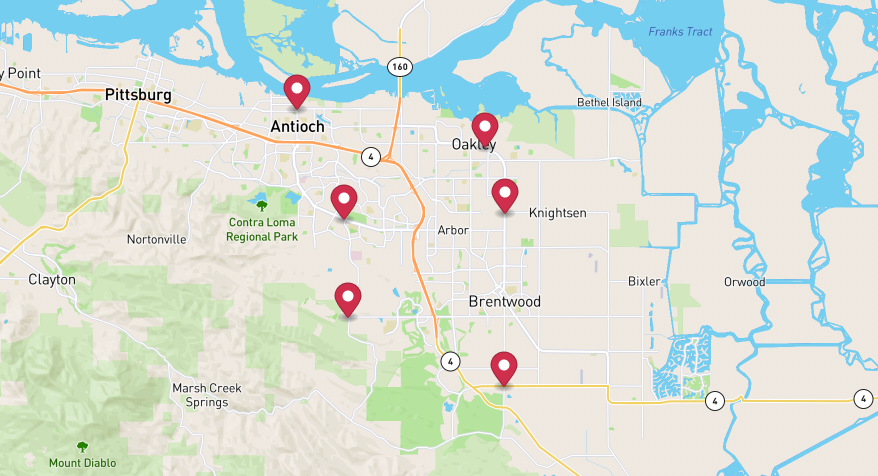
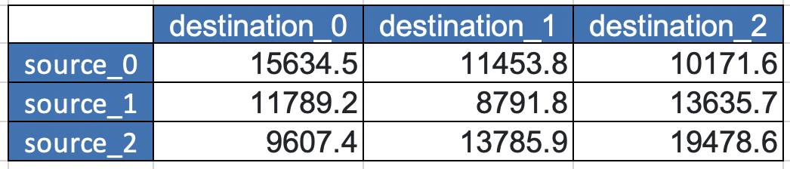
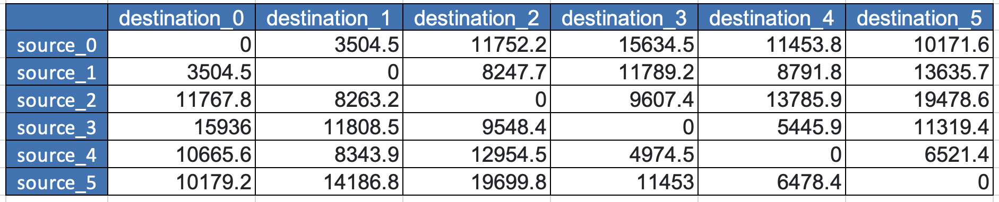

# Distance Matrix



When you have many stops and want to determine many distances at once,
Distance Matrix would be helpful to you.

## Table of contents
- [Distance Matrix](#distance-matrix)
  - [Example of Specified sources and destinations](#example-of-specified-sources-and-destinations)
  - [Example of All Possibilities](#example-of-all-possibilities)
  - [Request Payloads](#request-payloads)
  - [Importance](#importance)

## Example of Specified sources and destinations

Let's say we have 6 stops which 3 are sources and 3 are destinations,
we will make a calculation request then get the result.

**Send Calculation Request**

```
POST {{baseURL}}/enterprise/v1/dro/distance_matrix
```

**Body**
```json
{
    "requestId": "matrix-100",
    "points": [
        {
            "position":
            {
                "latitude": 37.996333094327554,
                "longitude": -121.70646459893086
            }
        },
        {
            "position":
            {
                "latitude": 37.96858164318102,
                "longitude": -121.6959508962403
            }
        },
        {
            "position":
            {
                "latitude": 37.8966488871678,
                "longitude": -121.69619540095405
            }
        },
        {
            "position":
            {
                "latitude": 37.925198993623624,
                "longitude": -121.77883799480549
            }
        },
        {
            "position":
            {
                "latitude": 37.966075787314864,
                "longitude": -121.78128304194283
            }
        },
        {
            "position":
            {
                "latitude": 38.011938673071406,
                "longitude": -121.80597801802993
            }
        }
    ],
    "sourcesIdx": [
        0,1,2
    ],
    "destinationsIdx": [
        3,4,5
    ],
    "asynchronous": true,
    "countryIso3": "USA"
}
```

**Get Calculation Result**
```
GET {{baseURL}}/enterprise/v1/dro/distance_matrix/{{requestId}}
```

**Response**
```json
{
    "rows": [
        {
            "value": [
                15634.5,
                11453.8,
                10171.6
            ]
        },
        {
            "value": [
                11789.2,
                8791.8,
                13635.7
            ]
        },
        {
            "value": [
                9607.4,
                13785.9,
                19478.6
            ]
        }
    ],
    "stat": {
        "uniqueSource": 3,
        "uniqueDestination": 3,
        "totalCells": 9
    },
    "requestId": "matrix-100",
    "startTimeEpoch": 1663051980,
    "accountBuid": "4022a1aada0e4c4684e61e3f73290a68",
    "request": {
        "requestId": "matrix-100",
        "points": [
            {
                "position": {
                    "latitude": 37.996333094327554,
                    "longitude": -121.70646459893086
                }
            },
            {
                "position": {
                    "latitude": 37.96858164318102,
                    "longitude": -121.6959508962403
                }
            },
            {
                "position": {
                    "latitude": 37.8966488871678,
                    "longitude": -121.69619540095405
                }
            },
            {
                "position": {
                    "latitude": 37.925198993623624,
                    "longitude": -121.77883799480549
                }
            },
            {
                "position": {
                    "latitude": 37.966075787314864,
                    "longitude": -121.78128304194283
                }
            },
            {
                "position": {
                    "latitude": 38.011938673071406,
                    "longitude": -121.80597801802993
                }
            }
        ],
        "sourcesIdx": [
            0,
            1,
            2
        ],
        "destinationsIdx": [
            3,
            4,
            5
        ],
        "asynchronous": true,
        "countryIso3": "USA"
    }
}
```

Then, we got a 3x3 distance(meters) matrix from the rows in the response.



## Example of All Possibilities


This time, we want to calculate all distances between 6 stops.

**Send Calculation Request**

```
POST {{baseURL}}/enterprise/v1/dro/distance_matrix
```

**Body**
```json
{
    "requestId": "matrix-101",
    "points": [
        {
            "position":
            {
                "latitude": 37.996333094327554,
                "longitude": -121.70646459893086
            }
        },
        {
            "position":
            {
                "latitude": 37.96858164318102,
                "longitude": -121.6959508962403
            }
        },
        {
            "position":
            {
                "latitude": 37.8966488871678,
                "longitude": -121.69619540095405
            }
        },
        {
            "position":
            {
                "latitude": 37.925198993623624,
                "longitude": -121.77883799480549
            }
        },
        {
            "position":
            {
                "latitude": 37.966075787314864,
                "longitude": -121.78128304194283
            }
        },
        {
            "position":
            {
                "latitude": 38.011938673071406,
                "longitude": -121.80597801802993
            }
        }
    ],
    "sourcesIdx": [
    ],
    "destinationsIdx": [
    ],
    "asynchronous": true,
    "countryIso3": "USA"
}
```

**Get Calculation Result**

```
GET {{baseURL}}/enterprise/v1/dro/distance_matrix/{{requestId}}
```

**Response**
```json
{
    "rows": [
        {
            "value": [
                0.0,
                3504.5,
                11752.2,
                15634.5,
                11453.8,
                10171.6
            ]
        },
        {
            "value": [
                3504.5,
                0.0,
                8247.7,
                11789.2,
                8791.8,
                13635.7
            ]
        },
        {
            "value": [
                11767.8,
                8263.2,
                0.0,
                9607.4,
                13785.9,
                19478.6
            ]
        },
        {
            "value": [
                15936.0,
                11808.5,
                9548.4,
                0.0,
                5445.9,
                11319.4
            ]
        },
        {
            "value": [
                10665.6,
                8343.9,
                12954.5,
                4974.5,
                0.0,
                6521.4
            ]
        },
        {
            "value": [
                10179.2,
                14186.8,
                19699.8,
                11453.0,
                6478.4,
                0.0
            ]
        }
    ],
    "stat": {
        "uniqueSource": 6,
        "uniqueDestination": 6,
        "totalCells": 36
    },
    "requestId": "matrix-101",
    "startTimeEpoch": 1663052092,
    "accountBuid": "4022a1aada0e4c4684e61e3f73290a68",
    "request": {
        "requestId": "matrix-101",
        "points": [
            {
                "position": {
                    "latitude": 37.996333094327554,
                    "longitude": -121.70646459893086
                }
            },
            {
                "position": {
                    "latitude": 37.96858164318102,
                    "longitude": -121.6959508962403
                }
            },
            {
                "position": {
                    "latitude": 37.8966488871678,
                    "longitude": -121.69619540095405
                }
            },
            {
                "position": {
                    "latitude": 37.925198993623624,
                    "longitude": -121.77883799480549
                }
            },
            {
                "position": {
                    "latitude": 37.966075787314864,
                    "longitude": -121.78128304194283
                }
            },
            {
                "position": {
                    "latitude": 38.011938673071406,
                    "longitude": -121.80597801802993
                }
            }
        ],
        "asynchronous": true,
        "countryIso3": "USA"
    }
}
```
Then, we got a 6x6 distance(meters) matrix from the rows in the response.


# Request Payloads
- points - [required] The stops we want to calculate for distances.
- requestId - [optional] If not specified we will generate one, it is determinsitacally based on the points, sourcesIdx, destinationsIdx.
- sources_idx - [optional] All points would be sources if it is not specified.
- destinations_idx - [optional] All points would be destinations if it is not specified.
- country_iso3 - [optional] A random Point would be used to determine its most likely country of origin if it is not specified.

# Importance
The calculation result will be available for 7 days (the result may be archived after 7 days).