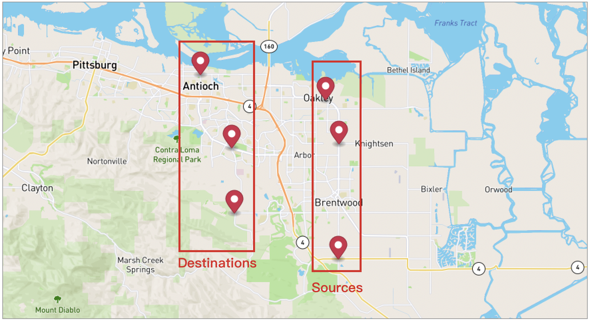
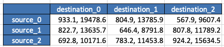
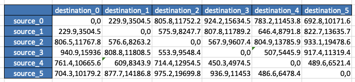

# Time Distance Matrix


When you have many stops and want to determine time and distances among them at once,

Time-Distance Matrix would be helpful to you.

## Table of contents
- [Time Distance Matrix](#time-distance-matrix)
  - [Example of Specified sources and destinations](#example-of-specified-sources-and-destinations)
  - [Example of All Possibilities](#example-of-all-possibilities)
  - [Example of Additional stops](#example-of-additional-stops)
  - [Request Payloads](#request-payloads)
  - [Importance](#importance)

## Example of Specified sources and destinations

Let's say we have 6 stops which 3 are sources and 3 are destinations,
we will make a calculation request then get the result.

**Send Calculation Request**

```
POST {{baseURL}}/enterprise/v1/dro/timedistance_matrix
```

**Body**
```json
{
    "requestId": "matrix-time-distance-1",
    "points": [
        {
            "position":
            {
                "latitude": 37.996333094327554,
                "longitude": -121.70646459893086
            }
        },
        {
            "position":
            {
                "latitude": 37.96858164318102,
                "longitude": -121.6959508962403
            }
        },
        {
            "position":
            {
                "latitude": 37.8966488871678,
                "longitude": -121.69619540095405
            }
        },
        {
            "position":
            {
                "latitude": 37.925198993623624,
                "longitude": -121.77883799480549
            }
        },
        {
            "position":
            {
                "latitude": 37.966075787314864,
                "longitude": -121.78128304194283
            }
        },
        {
            "position":
            {
                "latitude": 38.011938673071406,
                "longitude": -121.80597801802993
            }
        }
    ],
    "sourcesIdx": [
        0,1,2
    ],
    "destinationsIdx": [
        3,4,5
    ],
    "asynchronous": true,
    "countryIso3": "USA"
}
```

**Get Calculation Result**
```
GET {{baseURL}}/enterprise/v1/dro/timedistance_matrix/{{requestId}}
```

**Response**

- Each value under rows would be time1, distance1, time2, distance2...

```json
{
    "rows": [
        {
            "value": [
                933.1,
                19478.6,
                804.9,
                13785.9,
                567.9,
                9607.4
            ]
        },
        {
            "value": [
                822.7,
                13635.7,
                646.4,
                8791.8,
                807.8,
                11789.2
            ]
        },
        {
            "value": [
                692.8,
                10171.6,
                783.2,
                11453.8,
                924.2,
                15634.5
            ]
        }
    ],
    "stat": {
        "uniqueSource": 3,
        "uniqueDestination": 3,
        "totalCells": 9
    },
    "requestId": "matrix-time-distance-1",
    "startTimeEpoch": 1671675455,
    "accountBuid": "4022a1aada0e4c4684e61e3f73290a68",
    "request": {
        "requestId": "matrix-time-distance-1",
        "points": [
            {
                "position": {
                    "latitude": 37.996333094327554,
                    "longitude": -121.70646459893086
                }
            },
            {
                "position": {
                    "latitude": 37.96858164318102,
                    "longitude": -121.6959508962403
                }
            },
            {
                "position": {
                    "latitude": 37.8966488871678,
                    "longitude": -121.69619540095405
                }
            },
            {
                "position": {
                    "latitude": 37.925198993623624,
                    "longitude": -121.77883799480549
                }
            },
            {
                "position": {
                    "latitude": 37.966075787314864,
                    "longitude": -121.78128304194283
                }
            },
            {
                "position": {
                    "latitude": 38.011938673071406,
                    "longitude": -121.80597801802993
                }
            }
        ],
        "sourcesIdx": [
            2,
            1,
            0
        ],
        "destinationsIdx": [
            5,
            4,
            3
        ],
        "asynchronous": true,
        "countryIso3": "USA"
    }
}
```

Then, we got a 3x3 <b>time-distance(seconds,meters)</b> matrix from the rows in the response.



## Example of All Possibilities


This time, we want to calculate all distances between 6 stops.

**Send Calculation Request**

```
POST {{baseURL}}/enterprise/v1/dro/timedistance_matrix
```

**Body**
```json
{
    "requestId": "matrix-time-distance-2",
    "points": [
        {
            "position":
            {
                "latitude": 37.996333094327554,
                "longitude": -121.70646459893086
            }
        },
        {
            "position":
            {
                "latitude": 37.96858164318102,
                "longitude": -121.6959508962403
            }
        },
        {
            "position":
            {
                "latitude": 37.8966488871678,
                "longitude": -121.69619540095405
            }
        },
        {
            "position":
            {
                "latitude": 37.925198993623624,
                "longitude": -121.77883799480549
            }
        },
        {
            "position":
            {
                "latitude": 37.966075787314864,
                "longitude": -121.78128304194283
            }
        },
        {
            "position":
            {
                "latitude": 38.011938673071406,
                "longitude": -121.80597801802993
            }
        }
    ],
    "sourcesIdx": [
    ],
    "destinationsIdx": [
    ],
    "asynchronous": true,
    "countryIso3": "USA"
}
```

**Get Calculation Result**

```
GET {{baseURL}}/enterprise/v1/dro/timedistance_matrix/{{requestId}}
```

**Response**

- Each value under rows would be <b>time1,distance1,time2,distance2...</b>

```json
{
    "rows": [
        {
            "value": [
                0.0,
                0.0,
                229.9,
                3504.5,
                805.8,
                11752.2,
                924.2,
                15634.5,
                783.2,
                11453.8,
                692.8,
                10171.6
            ]
        },
        {
            "value": [
                229.9,
                3504.5,
                0.0,
                0.0,
                575.9,
                8247.7,
                807.8,
                11789.2,
                646.4,
                8791.8,
                822.7,
                13635.7
            ]
        },
        {
            "value": [
                806.5,
                11767.8,
                576.6,
                8263.2,
                0.0,
                0.0,
                567.9,
                9607.4,
                804.9,
                13785.9,
                933.1,
                19478.6
            ]
        },
        {
            "value": [
                940.9,
                15936.0,
                808.8,
                11808.5,
                553.9,
                9548.4,
                0.0,
                0.0,
                507.0,
                5445.9,
                917.4,
                11319.4
            ]
        },
        {
            "value": [
                761.4,
                10665.6,
                609.0,
                8343.9,
                714.4,
                12954.5,
                450.3,
                4974.5,
                0.0,
                0.0,
                489.6,
                6521.4
            ]
        },
        {
            "value": [
                704.3,
                10179.2,
                877.7,
                14186.8,
                975.2,
                19699.8,
                936.9,
                11453.0,
                486.6,
                6478.4,
                0.0,
                0.0
            ]
        }
    ],
    "stat": {
        "uniqueSource": 6,
        "uniqueDestination": 6,
        "totalCells": 36
    },
    "requestId": "matrix-time-distance-2",
    "startTimeEpoch": 1671677734,
    "accountBuid": "4022a1aada0e4c4684e61e3f73290a68",
    "request": {
        "requestId": "matrix-time-distance-2",
        "points": [
            {
                "position": {
                    "latitude": 37.996333094327554,
                    "longitude": -121.70646459893086
                }
            },
            {
                "position": {
                    "latitude": 37.96858164318102,
                    "longitude": -121.6959508962403
                }
            },
            {
                "position": {
                    "latitude": 37.8966488871678,
                    "longitude": -121.69619540095405
                }
            },
            {
                "position": {
                    "latitude": 37.925198993623624,
                    "longitude": -121.77883799480549
                }
            },
            {
                "position": {
                    "latitude": 37.966075787314864,
                    "longitude": -121.78128304194283
                }
            },
            {
                "position": {
                    "latitude": 38.011938673071406,
                    "longitude": -121.80597801802993
                }
            }
        ],
        "asynchronous": true,
        "countryIso3": "USA"
    }
}
```
Then, we got a 6x6 time-distance matrix from the rows in the response.


## Example of Additional Stops

To calculate with additional stops, we will use <b>referenceRequestId</b> which is the requestId of matrix we just created.

In this example, we added the 7th stop and a referenceRequestId to the request.

**Send Calculation Request**

```
POST {{baseURL}}/enterprise/v1/dro/distance_matrix
```

**Body**
```json
{
    "requestId":"matrix-time-distance-301",
    "referenceRequestId": "matrix-time-distance-210",
    "points": [
        {
            "position":
            {
                "latitude": 37.996333094327554,
                "longitude": -121.70646459893086
            }
        },
        {
            "position":
            {
                "latitude": 37.96858164318102,
                "longitude": -121.6959508962403
            }
        },
        {
            "position":
            {
                "latitude": 37.8966488871678,
                "longitude": -121.69619540095405
            }
        },
        {
            "position":
            {
                "latitude": 37.925198993623624,
                "longitude": -121.77883799480549
            }
        },
        {
            "position":
            {
                "latitude": 37.966075787314864,
                "longitude": -121.78128304194283
            }
        },
        {
            "position":
            {
                "latitude": 38.011938673071406,
                "longitude": -121.80597801802993
            }
        },
        {
            "position":
            {
                "latitude": 37.98842943517174,
                "longitude": -121.75703209673263
            }
        }
    ],
    "sourcesIdx": [
    ],
    "destinationsIdx": [
    ],
    "asynchronous": true,
    "countryIso3": "USA"
}
```

**Get Calculation Result**

Then we can get the 7x7 matrix with the requestId "matrix-time-distance-301"

```
GET {{baseURL}}/enterprise/v1/dro/distance_matrix/{{requestId}}
```

**Response**
```json
{
    "rows": [
        {
            "value": [
                0.0,
                0.0,
                229.9,
                3504.5,
                805.8,
                11752.2,
                924.2,
                15634.5,
                783.2,
                11453.8,
                692.8,
                10171.6,
                893.6,
                7834.2
            ]
        },
        {
            "value": [
                229.9,
                3504.5,
                0.0,
                0.0,
                575.9,
                8247.7,
                807.8,
                11789.2,
                646.4,
                8791.8,
                822.7,
                13635.7,
                870.9,
                10885.9
            ]
        },
        {
            "value": [
                806.5,
                11767.8,
                576.6,
                8263.2,
                0.0,
                0.0,
                567.9,
                9607.4,
                804.9,
                13785.9,
                933.1,
                19478.6,
                1029.4,
                15880.0
            ]
        },
        {
            "value": [
                940.9,
                15936.0,
                808.8,
                11808.5,
                553.9,
                9548.4,
                0.0,
                0.0,
                507.0,
                5445.9,
                917.4,
                11319.4,
                963.2,
                10621.8
            ]
        },
        {
            "value": [
                761.4,
                10665.6,
                609.0,
                8343.9,
                714.4,
                12954.5,
                450.3,
                4974.5,
                0.0,
                0.0,
                489.6,
                6521.4,
                562.7,
                5800.8
            ]
        },
        {
            "value": [
                704.3,
                10179.2,
                877.7,
                14186.8,
                975.2,
                19699.8,
                936.9,
                11453.0,
                486.6,
                6478.4,
                0.0,
                0.0,
                682.1,
                7916.4
            ]
        },
        {
            "value": [
                895.8,
                7855.2,
                887.8,
                10938.1,
                993.2,
                15548.7,
                960.9,
                10651.4,
                580.9,
                6004.1,
                651.9,
                7936.7,
                0.0,
                0.0
            ]
        }
    ],
    "stat": {
        "uniqueSource": 7,
        "uniqueDestination": 7,
        "totalCells": 49
    },
    "requestId": "matrix-time-distance-301",
    "startTimeEpoch": 1672275383,
    "accountBuid": "4022a1aada0e4c4684e61e3f73290a68",
    "request": {
        "requestId": "matrix-time-distance-301",
        "points": [
            {
                "position": {
                    "latitude": 37.996333094327554,
                    "longitude": -121.70646459893086
                }
            },
            {
                "position": {
                    "latitude": 37.96858164318102,
                    "longitude": -121.6959508962403
                }
            },
            {
                "position": {
                    "latitude": 37.8966488871678,
                    "longitude": -121.69619540095405
                }
            },
            {
                "position": {
                    "latitude": 37.925198993623624,
                    "longitude": -121.77883799480549
                }
            },
            {
                "position": {
                    "latitude": 37.966075787314864,
                    "longitude": -121.78128304194283
                }
            },
            {
                "position": {
                    "latitude": 38.011938673071406,
                    "longitude": -121.80597801802993
                }
            },
            {
                "position": {
                    "latitude": 37.98842943517174,
                    "longitude": -121.75703209673263
                }
            }
        ],
        "countryIso3": "USA",
        "referenceRequestId": "matrix-time-distance-210"
    }
}
```


# Request Payloads
- points - [required] The stops we want to calculate for time-distances.
- requestId - [optional] If not specified we will generate one, it is determinsitacally based on the points, sourcesIdx, destinationsIdx.
- referenceRequestId - [optional] The requestId of created matrix.
- sources_idx - [optional] All points would be sources if it is not specified.
- destinations_idx - [optional] All points would be destinations if it is not specified.
- country_iso3 - [optional] A random Point would be used to determine its most likely country of origin if it is not specified.

# Importance
The calculation result will be available for 7 days (the result may be archived after 7 days).
