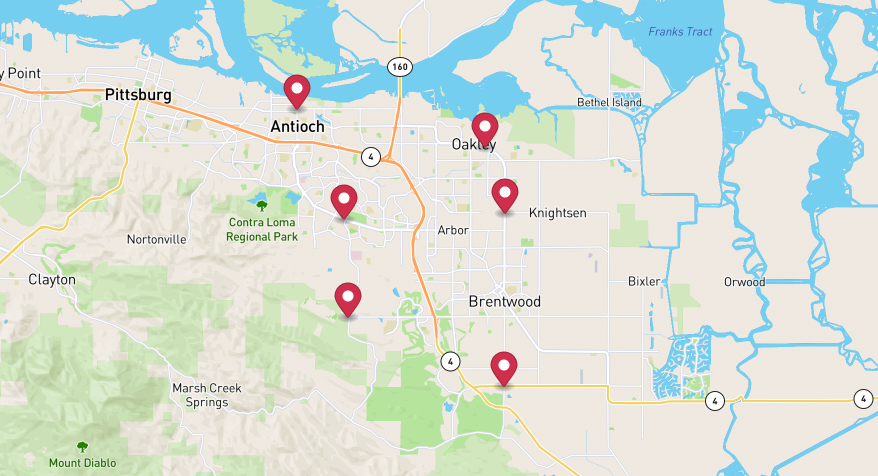

# Time Distance Matrix



When you have many stops and want to determine time and distances among them at once,

Time-Distance Matrix would be helpful to you.

## Table of contents
- [Time Distance Matrix](#time-distance-matrix)
  - [Example of Specified Sources and Destinations](#example-of-specified-sources-and-destinations)
  - [Example of All Possibilities](#example-of-all-possibilities)
  - [Example of Additional stops](#example-of-additional-stops)
  - [Request Payloads](#request-payloads)
  - [Importance](#importance)

## Example of Specified Sources and Destinations

Let's say we have 6 stops which 3 are sources and 3 are destinations,
we will make a calculation request then get the result.

**Send Calculation Request**

```
POST {{baseURL}}/enterprise/v1/dro/timedistance_matrix
```

**Body**
```json
{
    "requestId": "time-distance-matrix-20001A",
    "points": [
        {
            "position":
            {
                "latitude": 37.996333094327554,
                "longitude": -121.70646459893086
            }
        },
        {
            "position":
            {
                "latitude": 37.96858164318102,
                "longitude": -121.6959508962403
            }
        },
        {
            "position":
            {
                "latitude": 37.8966488871678,
                "longitude": -121.69619540095405
            }
        },
        {
            "position":
            {
                "latitude": 37.925198993623624,
                "longitude": -121.77883799480549
            }
        },
        {
            "position":
            {
                "latitude": 37.966075787314864,
                "longitude": -121.78128304194283
            }
        },
        {
            "position":
            {
                "latitude": 38.011938673071406,
                "longitude": -121.80597801802993
            }
        }
    ],
    "sourcesIdx": [
        0,1,2
    ],
    "destinationsIdx": [
        3,4,5
    ],
    "asynchronous": true,
    "countryIso3": "USA"
}
```

**Get Calculation Result**
```
GET {{baseURL}}/enterprise/v1/dro/timedistance_matrix/{{requestId}}
```

**Response**

- Each value under rows would be <b>time1, distance1, time2, distance2...</b>

```json
{
    "rows": [
        {
            "value": [
                924.2,
                15634.5,
                783.2,
                11453.8,
                692.8,
                10171.6
            ]
        },
        {
            "value": [
                807.8,
                11789.2,
                646.4,
                8791.8,
                822.7,
                13635.7
            ]
        },
        {
            "value": [
                567.9,
                9607.4,
                804.9,
                13785.9,
                933.1,
                19478.6
            ]
        }
    ],
    "stat": {
        "uniqueSource": 3,
        "uniqueDestination": 3,
        "totalCells": 9
    },
    "requestId": "time-distance-matrix-20001A",
    "startTimeEpoch": 1672297159,
    "accountBuid": "4022a1aada0e4c4684e61e3f73290a68",
    "request": {
        "requestId": "time-distance-matrix-20001A",
        "points": [
            {
                "position": {
                    "latitude": 37.996333094327554,
                    "longitude": -121.70646459893086
                }
            },
            {
                "position": {
                    "latitude": 37.96858164318102,
                    "longitude": -121.6959508962403
                }
            },
            {
                "position": {
                    "latitude": 37.8966488871678,
                    "longitude": -121.69619540095405
                }
            },
            {
                "position": {
                    "latitude": 37.925198993623624,
                    "longitude": -121.77883799480549
                }
            },
            {
                "position": {
                    "latitude": 37.966075787314864,
                    "longitude": -121.78128304194283
                }
            },
            {
                "position": {
                    "latitude": 38.011938673071406,
                    "longitude": -121.80597801802993
                }
            }
        ],
        "sourcesIdx": [
            0,
            1,
            2
        ],
        "destinationsIdx": [
            3,
            4,
            5
        ],
        "asynchronous": true,
        "countryIso3": "USA"
    }
}
```

Then, we got a 3x3 <b>time-distance(seconds,meters)</b> matrix from the rows in the response.


## Example of All Possibilities


This time, we want to calculate all distances between 6 stops.

**Send Calculation Request**

```
POST {{baseURL}}/enterprise/v1/dro/timedistance_matrix
```

**Body**
```json
{
    "requestId": "time-distance-matrix-20001B",
    "points": [
        {
            "position":
            {
                "latitude": 37.996333094327554,
                "longitude": -121.70646459893086
            }
        },
        {
            "position":
            {
                "latitude": 37.96858164318102,
                "longitude": -121.6959508962403
            }
        },
        {
            "position":
            {
                "latitude": 37.8966488871678,
                "longitude": -121.69619540095405
            }
        },
        {
            "position":
            {
                "latitude": 37.925198993623624,
                "longitude": -121.77883799480549
            }
        },
        {
            "position":
            {
                "latitude": 37.966075787314864,
                "longitude": -121.78128304194283
            }
        },
        {
            "position":
            {
                "latitude": 38.011938673071406,
                "longitude": -121.80597801802993
            }
        }
    ],
    "sourcesIdx": [
    ],
    "destinationsIdx": [
    ],
    "asynchronous": true,
    "countryIso3": "USA"
}
```

**Get Calculation Result**

```
GET {{baseURL}}/enterprise/v1/dro/timedistance_matrix/{{requestId}}
```

**Response**

- Each value under rows would be <b>time1,distance1,time2,distance2...</b>

```json
{
    "rows": [
        {
            "value": [
                0.0,
                0.0,
                229.9,
                3504.5,
                805.8,
                11752.2,
                924.2,
                15634.5,
                783.2,
                11453.8,
                692.8,
                10171.6
            ]
        },
        {
            "value": [
                229.9,
                3504.5,
                0.0,
                0.0,
                575.9,
                8247.7,
                807.8,
                11789.2,
                646.4,
                8791.8,
                822.7,
                13635.7
            ]
        },
        {
            "value": [
                806.5,
                11767.8,
                576.6,
                8263.2,
                0.0,
                0.0,
                567.9,
                9607.4,
                804.9,
                13785.9,
                933.1,
                19478.6
            ]
        },
        {
            "value": [
                940.9,
                15936.0,
                808.8,
                11808.5,
                553.9,
                9548.4,
                0.0,
                0.0,
                507.0,
                5445.9,
                917.4,
                11319.4
            ]
        },
        {
            "value": [
                761.4,
                10665.6,
                609.0,
                8343.9,
                714.4,
                12954.5,
                450.3,
                4974.5,
                0.0,
                0.0,
                489.6,
                6521.4
            ]
        },
        {
            "value": [
                704.3,
                10179.2,
                877.7,
                14186.8,
                975.2,
                19699.8,
                936.9,
                11453.0,
                486.6,
                6478.4,
                0.0,
                0.0
            ]
        }
    ],
    "stat": {
        "uniqueSource": 6,
        "uniqueDestination": 6,
        "totalCells": 36
    },
    "requestId": "time-distance-matrix-20001B",
    "startTimeEpoch": 1672297197,
    "accountBuid": "4022a1aada0e4c4684e61e3f73290a68",
    "request": {
        "requestId": "time-distance-matrix-20001B",
        "points": [
            {
                "position": {
                    "latitude": 37.996333094327554,
                    "longitude": -121.70646459893086
                }
            },
            {
                "position": {
                    "latitude": 37.96858164318102,
                    "longitude": -121.6959508962403
                }
            },
            {
                "position": {
                    "latitude": 37.8966488871678,
                    "longitude": -121.69619540095405
                }
            },
            {
                "position": {
                    "latitude": 37.925198993623624,
                    "longitude": -121.77883799480549
                }
            },
            {
                "position": {
                    "latitude": 37.966075787314864,
                    "longitude": -121.78128304194283
                }
            },
            {
                "position": {
                    "latitude": 38.011938673071406,
                    "longitude": -121.80597801802993
                }
            }
        ],
        "asynchronous": true,
        "countryIso3": "USA"
    }
}
```
Then, we got a 6x6 <b>time-distance matrix</b> from the rows in the response.


## Example of Additional Stops

To calculate with additional stops, we will use <b>referenceRequestId</b> which is the requestId of matrix we just created.

In this example, we added another 3 stops with a referenceRequestId to the request.

**Send Calculation Request**

```
POST {{baseURL}}/enterprise/v1/dro/distance_matrix
```

**Body**
```json
{
    "requestId": "time-distance-matrix-A20001",
    "referenceRequestId":"time-distance-matrix-20001B",
    "points": [
        {
            "position":
            {
                "latitude": 37.996333094327554,
                "longitude": -121.70646459893086
            }
        },
        {
            "position":
            {
                "latitude": 37.96858164318102,
                "longitude": -121.6959508962403
            }
        },
        {
            "position":
            {
                "latitude": 37.8966488871678,
                "longitude": -121.69619540095405
            }
        },
        {
            "position":
            {
                "latitude": 37.925198993623624,
                "longitude": -121.77883799480549
            }
        },
        {
            "position":
            {
                "latitude": 37.966075787314864,
                "longitude": -121.78128304194283
            }
        },
        {
            "position":
            {
                "latitude": 38.011938673071406,
                "longitude": -121.80597801802993
            }
        },
        {
            "position": {
                "latitude": 37.988837389014364,
                "longitude": -121.76569457567187
            }
        },
        {
            "position": {
                "latitude": 37.983100261654,
                "longitude": -121.75899537913271
            }
        },
        {
            "position": {
                "latitude": 37.98395140229323,
                "longitude": -121.75187623295975
            }
        }
    ],
    "sourcesIdx": [
    ],
    "destinationsIdx": [
    ],
    "asynchronous": true,
    "countryIso3": "USA"
}
```

**Get Calculation Result**

Then, we will get a 9x9 matrix and field <b>referencedCells</b> in "stat" with the requestId "time-distance-matrix-A20001"

```
GET {{baseURL}}/enterprise/v1/dro/distance_matrix/{{requestId}}
```

**Response**

- Each value under rows would be <b>time1,distance1,time2,distance2...</b>

```json
{
    "rows": [
        {
            "value": [
                0.0,
                0.0,
                229.9,
                3504.5,
                805.8,
                11752.2,
                924.2,
                15634.5,
                783.2,
                11453.8,
                692.8,
                10171.6,
                860.1,
                7713.8,
                714.1,
                6536.6,
                780.1,
                7213.3
            ]
        },
        {
            "value": [
                229.9,
                3504.5,
                0.0,
                0.0,
                575.9,
                8247.7,
                807.8,
                11789.2,
                646.4,
                8791.8,
                822.7,
                13635.7,
                748.2,
                9789.6,
                706.8,
                9692.8,
                757.4,
                10265.0
            ]
        },
        {
            "value": [
                806.5,
                11767.8,
                576.6,
                8263.2,
                0.0,
                0.0,
                567.9,
                9607.4,
                804.9,
                13785.9,
                933.1,
                19478.6,
                906.7,
                14783.7,
                865.3,
                14686.9,
                915.9,
                15259.1
            ]
        },
        {
            "value": [
                940.9,
                15936.0,
                808.8,
                11808.5,
                553.9,
                9548.4,
                0.0,
                0.0,
                507.0,
                5445.9,
                917.4,
                11319.4,
                840.5,
                9525.5,
                799.1,
                9428.7,
                849.7,
                10000.9
            ]
        },
        {
            "value": [
                761.4,
                10665.6,
                609.0,
                8343.9,
                714.4,
                12954.5,
                450.3,
                4974.5,
                0.0,
                0.0,
                489.6,
                6521.4,
                440.0,
                4704.4,
                398.6,
                4607.6,
                449.2,
                5179.9
            ]
        },
        {
            "value": [
                704.3,
                10179.2,
                877.7,
                14186.8,
                975.2,
                19699.8,
                936.9,
                11453.0,
                486.6,
                6478.4,
                0.0,
                0.0,
                559.4,
                6820.0,
                518.0,
                6723.2,
                568.6,
                7295.5
            ]
        },
        {
            "value": [
                799.7,
                12219.5,
                767.0,
                9825.0,
                872.4,
                14435.6,
                840.1,
                9538.3,
                460.1,
                4891.1,
                531.1,
                6823.6,
                0.0,
                0.0,
                155.1,
                1199.9,
                205.7,
                1772.1
            ]
        },
        {
            "value": [
                716.5,
                6557.6,
                736.0,
                9745.0,
                841.4,
                14355.6,
                809.1,
                9458.3,
                429.1,
                4811.0,
                500.1,
                6743.6,
                156.2,
                1190.5,
                0.0,
                0.0,
                76.2,
                690.1
            ]
        },
        {
            "value": [
                785.6,
                7234.3,
                777.6,
                10317.2,
                883.0,
                14927.8,
                850.7,
                10030.5,
                470.7,
                5383.2,
                541.7,
                7315.8,
                197.8,
                1762.8,
                73.7,
                690.1,
                0.0,
                0.0
            ]
        }
    ],
    "stat": {
        "uniqueSource": 9,
        "uniqueDestination": 9,
        "totalCells": 81,
        "referencedCells": 36
    },
    "requestId": "time-distance-matrix-A20001",
    "startTimeEpoch": 1672297371,
    "accountBuid": "4022a1aada0e4c4684e61e3f73290a68",
    "request": {
        "requestId": "time-distance-matrix-A20001",
        "points": [
            {
                "position": {
                    "latitude": 37.996333094327554,
                    "longitude": -121.70646459893086
                }
            },
            {
                "position": {
                    "latitude": 37.96858164318102,
                    "longitude": -121.6959508962403
                }
            },
            {
                "position": {
                    "latitude": 37.8966488871678,
                    "longitude": -121.69619540095405
                }
            },
            {
                "position": {
                    "latitude": 37.925198993623624,
                    "longitude": -121.77883799480549
                }
            },
            {
                "position": {
                    "latitude": 37.966075787314864,
                    "longitude": -121.78128304194283
                }
            },
            {
                "position": {
                    "latitude": 38.011938673071406,
                    "longitude": -121.80597801802993
                }
            },
            {
                "position": {
                    "latitude": 37.988837389014364,
                    "longitude": -121.76569457567187
                }
            },
            {
                "position": {
                    "latitude": 37.983100261654,
                    "longitude": -121.75899537913271
                }
            },
            {
                "position": {
                    "latitude": 37.98395140229323,
                    "longitude": -121.75187623295975
                }
            }
        ],
        "asynchronous": true,
        "countryIso3": "USA",
        "referenceRequestId": "time-distance-matrix-20001B"
    }
}
```


# Request Payloads
- points - [required] The stops we want to calculate for time-distances.
- requestId - [optional] If not specified we will generate one, it is determinsitacally based on the points, sourcesIdx, destinationsIdx.
- referenceRequestId - [optional] The requestId of created matrix.
- sources_idx - [optional] All points would be sources if it is not specified.
- destinations_idx - [optional] All points would be destinations if it is not specified.
- country_iso3 - [optional] A random Point would be used to determine its most likely country of origin if it is not specified.

# Importance
The calculation result will be available for 7 days (the result may be archived after 7 days).
