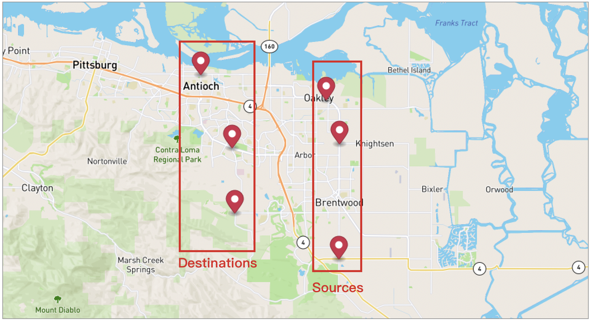
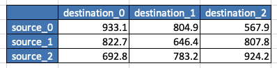
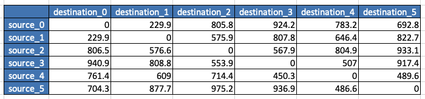

# Time Matrix


When you have many stops and want to determine the travel time among them at once,

Time Matrix would be helpful to you.

## Table of contents
- [Time Matrix](#time-matrix)
  - [Example of Specified sources and destinations](#example-of-specified-sources-and-destinations)
  - [Example of All Possibilities](#example-of-all-possibilities)
  - [Example of Additional stops](#example-of-additional-stops)
  - [Request Payloads](#request-payloads)
  - [Importance](#importance)

## Example of Specified sources and destinations

Let's say we have 6 stops which 3 are sources and 3 are destinations,
we will make a calculation request then get the result.

**Send Calculation Request**

```
POST {{baseURL}}/enterprise/v1/dro/time_matrix
```

**Body**
```json
{
    "requestId": "time-matrix-2001A",
    "points": [
        {
            "position":
            {
                "latitude": 37.996333094327554,
                "longitude": -121.70646459893086
            }
        },
        {
            "position":
            {
                "latitude": 37.96858164318102,
                "longitude": -121.6959508962403
            }
        },
        {
            "position":
            {
                "latitude": 37.8966488871678,
                "longitude": -121.69619540095405
            }
        },
        {
            "position":
            {
                "latitude": 37.925198993623624,
                "longitude": -121.77883799480549
            }
        },
        {
            "position":
            {
                "latitude": 37.966075787314864,
                "longitude": -121.78128304194283
            }
        },
        {
            "position":
            {
                "latitude": 38.011938673071406,
                "longitude": -121.80597801802993
            }
        }
    ],
    "sourcesIdx": [
        0,1,2
    ],
    "destinationsIdx": [
        3,4,5
    ],
    "asynchronous": true,
    "countryIso3": "USA"
}
```

**Get Calculation Result**
```
GET {{baseURL}}/enterprise/v1/dro/time_matrix/{{requestId}}
```

**Response**

```json
{
    "rows": [
        {
            "value": [
                924.2,
                783.2,
                692.8
            ]
        },
        {
            "value": [
                807.8,
                646.4,
                822.7
            ]
        },
        {
            "value": [
                567.9,
                804.9,
                933.1
            ]
        }
    ],
    "stat": {
        "uniqueSource": 3,
        "uniqueDestination": 3,
        "totalCells": 9
    },
    "requestId": "time-matrix-2001A",
    "startTimeEpoch": 1672296810,
    "accountBuid": "4022a1aada0e4c4684e61e3f73290a68",
    "request": {
        "requestId": "time-matrix-2001A",
        "points": [
            {
                "position": {
                    "latitude": 37.996333094327554,
                    "longitude": -121.70646459893086
                }
            },
            {
                "position": {
                    "latitude": 37.96858164318102,
                    "longitude": -121.6959508962403
                }
            },
            {
                "position": {
                    "latitude": 37.8966488871678,
                    "longitude": -121.69619540095405
                }
            },
            {
                "position": {
                    "latitude": 37.925198993623624,
                    "longitude": -121.77883799480549
                }
            },
            {
                "position": {
                    "latitude": 37.966075787314864,
                    "longitude": -121.78128304194283
                }
            },
            {
                "position": {
                    "latitude": 38.011938673071406,
                    "longitude": -121.80597801802993
                }
            }
        ],
        "sourcesIdx": [
            0,
            1,
            2
        ],
        "destinationsIdx": [
            3,
            4,
            5
        ],
        "asynchronous": true,
        "countryIso3": "USA"
    }
}
```


Then, we got a 3x3 time(seconds) matrix from the rows in the response.



## Example of All Possibilities


In this case, we want to calculate travel time among the 6 stops.

**Send Calculation Request**

```
POST {{baseURL}}/enterprise/v1/dro/time_matrix
```

**Body**
```json
{
    "requestId": "time-matrix-2001B",
    "points": [
        {
            "position":
            {
                "latitude": 37.996333094327554,
                "longitude": -121.70646459893086
            }
        },
        {
            "position":
            {
                "latitude": 37.96858164318102,
                "longitude": -121.6959508962403
            }
        },
        {
            "position":
            {
                "latitude": 37.8966488871678,
                "longitude": -121.69619540095405
            }
        },
        {
            "position":
            {
                "latitude": 37.925198993623624,
                "longitude": -121.77883799480549
            }
        },
        {
            "position":
            {
                "latitude": 37.966075787314864,
                "longitude": -121.78128304194283
            }
        },
        {
            "position":
            {
                "latitude": 38.011938673071406,
                "longitude": -121.80597801802993
            }
        }
    ],
    "sourcesIdx": [
    ],
    "destinationsIdx": [
    ],
    "asynchronous": true,
    "countryIso3": "USA"
}
```

**Get Calculation Result**

```
GET {{baseURL}}/enterprise/v1/dro/time_matrix/{{requestId}}
```

**Response**

```json
{
    "rows": [
        {
            "value": [
                0.0,
                229.9,
                805.8,
                924.2,
                783.2,
                692.8
            ]
        },
        {
            "value": [
                229.9,
                0.0,
                575.9,
                807.8,
                646.4,
                822.7
            ]
        },
        {
            "value": [
                806.5,
                576.6,
                0.0,
                567.9,
                804.9,
                933.1
            ]
        },
        {
            "value": [
                940.9,
                808.8,
                553.9,
                0.0,
                507.0,
                917.4
            ]
        },
        {
            "value": [
                761.4,
                609.0,
                714.4,
                450.3,
                0.0,
                489.6
            ]
        },
        {
            "value": [
                704.3,
                877.7,
                975.2,
                936.9,
                486.6,
                0.0
            ]
        }
    ],
    "stat": {
        "uniqueSource": 6,
        "uniqueDestination": 6,
        "totalCells": 36
    },
    "requestId": "time-matrix-2001B",
    "startTimeEpoch": 1672296872,
    "accountBuid": "4022a1aada0e4c4684e61e3f73290a68",
    "request": {
        "requestId": "time-matrix-2001B",
        "points": [
            {
                "position": {
                    "latitude": 37.996333094327554,
                    "longitude": -121.70646459893086
                }
            },
            {
                "position": {
                    "latitude": 37.96858164318102,
                    "longitude": -121.6959508962403
                }
            },
            {
                "position": {
                    "latitude": 37.8966488871678,
                    "longitude": -121.69619540095405
                }
            },
            {
                "position": {
                    "latitude": 37.925198993623624,
                    "longitude": -121.77883799480549
                }
            },
            {
                "position": {
                    "latitude": 37.966075787314864,
                    "longitude": -121.78128304194283
                }
            },
            {
                "position": {
                    "latitude": 38.011938673071406,
                    "longitude": -121.80597801802993
                }
            }
        ],
        "asynchronous": true,
        "countryIso3": "USA"
    }
}
```

Then, we got a 6x6 time(seconds) matrix from the rows in the response.


## Example of Additional Stops

To calculate with additional stops, we will use <b>referenceRequestId</b> which is the requestId of matrix we just created.

In this example, we added another 3 stops with a referenceRequestId to the request.

```
POST {{baseURL}}/enterprise/v1/dro/time_matrix
```

**Body**
```json
{
    "requestId": "time-matrix-A2001",
    "referenceRequestId": "time-matrix-2001B",
    "points": [
        {
            "position": {
                "latitude": 37.996333094327554,
                "longitude": -121.70646459893086
            }
        },
        {
            "position": {
                "latitude": 37.96858164318102,
                "longitude": -121.6959508962403
            }
        },
        {
            "position": {
                "latitude": 37.8966488871678,
                "longitude": -121.69619540095405
            }
        },
        {
            "position": {
                "latitude": 37.925198993623624,
                "longitude": -121.77883799480549
            }
        },
        {
            "position": {
                "latitude": 37.966075787314864,
                "longitude": -121.78128304194283
            }
        },
        {
            "position": {
                "latitude": 38.011938673071406,
                "longitude": -121.80597801802993
            }
        },
        {
            "position": {
                "latitude": 37.988837389014364,
                "longitude": -121.76569457567187
            }
        },
        {
            "position": {
                "latitude": 37.983100261654,
                "longitude": -121.75899537913271
            }
        },
        {
            "position": {
                "latitude": 37.98395140229323,
                "longitude": -121.75187623295975
            }
        }
    ],
    "sourcesIdx": [],
    "destinationsIdx": [],
    "asynchronous": true,
    "countryIso3": "USA"
}
```

**Get Calculation Result**

```
GET {{baseURL}}/enterprise/v1/dro/time_matrix/{{requestId}}
```

Then, we will get a 9x9 matrix with the requestId "time-matrix-A2001" with a <b>referencedCells</b> in "stat" field.

**Response**

```json
{
    "rows": [
        {
            "value": [
                0.0,
                229.9,
                805.8,
                924.2,
                783.2,
                692.8,
                860.1,
                714.1,
                780.1
            ]
        },
        {
            "value": [
                229.9,
                0.0,
                575.9,
                807.8,
                646.4,
                822.7,
                748.2,
                706.8,
                757.4
            ]
        },
        {
            "value": [
                806.5,
                576.6,
                0.0,
                567.9,
                804.9,
                933.1,
                906.7,
                865.3,
                915.9
            ]
        },
        {
            "value": [
                940.9,
                808.8,
                553.9,
                0.0,
                507.0,
                917.4,
                840.5,
                799.1,
                849.7
            ]
        },
        {
            "value": [
                761.4,
                609.0,
                714.4,
                450.3,
                0.0,
                489.6,
                440.0,
                398.6,
                449.2
            ]
        },
        {
            "value": [
                704.3,
                877.7,
                975.2,
                936.9,
                486.6,
                0.0,
                559.4,
                518.0,
                568.6
            ]
        },
        {
            "value": [
                799.7,
                767.0,
                872.4,
                840.1,
                460.1,
                531.1,
                0.0,
                155.1,
                205.7
            ]
        },
        {
            "value": [
                716.5,
                736.0,
                841.4,
                809.1,
                429.1,
                500.1,
                156.2,
                0.0,
                76.2
            ]
        },
        {
            "value": [
                785.6,
                777.6,
                883.0,
                850.7,
                470.7,
                541.7,
                197.8,
                73.7,
                0.0
            ]
        }
    ],
    "stat": {
        "uniqueSource": 9,
        "uniqueDestination": 9,
        "totalCells": 81,
        "referencedCells": 36
    },
    "requestId": "time-matrix-A2001",
    "startTimeEpoch": 1672297031,
    "accountBuid": "4022a1aada0e4c4684e61e3f73290a68",
    "request": {
        "requestId": "time-matrix-A2001",
        "points": [
            {
                "position": {
                    "latitude": 37.996333094327554,
                    "longitude": -121.70646459893086
                }
            },
            {
                "position": {
                    "latitude": 37.96858164318102,
                    "longitude": -121.6959508962403
                }
            },
            {
                "position": {
                    "latitude": 37.8966488871678,
                    "longitude": -121.69619540095405
                }
            },
            {
                "position": {
                    "latitude": 37.925198993623624,
                    "longitude": -121.77883799480549
                }
            },
            {
                "position": {
                    "latitude": 37.966075787314864,
                    "longitude": -121.78128304194283
                }
            },
            {
                "position": {
                    "latitude": 38.011938673071406,
                    "longitude": -121.80597801802993
                }
            },
            {
                "position": {
                    "latitude": 37.988837389014364,
                    "longitude": -121.76569457567187
                }
            },
            {
                "position": {
                    "latitude": 37.983100261654,
                    "longitude": -121.75899537913271
                }
            },
            {
                "position": {
                    "latitude": 37.98395140229323,
                    "longitude": -121.75187623295975
                }
            }
        ],
        "asynchronous": true,
        "countryIso3": "USA",
        "referenceRequestId": "time-matrix-2001B"
    }
}
```


## Request Payloads
- points - [required] The stops we want to calculate for time.
- requestId - [optional] If not specified we will generate one, it is determinsitacally based on the points, sourcesIdx, destinationsIdx.
- referenceRequestId - [optional] The requestId of created matrix.
- sources_idx - [optional] All points would be sources if it is not specified.
- destinations_idx - [optional] All points would be destinations if it is not specified.
- country_iso3 - [optional] A random Point would be used to determine its most likely country of origin if it is not specified.

## Importance
The calculation result will be available for 7 days (the result may be archived after 7 days).