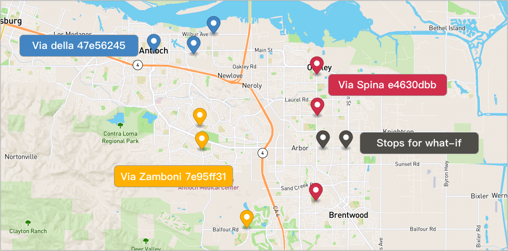

# Assignee Location and Staleness



Let's say we have 2 stops and 3 routes for what-if observation.
- Two stops (Right of the map, Black)
- Via della 47e56245 (Top of the map, blue) - It is not associated with an assignee.
- Via Spina e4630dbb (Right of the map, Red) - Associated with assignee but location was updated long time ago.
- Via Zamboni 7e95ff31 (Left of the map, Yellow) - Associated with assignee but location is never updated.

## Table of contents
- [Assignee Location and Staleness](#assignee-location-and-staleness)
- [Default Setting Example](#default-setting-example)
- [Include Unknown Position Assignee Example](#include-unknown-position-assignee-example)
- [Include Unknown and Staleness Position Assignees Example](#include-unknown-and-staleness-position-assignees-example)
- [Parameters](#parameters)

## Default Setting Example
By selecting a route, the system will check defaultly
- Whether or not the route is associated with an assignee
- Whether or not the assignee's location is updated and is it fresh (within 60 minutes of the request of the route)

Let's see an example of all selected routes are not selected as candidate.

**Request**
```
POST {{baseURL}}/enterprise/v1/lists/route_whatif
```

**Body**
```json
{
    "item": [
        {
            "list_item_id": "stop-01",
            "address": "7701 Lone Tree Wy, Brentwood, CA 94513, United States"
        },
        {
            "list_item_id": "stop-02",
            "address": "8383 Lone Tree Wy, Brentwood, CA 94513, United States"
        }
    ],
    "listRouteIds": [
        "e4630dbb-44f9-447c-8c5d-ba0aee0a6b82",
        "7e95ff31-2d79-4405-82b2-3a9f8ea89c34",
        "47e56245-0a78-4cb9-a268-83fa2f247d91"
    ],
    "assignee_position_freshness_minutes":60,
    "allow_unknown_assignee_location":false
}
```

**Response**

We can see the details from logs in the response
- Freshness configuration is 60 minutes
- Via della 47e56245 - is not associated with an  assignee
- Via Spina e4630dbb - is associated with an assignee, updated location before but not fresh now (within 60 minutes)
- Via Zamboni 7e95ff31 - is associated with an assignee but the location is not updated (0/0 position)

```json
{
    "item": [
        {
            "listItemId": "stop-01",
            "address": "7701 Lone Tree Wy, Brentwood, CA 94513, United States"
        },
        {
            "listItemId": "stop-02",
            "address": "8383 Lone Tree Wy, Brentwood, CA 94513, United States"
        }
    ],
    "listRouteIds": [
        "e4630dbb-44f9-447c-8c5d-ba0aee0a6b82",
        "7e95ff31-2d79-4405-82b2-3a9f8ea89c34",
        "47e56245-0a78-4cb9-a268-83fa2f247d91"
    ],
    "requestId": "6c8e09aa1605475fae3202e5949aa441",
    "assigneePositionFreshnessMinutes": 60,
    "logs": [
        "The Assignee Freshness configuration is at 60 minutes",
        "Starting to compute what-ifs for 3 routes at 1663323870",
        "Route 47e56245-0a78-4cb9-a268-83fa2f247d91 does not have assignee and is not suitable",
        "Route 7e95ff31-2d79-4405-82b2-3a9f8ea89c34's assignee has 0/0 position and is not suitable",
        "Route e4630dbb-44f9-447c-8c5d-ba0aee0a6b82 is not suitable because assignee's position timestamp Wed Sep 14 10:00:00 UTC 2022 is stale",
        "There are 3 routes where 1 are not suitable and 0 are possibilities"
    ],
    "status": "completed",
    "accountBuid": "4022a1aada0e4c4684e61e3f73290a68",
    "startTimeEpoch": 1663323870,
    "endTimeEpoch": 1663323871,
    "message": "Completed"
}
```

## Include Unknown Position Assignee Example
To include route "Via Spina e4630dbb" and "Via Zamboni 7e95ff31" for what-if observation
- Set `allow_unknown_assignee_location` to true.

**Request**
```json
{
    "item": [
        {
            "list_item_id": "stop-01",
            "address": "7701 Lone Tree Wy, Brentwood, CA 94513, United States"
        },
        {
            "list_item_id": "stop-02",
            "address": "8383 Lone Tree Wy, Brentwood, CA 94513, United States"
        }
    ],
    "listRouteIds": [
        "e4630dbb-44f9-447c-8c5d-ba0aee0a6b82",
        "7e95ff31-2d79-4405-82b2-3a9f8ea89c34",
        "47e56245-0a78-4cb9-a268-83fa2f247d91"
    ],
    "assignee_position_freshness_minutes":60,
    "allow_unknown_assignee_location":true
}
```

**Response**
```json
{
    "item": [
        {
            "listItemId": "stop-01",
            "address": "7701 Lone Tree Wy, Brentwood, CA 94513, United States"
        },
        {
            "listItemId": "stop-02",
            "address": "8383 Lone Tree Wy, Brentwood, CA 94513, United States"
        }
    ],
    "listRouteIds": [
        "e4630dbb-44f9-447c-8c5d-ba0aee0a6b82",
        "7e95ff31-2d79-4405-82b2-3a9f8ea89c34",
        "47e56245-0a78-4cb9-a268-83fa2f247d91"
    ],
    "requestId": "eacd514490a144cfbbadbdfe471127c9",
    "assigneePositionFreshnessMinutes": 60,
    "logs": [
        "The Assignee Freshness configuration is at 60 minutes",
        "Starting to compute what-ifs for 3 routes at 1663324610",
        "Route 47e56245-0a78-4cb9-a268-83fa2f247d91 does not have assignee, assuming ok for evaluation",
        "Route e4630dbb-44f9-447c-8c5d-ba0aee0a6b82 is not suitable because assignee's position timestamp Wed Sep 14 10:00:00 UTC 2022 is stale",
        "Route 7e95ff31-2d79-4405-82b2-3a9f8ea89c34's assignee has 0/0 position, assuming ok for evaluation",
        "Route 7e95ff31-2d79-4405-82b2-3a9f8ea89c34 is computed with delta cost (561,[529,535])",
        "Route 47e56245-0a78-4cb9-a268-83fa2f247d91 is computed with delta cost (564,[554,545])",
        "There are 3 routes where 1 are not suitable and 2 are possibilities"
    ],
    "status": "completed",
    "accountBuid": "4022a1aada0e4c4684e61e3f73290a68",
    "allowUnknownAssigneeLocation": true,
    "startTimeEpoch": 1663324610,
    "endTimeEpoch": 1663324611,
    "result": {
        "routes": [
            {
                "listRouteId": "7e95ff31-2d79-4405-82b2-3a9f8ea89c34",
                "deltaDistanceM": 8746.900000000001,
                "deltaTimeS": 717.4000000000001
            },
            {
                "listRouteId": "47e56245-0a78-4cb9-a268-83fa2f247d91",
                "deltaDistanceM": 12334.900000000001,
                "deltaTimeS": 811.6999999999999
            }
        ]
    },
    "message": "Completed"
}
```

## Include Unknown and Staleness Position Assignees Example
This time, we are not only setting `allow_unknown_assignee_location` to true 

but also giving `assignee_position_freshness_minutes` a very large number to include the route associated with assignee which's location is staleness.

**Request**
```json
{
    "item": [
        {
            "list_item_id": "stop-01",
            "address": "7701 Lone Tree Wy, Brentwood, CA 94513, United States"
        },
        {
            "list_item_id": "stop-02",
            "address": "8383 Lone Tree Wy, Brentwood, CA 94513, United States"
        }
    ],
    "listRouteIds": [
        "e4630dbb-44f9-447c-8c5d-ba0aee0a6b82",
        "7e95ff31-2d79-4405-82b2-3a9f8ea89c34",
        "47e56245-0a78-4cb9-a268-83fa2f247d91"
    ],
    "assignee_position_freshness_minutes":6000,
    "allow_unknown_assignee_location":true
}
```

**Response**
```json
{
    "item": [
        {
            "listItemId": "stop-01",
            "address": "7701 Lone Tree Wy, Brentwood, CA 94513, United States"
        },
        {
            "listItemId": "stop-02",
            "address": "8383 Lone Tree Wy, Brentwood, CA 94513, United States"
        }
    ],
    "listRouteIds": [
        "e4630dbb-44f9-447c-8c5d-ba0aee0a6b82",
        "7e95ff31-2d79-4405-82b2-3a9f8ea89c34",
        "47e56245-0a78-4cb9-a268-83fa2f247d91"
    ],
    "requestId": "89f558e5d41e44d8af8e9d2fd843fc3b",
    "assigneePositionFreshnessMinutes": 6000,
    "logs": [
        "The Assignee Freshness configuration is at 6000 minutes",
        "Starting to compute what-ifs for 3 routes at 1663325162",
        "Route 47e56245-0a78-4cb9-a268-83fa2f247d91 does not have assignee, assuming ok for evaluation",
        "Route 7e95ff31-2d79-4405-82b2-3a9f8ea89c34's assignee has 0/0 position, assuming ok for evaluation",
        "Route 47e56245-0a78-4cb9-a268-83fa2f247d91 is computed with delta cost (19,[7,10])",
        "Route 7e95ff31-2d79-4405-82b2-3a9f8ea89c34 is computed with delta cost (20,[8,9])",
        "Route e4630dbb-44f9-447c-8c5d-ba0aee0a6b82 is computed with delta cost (28,[12,10])",
        "There are 3 routes where 0 are not suitable and 3 are possibilities"
    ],
    "status": "completed",
    "accountBuid": "4022a1aada0e4c4684e61e3f73290a68",
    "allowUnknownAssigneeLocation": true,
    "startTimeEpoch": 1663325162,
    "endTimeEpoch": 1663325162,
    "result": {
        "routes": [
            {
                "listRouteId": "e4630dbb-44f9-447c-8c5d-ba0aee0a6b82",
                "deltaDistanceM": 1894.7000000000007,
                "deltaTimeS": 107.10000000000014
            },
            {
                "listRouteId": "7e95ff31-2d79-4405-82b2-3a9f8ea89c34",
                "deltaDistanceM": 8746.900000000001,
                "deltaTimeS": 717.4000000000001
            },
            {
                "listRouteId": "47e56245-0a78-4cb9-a268-83fa2f247d91",
                "deltaDistanceM": 12334.900000000001,
                "deltaTimeS": 811.6999999999999
            }
        ]
    },
    "message": "Completed"
}
```

## Parameters
- assignee_position_freshness_minutes - (optional) default is 60
- allow_unknown_assignee_location - (optional) default is false