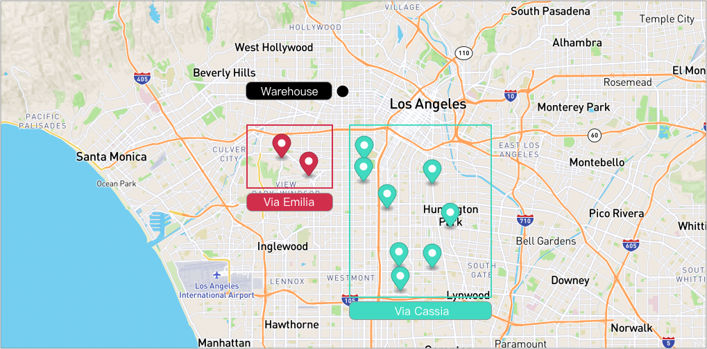

# What-if with Route Size Limit


## Table of contents
- [Create the data](#create-the-data)
  - [Create a warehouse](#create-a-warehouse)
  - [Create routes](#create-routes)
  - [Add stops to the routes](#add-stops-to-the-routes)
- [Run What If](#run-what-if)
- [Some Important Notes](#some-important-notes)

## Create the data
### Create a warehouse

**Request Example**

```
POST {{baseURL}}/enterprise/v1/lists/warehouses
```

**Body**
- It is important to set list_warehouse_id that is unique in your account.

```json
{
  "warehouse": [
    {
      "name": "Thermopylae",
      "listWarehouseId": "d56bb78a-cdcb-4cfb-975a-597bb2b468f0",
      "address": "5905 Wilshire Blvd, Los Angeles, CA 90036, United States"
    }
  ]
}
```

**Note**: Your list_warehouse_id and address would be different.

### Create routes

A grouping Route, although isn't required for optimization, is a convenient bucket to gather
stops to be optimized.

**Request Example**

```
POST {{baseURL}}/enterprise/v1/lists/routes
```

**Body**
```json
{
    "route":[
        {
            "name": "Via Emilia",
            "list_route_id": "7f3e5c32-7c5b-482b-9490-f6f04c306cb7",
            "status": "OPEN",
            "date_str": "2031-02-21",
            "warehouse":
            {
                "list_warehouse_id": "6f4f7bf9-b878-4eda-b01d-17dfcfcdadc3"
            }
        },
        {
            "name": "Via Cassia",
            "list_route_id": "da41cfbb-812c-48f5-b678-f59f2e9255cf",
            "status": "OPEN",
            "date_str": "2031-02-21",
            "warehouse":
            {
                "list_warehouse_id": "6f4f7bf9-b878-4eda-b01d-17dfcfcdadc3"
            }
        }
    ]
}
```

**Note**: Your list_warehouse_id, list_route_id would be different.

### Add stops to the routes
**Request Example**

```
POST {{baseURL}}/enterprise/v1/lists/items
```

**body**
You can see the payload detail here [assets/stops.json](assets/stops.json) while the partial below.
- 2 stops for route Via Emilia (7f3e5c32-7c5b-482b-9490-f6f04c306cb7).
- 8 stops for route Via Cassia (da41cfbb-812c-48f5-b678-f59f2e9255cf).
- Each stop contains the route reference to the route that was created above with route id.
```json
{
    "item": [
        {
            "list_item_id": "7f3e5c32-7c5b-482b-9490-f6f04c306cb7-01",
            "address": "3710 S La Brea Ave Ste A, Los Angeles, CA 90016, United States",
            "route": {
                "list_route_id": "7f3e5c32-7c5b-482b-9490-f6f04c306cb7"
            }
        },
        {
            "list_item_id": "7f3e5c32-7c5b-482b-9490-f6f04c306cb7-02",
            "address": "4233 S Crenshaw Blvd, Los Angeles, CA 90008, United States",
            "route": {
                "list_route_id": "7f3e5c32-7c5b-482b-9490-f6f04c306cb7"
            }
        },
        
        ...

        {
            "list_item_id": "da41cfbb-812c-48f5-b678-f59f2e9255cf-08",
            "address": "620 E 111th Pl, Los Angeles, CA 90059, United States",
            "route": {
                "list_route_id": "da41cfbb-812c-48f5-b678-f59f2e9255cf"
            }
        }
    ]
}
```

Here's a visualization of result.



### Run What If
Now, we want to see what-if on routes which won't exceed 5 stops.

**Request Example**

```
POST {{baseURL}}/enterprise/v1/lists/route_whatif
```

- We will use `route_size_limit` (optional,integer) as a constraint in the request.

```json
{
    "item": [
        {
            "list_item_id": "7d4b65f1-985c-40d9-a49a-fd92be45d035-011",
            "address": "1750 Vine St, Los Angeles, CA 90028, United States"
        },
        {
            "list_item_id": "7d4b65f1-985c-40d9-a49a-fd92be45d035-012",
            "address": "3508 W Washington Blvd, Los Angeles, CA 90018, United States"
        },
        {
            "list_item_id": "7d4b65f1-985c-40d9-a49a-fd92be45d035-013",
            "address": "5500 Campanile Dr, San Diego, CA 92182, United States"
        },
        {
            "list_item_id": "7d4b65f1-985c-40d9-a49a-fd92be45d035-014",
            "address": "851 Showroom Pl #100, Chula Vista, CA 91914, United States"
            
        }
    ],
    "listRouteIds": [
        "7f3e5c32-7c5b-482b-9490-f6f04c306cb7",
        "da41cfbb-812c-48f5-b678-f59f2e9255cf"
    ],
    "route_size_limit": 5
}
```

**Response Example**
From the response we can see, only one route has result.
Since the other one has exceed the route size limit which is 5.

- There are 2 stops in 7f3e5c32-7c5b-482b-9490-f6f04c306cb7.
- There are 8 stops in da41cfbb-812c-48f5-b678-f59f2e9255cf.

We can also see it from the field "logs"

```json
{
    "item": [
        {
            "listItemId": "7d4b65f1-985c-40d9-a49a-fd92be45d035-011",
            "address": "1750 Vine St, Los Angeles, CA 90028, United States"
        },
        {
            "listItemId": "7d4b65f1-985c-40d9-a49a-fd92be45d035-012",
            "address": "3508 W Washington Blvd, Los Angeles, CA 90018, United States"
        },
        {
            "listItemId": "7d4b65f1-985c-40d9-a49a-fd92be45d035-013",
            "address": "5500 Campanile Dr, San Diego, CA 92182, United States"
        },
        {
            "listItemId": "7d4b65f1-985c-40d9-a49a-fd92be45d035-014",
            "address": "851 Showroom Pl #100, Chula Vista, CA 91914, United States"
        }
    ],
    "listRouteIds": [
        "7f3e5c32-7c5b-482b-9490-f6f04c306cb7",
        "da41cfbb-812c-48f5-b678-f59f2e9255cf"
    ],
    "routeSizeLimit": 5,
    "requestId": "3b01c70440b044468ec21ac98554cc1e",
    "logs": [
        "Starting to compute what-ifs for 2 routes",
        "Route da41cfbb-812c-48f5-b678-f59f2e9255cf has 8 stops. More than 5",
        "There are 2 routes where 1 are not suitable and 1 are possibilities"
    ],
    "status": "completed",
    "result": {
        "routes": [
            {
                "listRouteId": "7f3e5c32-7c5b-482b-9490-f6f04c306cb7",
                "deltaDistanceM": 242907.00000000003,
                "deltaTimeS": 11771.400000000001
            }
        ]
    },
    "message": "Completed"
}
```

## Some Important Notes
- if a route does not have "deltaDistanceM" and "deltaTimeS", then, it is 0 (default value). This often happens when the stops to be added already exist on that route
- delta distance and time can be negative, suggesting reductions
- reduction in one DOES NOT imply reduction in another
  - for example, if a distance is reduced, but with more city driving, then, the time may be increased (sometimes quite dramatically)
- It is critical to look at both distance and time deltas to pick one that achieve proper balance. Thus, if a route has both smallest delta distance and smallest delta time, that is often a good route.
  - However, if the smallest delta distance route is not the same as the smallest delta time, it is often the case that the smallest delta time is a better route