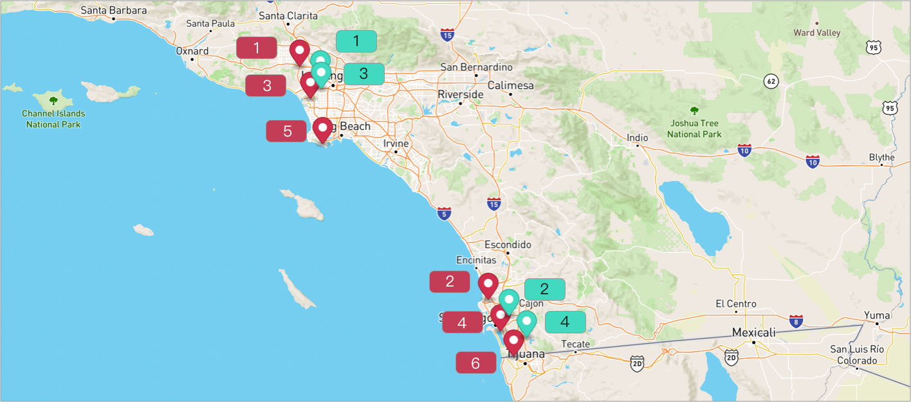

# What-if with Source Sequence
Sometimes we want to keep the ordering of the stops visiting for observing.

In this case, we can use ListItem's attribute source_seq.

For example, if we have 5 stops and the relative ordering for each other is A -> B -> X -> Y -> Z

then, we can set source_seq for each of them.
- A (source_seq = 7)
- B (source_seq = 15)
- X (source_seq = 20)
- Y (source_seq = 300)
- Z (source_seq = 800)

And if we want to remove the `source_seq` as a factor for observing, we can set the ListItem's source_seq to 0 or use attribute `ignore_source_sequence` for what-if request, when it is set to true, the `source_seq` would be ignored.

## Table of contents
- [Create the data](#create-the-data)
  - [Create a warehouse](#create-a-warehouse)
  - [Create routes](#create-routes)
  - [Add stops to the routes](#add-stops-to-the-routes)
- [Run What If](#run-what-if)
- [Some Important Notes](#some-important-notes)

## Create the data
### Create a warehouse

**Request Example**

```
POST https://isp.beans.ai/enterprise/v1/lists/warehouses
```

- list_warehouse_id - It is unique in your account.

```json
{
  "warehouse": [
    {
      "name": "Thermopylae",
      "listWarehouseId": "6f4f7bf9-b878-4eda-b01d-17dfcfcdadc3",
      "address": "3790 Wilshire Blvd, Los Angeles, CA 90010, United States"
    }
  ]
}
```

**Note**: Your list_warehouse_id and address would be different.

### Create routes

A grouping Route, although isn't required for optimization, is a convenient bucket to gather
stops to be optimized.

**Request Example**

```
POST https://isp.beans.ai/enterprise/v1/lists/routes
```

- list_route_id - It is unique in your account.
- date_str - It is in yyyy-MM-dd format.

**Body**
```json
{
    "route":[
        {
            "name": "Via Emilia",
            "list_route_id": "5793c99b-b284-4601-a992-bd40eb8c501d",
            "status": "OPEN",
            "date_str": "2023-02-21",
            "warehouse":
            {
                "list_warehouse_id": "6f4f7bf9-b878-4eda-b01d-17dfcfcdadc3"
            }
        },
        {
            "name": "Via Cassia",
            "list_route_id": "405bf4db-a8c2-49ae-b1aa-8d783f0d7235",
            "status": "OPEN",
            "date_str": "2023-02-21",
            "warehouse":
            {
                "list_warehouse_id": "6f4f7bf9-b878-4eda-b01d-17dfcfcdadc3"
            }
        }
    ]
}
```

**Note**: Your list_warehouse_id, list_route_id would be different.

### Add stops to the routes


Let's add 6 stops for route "Via Emilia" and 2 stops for route "Via Cassia"

And we will predetermine the order of stops with source_seq.

**Request Example**
```
POST https://isp.beans.ai/enterprise/v1/lists/items
```
**Body**
- source_seq - To predetermine the ordering of the stop.

```json
{
    "item":
    [
        // Route Via Emilia
        {
            "list_item_id": "b115c136-2e41-4d98-82fc-280379b8fb00-01",
            "address": "250 S Rossmore Ave, Los Angeles, CA 90004, United States",
            "route":
            {
                "list_route_id": "5793c99b-b284-4601-a992-bd40eb8c501d"
            },
            "source_seq": 1
        },
        {
            "list_item_id": "b115c136-2e41-4d98-82fc-280379b8fb00-02",
            "address": "743 S Lucerne Blvd, Los Angeles, CA 90005, United States",
            "route":
            {
                "list_route_id": "5793c99b-b284-4601-a992-bd40eb8c501d"
            },
            "source_seq": 3
        },
        {
            "list_item_id": "b115c136-2e41-4d98-82fc-280379b8fb00-03",
            "address": "4120 W Olympic Blvd, Los Angeles, CA 90019, United States",
            "route":
            {
                "list_route_id": "5793c99b-b284-4601-a992-bd40eb8c501d"
            },
            "source_seq": 5
        },
        {
            "list_item_id": "b115c136-2e41-4d98-82fc-280379b8fb00-04",
            "address": "3555 W Temple St, Los Angeles, CA 90004, United States",
            "route":
            {
                "list_route_id": "5793c99b-b284-4601-a992-bd40eb8c501d"
            },
            "source_seq": 2
        },
        {
            "list_item_id": "b115c136-2e41-4d98-82fc-280379b8fb00-05",
            "address": "610 S Rampart Blvd, Los Angeles, CA 90057, United States",
            "route":
            {
                "list_route_id": "5793c99b-b284-4601-a992-bd40eb8c501d"
            },
            "source_seq": 4
        },
        {
            "list_item_id": "b115c136-2e41-4d98-82fc-280379b8fb00-06",
            "address": "1800 W Olympic Blvd, Los Angeles, CA 90006, United States",
            "route":
            {
                "list_route_id": "5793c99b-b284-4601-a992-bd40eb8c501d"
            },
            "source_seq": 6
        },

        // Route Via Cassia
        {
            "list_item_id": "4b5c15a2-f281-4a6d-ae79-81ab0a208587-01",
            "address": "7353 Melrose Ave, Los Angeles, CA 90046, United States",
            "route":
            {
                "list_route_id": "405bf4db-a8c2-49ae-b1aa-8d783f0d7235"
            },
            "source_seq": 1
        },
        {
            "list_item_id": "4b5c15a2-f281-4a6d-ae79-81ab0a208587-02",
            "address": "2200 Sunset Blvd, Los Angeles, CA 90026, United States",
            "route":
            {
                "list_route_id": "405bf4db-a8c2-49ae-b1aa-8d783f0d7235"
            },
            "source_seq": 2
        }
    ]
}
```


### Run What If
Now we want to see what if we put the two stops into the route which has 6 stops.

**Request Example**

```
POST https://isp.beans.ai/enterprise/v1/lists/route_whatif
```

**Body**

```json
{
    "item": [
        {
            "list_item_id": "4b5c15a2-f281-4a6d-ae79-81ab0a208587-01",
            "address": "7353 Melrose Ave, Los Angeles, CA 90046, United States",
            "route": {
                "list_route_id": "405bf4db-a8c2-49ae-b1aa-8d783f0d7235"
            },
            "source_seq":1
        },
        {
            "list_item_id": "4b5c15a2-f281-4a6d-ae79-81ab0a208587-02",
            "address": "2200 Sunset Blvd, Los Angeles, CA 90026, United States",
            "route": {
                "list_route_id": "405bf4db-a8c2-49ae-b1aa-8d783f0d7235"
            },
            "source_seq":2
        }
    ],
    "listRouteIds": [
        "5793c99b-b284-4601-a992-bd40eb8c501d"
    ],
    "route_size_limit": 50,
    "ignore_source_sequence": true
}
```
- item (required)
  - An array of stops
- list_route_ids (optional)
  - An array of existing route IDs in the system. If a route ID does not exist in the system, it would be ignored
- - If this is NOT specified, then, ALL open routes are considered, which could be very expansive depending on the number of open routes
- route_size_limit (optional, though strongly recommended) 
  - The upper limit of the number of items in a route for that route to be considered. So, for example, if 3a26ff50fb3830b8be7f3d50e0b5e0fa has 60 stops, that route would NOT be considered 
- request_id (required)
  - The ID to identify this request, can be used to query the status later.
- use_warehouse_as_terminal (optional)
  - Default to false would render the route to be computed to "end anywhere". If it is set the true, then, the warehouse specified on the route would be used as the terminal of the route.
- include_multi_day_window_stops (optional)
  - Default to false would remove the stops from request (and not from route) where the gap between deliver_from and deliver_by is more than 24 hours. This is to guard against the situation where a stop may be fulfilled anytime within the next 5 days, for instance.
  - If this is set to true, such stops would be included in the route computation, and the system would currently attempt to honor that stop within the single day
- include_open_stops_outside_current_date (optional)
  - default is false.
  - if it is true, all the stops that are still "open" would be included in the what-if computations.
  - If it is false, then, a stop where deliver_from_str and deliver_by_str that does not intersect with the current local date time will NOT be included.
- `ignore_source_sequence`
  - default is false.
  - if it is false, it means source_seq attribute would be observed.

**Response Example**

```json
{
    "item": [
        {
            "listItemId": "4b5c15a2-f281-4a6d-ae79-81ab0a208587-01",
            "address": "7353 Melrose Ave, Los Angeles, CA 90046, United States",
            "route": {
                "listRouteId": "405bf4db-a8c2-49ae-b1aa-8d783f0d7235"
            },
            "sourceSeq": 1
        },
        {
            "listItemId": "4b5c15a2-f281-4a6d-ae79-81ab0a208587-02",
            "address": "2200 Sunset Blvd, Los Angeles, CA 90026, United States",
            "route": {
                "listRouteId": "405bf4db-a8c2-49ae-b1aa-8d783f0d7235"
            },
            "sourceSeq": 2
        }
    ],
    "listRouteIds": [
        "5793c99b-b284-4601-a992-bd40eb8c501d"
    ],
    "routeSizeLimit": 50,
    "requestId": "d0dedf00714a4d76ae143d7c9a3e346a",
    "logs": [
        "Starting to compute what-ifs for 1 routes",
        "There are 1 routes where 0 are not suitable and 1 are possibilities"
    ],
    "status": "completed",
    "result": {
        "routes": [
            {
                "listRouteId": "5793c99b-b284-4601-a992-bd40eb8c501d",
                "deltaDistanceM": 10479.0,
                "deltaTimeS": 1544.0
            }
        ]
    },
    "message": "Completed"
}
```

## Some Important Notes
- if a route does not have "deltaDistanceM" and "deltaTimeS", then, it is 0 (default value). This often happens when the stops to be added already exist on that route
- delta distance and time can be negative, suggesting reductions
- reduction in one DOES NOT imply reduction in another
  - for example, if a distance is reduced, but with more city driving, then, the time may be increased (sometimes quite dramatically)
- It is critical to look at both distance and time deltas to pick one that achieve proper balance. Thus, if a route has both smallest delta distance and smallest delta time, that is often a good route.
  - However, if the smallest delta distance route is not the same as the smallest delta time, it is often the case that the smallest delta time is a better route