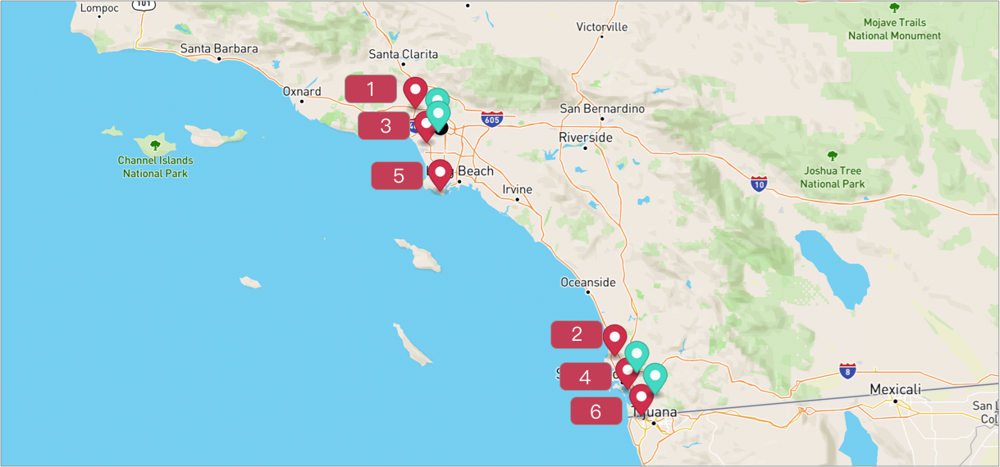

# What-if with Source Sequence
Sometimes we want to keep the ordering of the stops visiting for observation.

In this case, we can use ListItem's attribute source_seq.

For example, if we have 5 stops and the relative ordering for each other is A -> B -> X -> Y -> Z

then, we can set source_seq for each of them.
- A (source_seq = 7)
- B (source_seq = 15)
- X (source_seq = 20)
- Y (source_seq = 300)
- Z (source_seq = 800)

And if we want to remove the `source_seq` as a factor for observation, we can set the ListItem's source_seq to 0 or use attribute `ignore_source_sequence` with what-if request, when it is set to true, the `source_seq` would be ignored.

## Table of contents
- [Create the data](#create-the-data)
  - [Create a warehouse](#create-a-warehouse)
  - [Create routes](#create-routes)
  - [Add stops to the routes](#add-stops-to-the-routes)
- [Run What If](#run-what-if)
- [Some Important Notes](#some-important-notes)

## Create the data
### Create a warehouse

**Request Example**

```
POST https://isp.beans.ai/enterprise/v1/lists/warehouses
```

- list_warehouse_id - It is unique in your account.

```json
{
  "warehouse": [
    {
      "name": "Thermopylae",
      "listWarehouseId": "6f4f7bf9-b878-4eda-b01d-17dfcfcdadc3",
      "address": "3790 Wilshire Blvd, Los Angeles, CA 90010, United States"
    }
  ]
}
```

**Note**: Your list_warehouse_id and address would be different.

### Create routes

A grouping Route, although isn't required for optimization, is a convenient bucket to gather
stops to be optimized.

**Request Example**

```
POST https://isp.beans.ai/enterprise/v1/lists/routes
```

- list_route_id - It is unique in your account.
- date_str - It is in yyyy-MM-dd format.

**Body**
```json
{
    "route":[
        {
            "name": "Via Emilia",
            "list_route_id": "f5ef7959-1414-4b7f-ba9c-d0f8f351a07c",
            "status": "OPEN",
            "date_str": "2031-02-21",
            "warehouse":
            {
                "list_warehouse_id": "6f4f7bf9-b878-4eda-b01d-17dfcfcdadc3"
            }
        }
    ]
}
```

**Note**: Your list_warehouse_id, list_route_id would be different.

### Add stops to the routes


Let's add 6 stops to the route.

And we will predetermine the order of stops with source_seq.

**Request Example**
```
POST https://isp.beans.ai/enterprise/v1/lists/items
```
**Body**
- source_seq - To predetermine the ordering of the stop.

```json
{
    "item": [
        {
            "list_item_id": "f5ef7959-1414-4b7f-ba9c-d0f8f351a07c-01",
            "address": "4989 Sepulveda Blvd, Sherman Oaks, CA 91403, United States",
            "route":
            {
                "list_route_id": "f5ef7959-1414-4b7f-ba9c-d0f8f351a07c"
            },
            "tracking_id": "f5ef7959-01",
            "source_seq": 1
        },
        {
            "list_item_id": "f5ef7959-1414-4b7f-ba9c-d0f8f351a07c-02",
            "address": "6000 Sepulveda Blvd, Culver City, CA 90230, United States",
            "route":
            {
                "list_route_id": "f5ef7959-1414-4b7f-ba9c-d0f8f351a07c"
            },
            "tracking_id": "f5ef7959-02",
            "source_seq": 3
        },
        {
            "list_item_id": "f5ef7959-1414-4b7f-ba9c-d0f8f351a07c-03",
            "address": "1300 S Dodson Ave, San Pedro, CA 90732, United States",
            "route":
            {
                "list_route_id": "f5ef7959-1414-4b7f-ba9c-d0f8f351a07c"
            },
            "tracking_id": "f5ef7959-03",
            "source_seq": 5
        },
        {
            "list_item_id": "f5ef7959-1414-4b7f-ba9c-d0f8f351a07c-04",
            "address": "6949 Genesee Ave, San Diego, CA 92122, United States",
            "route":
            {
                "list_route_id": "f5ef7959-1414-4b7f-ba9c-d0f8f351a07c"
            },
            "tracking_id": "f5ef7959-04",
            "source_seq": 2
        },
        {
            "list_item_id": "f5ef7959-1414-4b7f-ba9c-d0f8f351a07c-05",
            "address": "3465 Senn St, San Diego, CA 92136, United States",
            "route":
            {
                "list_route_id": "f5ef7959-1414-4b7f-ba9c-d0f8f351a07c"
            },
            "tracking_id": "f5ef7959-05",
            "source_seq": 4
        },
        {
            "list_item_id": "f5ef7959-1414-4b7f-ba9c-d0f8f351a07c-06",
            "address": "4211 Camino De La Plaza, San Diego, CA 92173, United States",
            "route":
            {
                "list_route_id": "f5ef7959-1414-4b7f-ba9c-d0f8f351a07c"
            },
            "tracking_id": "f5ef7959-06",
            "source_seq": 6
        }
    ]
}
```


### Run What If
Now let's see what-if we put 4 floating stops to the route with `ignore_source_sequence = true`


**Request Example**

```
POST https://isp.beans.ai/enterprise/v1/lists/route_whatif
```

**Body**

```json
{
    "item": [
        {
            "list_item_id": "7d4b65f1-985c-40d9-a49a-fd92be45d035-011",
            "address": "1750 Vine St, Los Angeles, CA 90028, United States"
        },
        {
            "list_item_id": "7d4b65f1-985c-40d9-a49a-fd92be45d035-012",
            "address": "3508 W Washington Blvd, Los Angeles, CA 90018, United States"
        },
        {
            "list_item_id": "7d4b65f1-985c-40d9-a49a-fd92be45d035-013",
            "address": "5500 Campanile Dr, San Diego, CA 92182, United States"
        },
        {
            "list_item_id": "7d4b65f1-985c-40d9-a49a-fd92be45d035-014",
            "address": "851 Showroom Pl #100, Chula Vista, CA 91914, United States"
            
        }
    ],
    "listRouteIds": [
        "f5ef7959-1414-4b7f-ba9c-d0f8f351a07c"
    ],
    "ignore_source_sequence": true
}
```
- item (required)
  - An array of stops
- list_route_ids (optional)
  - An array of existing route IDs in the system. If a route ID does not exist in the system, it would be ignored
  - If this is NOT specified, then, ALL open routes are considered, which could be very expansive depending on the number of open routes
- `ignore_source_sequence` (optional)
  - default is false.
  - if it is false, it means source_seq attribute would be observed.

**Response Example**

```json
{
    "item": [
        {
            "listItemId": "7d4b65f1-985c-40d9-a49a-fd92be45d035-011",
            "address": "1750 Vine St, Los Angeles, CA 90028, United States"
        },
        {
            "listItemId": "7d4b65f1-985c-40d9-a49a-fd92be45d035-012",
            "address": "3508 W Washington Blvd, Los Angeles, CA 90018, United States"
        },
        {
            "listItemId": "7d4b65f1-985c-40d9-a49a-fd92be45d035-013",
            "address": "5500 Campanile Dr, San Diego, CA 92182, United States"
        },
        {
            "listItemId": "7d4b65f1-985c-40d9-a49a-fd92be45d035-014",
            "address": "851 Showroom Pl #100, Chula Vista, CA 91914, United States"
        }
    ],
    "listRouteIds": [
        "f5ef7959-1414-4b7f-ba9c-d0f8f351a07c"
    ],
    "requestId": "d13210fc0075487fbd575b68c7070a4f",
    "ignoreSourceSequence": true,
    "logs": [
        "Starting to compute what-ifs for 1 routes",
        "There are 1 routes where 0 are not suitable and 1 are possibilities"
    ],
    "status": "completed",
    "result": {
        "routes": [
            {
                "listRouteId": "f5ef7959-1414-4b7f-ba9c-d0f8f351a07c",
                "deltaDistanceM": 42911.899999999965,
                "deltaTimeS": 3170.7000000000007
            }
        ]
    },
    "message": "Completed"
}
```

Let's see the different result with `ignore_source_sequence = false`
```json
 ...
    "result": {
        "routes": [
            {
                "listRouteId": "f5ef7959-1414-4b7f-ba9c-d0f8f351a07c",
                "deltaDistanceM": 27406.0,
                "deltaTimeS": 2535.5
            }
        ]
    },
 ...

```


## Some Important Notes
- If a route does not have "deltaDistanceM" and "deltaTimeS", then, it is 0 (default value). This often happens when the stops to be added already exist on that route
- Delta distance and time can be negative, suggesting reductions
- Reduction in one DOES NOT imply reduction in another
  - for example, if a distance is reduced, but with more city driving, then, the time may be increased (sometimes quite dramatically)
- It is critical to look at both distance and time deltas to pick one that achieve proper balance. Thus, if a route has both smallest delta distance and smallest delta time, that is often a good route.
  - However, if the smallest delta distance route is not the same as the smallest delta time, it is often the case that the smallest delta time is a better route