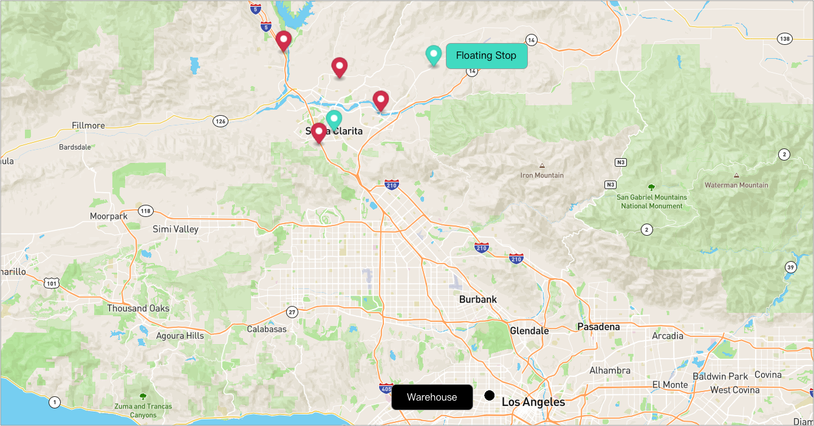

# What-if with Route Size Limit


Sometimes we want to observe what-if we use warehouse as a route's terminal.
And for this, we introduce attribute `use_warehouse_as_terminal`.

## Table of contents
- [Create the data](#create-the-data)
  - [Create a warehouse](#create-a-warehouse)
  - [Create routes](#create-routes)
  - [Add stops to the routes](#add-stops-to-the-routes)
- [Run What If](#run-what-if)
- [Some Important Notes](#some-important-notes)

## Create the data
### Create a warehouse

**Request Example**

```
POST {{baseURL}}/enterprise/v1/lists/warehouses
```

**Body**
- It is important to set list_warehouse_id that is unique in your account.

```json
{
  "warehouse": [
    {
      "name": "Thermopylae",
      "listWarehouseId": "d56bb78a-cdcb-4cfb-975a-597bb2b468f0",
      "address": "5905 Wilshire Blvd, Los Angeles, CA 90036, United States"
    }
  ]
}
```

**Note**: Your list_warehouse_id and address would be different.

### Create routes

A grouping Route, although isn't required for optimization, is a convenient bucket to gather
stops to be optimized.

**Request Example**

```
POST {{baseURL}}/enterprise/v1/lists/routes
```

**Body**
```json
{
    "route":[
        {
            "name": "Via Emilia",
            "list_route_id": "fa3ca41f-80fa-4b68-8315-967f0a24485f",
            "status": "OPEN",
            "date_str": "2031-02-21",
            "warehouse":
            {
                "list_warehouse_id": "6f4f7bf9-b878-4eda-b01d-17dfcfcdadc3"
            }
        }
    ]
}
```

**Note**: Your list_warehouse_id, list_route_id would be different.

### Add stops to the routes
Let's add 4 stops to the route.

**Request Example**
```
POST {{baseURL}}/enterprise/v1/lists/items
```

**body**
- Each stop contains the route reference to the route that was created above with route id.

```json
{
    "item": [
        {
            "listItemId": "adc61bbe-5d49-4d39-b298-74612296d9a9",
            "address": "31505  CASTAIC RD,CASTAIC",
            "status": "NEW",
            "route": {
                "listRouteId": "fa3ca41f-80fa-4b68-8315-967f0a24485f"
            },
            "type": "DROPOFF"
        },
        {
            "listItemId": "4e679ca6-29ae-498f-a85b-ece4a8c08851",
            "address": "25201  THE OLD RD,STEVENSON RANCH",
            "status": "NEW",
            "route": {
                "listRouteId": "fa3ca41f-80fa-4b68-8315-967f0a24485f"
            },
            "type": "DROPOFF"
        },
        {
            "listItemId": "bcc72e86-50ce-4868-87dc-ca40bc42d415",
            "address": "27911  SECO CYN RD#1A-1C,SANTA CLARITA",
            "status": "NEW",
            "route": {
                "listRouteId": "fa3ca41f-80fa-4b68-8315-967f0a24485f"
            },
            "type": "DROPOFF"
        },
        {
            "listItemId": "d01dcdf7-4f4e-4c27-a07c-8d140ad88226",
            "address": "19301  SOLEDAD CANYON,CANYON COUNTRY",
            "status": "NEW",
            "route": {
                "listRouteId": "fa3ca41f-80fa-4b68-8315-967f0a24485f"
            },
            "type": "DROPOFF"
        }
    ]
}
```

Here's a visualization of result.


### Run What If
Now, let's see the difference of to use warheouse as terminal or not with 2 floating stops


**Request Example**

```
POST {{baseURL}}/enterprise/v1/lists/route_whatif
```
Let's see what-if we use warehouse as terminal.

```json
{
    "item": [
        {
            "list_item_id": "358cba6b-a102-4f6b-8f17-19aae5c51ccb-01",
            "address": "15112 Sierra Hwy, Santa Clarita, CA 91390, United States"
        },
        {
            "list_item_id": "358cba6b-a102-4f6b-8f17-19aae5c51ccb-02",
            "address": "Santa Clarita, CA 91390, United States"
        }
    ],
    "listRouteIds": [
        "fa3ca41f-80fa-4b68-8315-967f0a24485f"
    ],
    "use_warehouse_as_terminal":true
}
```

- `use_warehouse_as_terminal` - (optional, boolean) use warehouse as terminal or not.

**Response Example**


```json
{
    "item": [
        {
            "listItemId": "358cba6b-a102-4f6b-8f17-19aae5c51ccb-01",
            "address": "15112 Sierra Hwy, Santa Clarita, CA 91390, United States"
        },
        {
            "listItemId": "358cba6b-a102-4f6b-8f17-19aae5c51ccb-02",
            "address": "Santa Clarita, CA 91390, United States"
        }
    ],
    "listRouteIds": [
        "fa3ca41f-80fa-4b68-8315-967f0a24485f"
    ],
    "requestId": "2f7788c0a2154314aae034e90559478a",
    "useWarehouseAsTerminal": true,
    "logs": [
        "Starting to compute what-ifs for 1 routes",
        "There are 1 routes where 0 are not suitable and 1 are possibilities"
    ],
    "status": "completed",
    "result": {
        "routes": [
            {
                "listRouteId": "fa3ca41f-80fa-4b68-8315-967f0a24485f",
                "deltaDistanceM": 20669.29999999999,
                "deltaTimeS": 1683.8000000000002
            }
        ]
    },
    "message": "Completed"
}
```

**When use_warehouse_as_terminal = flse**

Let's see what-if we don't use warehouse as terminal and see the result.

**Response**
```json
    "result": {
        "routes": [
            {
                "listRouteId": "fa3ca41f-80fa-4b68-8315-967f0a24485f",
                "deltaDistanceM": 15192.400000000001,
                "deltaTimeS": 1439.1999999999998
            }
        ]
    },
```


## Some Important Notes
- if a route does not have "deltaDistanceM" and "deltaTimeS", then, it is 0 (default value). This often happens when the stops to be added already exist on that route
- delta distance and time can be negative, suggesting reductions
- reduction in one DOES NOT imply reduction in another
  - for example, if a distance is reduced, but with more city driving, then, the time may be increased (sometimes quite dramatically)
- It is critical to look at both distance and time deltas to pick one that achieve proper balance. Thus, if a route has both smallest delta distance and smallest delta time, that is often a good route.
  - However, if the smallest delta distance route is not the same as the smallest delta time, it is often the case that the smallest delta time is a better route